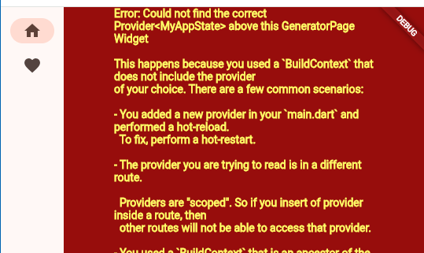

## Flutter初心者

プログラミング初心者ではないがFlutter初心者だ。  
「これからFlutterでやっていきます」というわけではない。
仕事としてしぶしぶとしてではあるが、モバイル機器を無視して済むような時代でもないので、技術としては持っておきたい。

モバイルアプリに興味はないが作らないといけない、
GUIは見栄えはこだわらず必要な機能が動けば良い、
裏側で動かすシステムの動作確認のためにモバイルアプリが必要、
そういう立場である。

部品としてはこれくらい動かせればよいだろうか。

* ラベル
* テキストボックス
* コンボボックス
* ボタン
* 画面遷移
* DB

## わかった気になる

ここを読んでちょっとわかった気になった。
文字の説明だけなのでコーディング的に「わかった」のではなく、こういうものがあるんだねぇという「わかった」だ。

* [Flutter初心者のためのガイド：基本から始めよう #iOS - Qiita](https://qiita.com/automation2025/items/1b7ba800908929adfdd2)
  * Widget
    * Stateful
    * Stateless
  * Navigator
  * 状態管理は必要に応じて
    * デフォルトアプリの`State`もそうなのかな？

## CodeLabsのチュートリアル

さすがにプロジェクト新規作成のコードだけではわからんのでチュートリアルのようなものをやってみる。
日本語になっているのが助かる。

* [初めての Flutter アプリ](https://codelabs.developers.google.com/codelabs/flutter-codelab-first?hl=ja#0)

`pubspec.yaml`を変更するなどまったく考えていなかった。
Rustの`Cargo.toml`のようなファイルだと思うが、もっと`flutter.yaml`とか`app_config.yaml`のような名前で良かったんじゃなかろうか。

前回わからなかった起動の仕方は、たぶんF5キーとかCtrl+F5キーなどのvscodeの起動だけでよいのだと思う。
`main.dart`を開いてもボタンは出てこなかったが、3点メニューから選ぶことができたしキー押下でもできるし、あまり考えなくてよいだろう。

Webアプリとして動かした場合、`print`でのデバッグ出力はvscodeの方ではなくブラウザの方に出ていた。`console.log`などと同じ扱いなのだろう。

などなど細かいところは気になったが、説明があるのはよいですな。

## リファクタリングが多彩

vscodeの"Refactor"は言語？によってやってくれることが異なる。Extensionの効果なのだろうが詳しくは知らん。
たとえばRustだとリネームが強力で自分で検索してやるよりもはるかに安全だ。Android StudioでKotlinを変更するのと同じくらいのことをやっていそうだ。

Flutterではチュートリアルでも説明があるがWidgetに対する機能が充実している。
"Rowで囲む"とか"Centerで囲む"みたいなのもあれば、別のWidgetにして`class`を追加してくれたりする。

別のファイルに追い出したりもやってくれた。`import`は機械的な追加をしているようだが、不要なら削除すればよいだけだ。  
ただ、コンパイル時にエラーが出ないのかvscodeのProblemには何も出ないのにブラウザ側で実行するとエラーが見える。この文字はグラフィックなのでコピーできん。
ブラウザ側のデバッグコンソールには出ているようだがね。

ファイル分割なのかモジュール分割なのかわからんが、学習の最初の方で別のファイルに置く手段を知っておかないとだらだらと長いファイルを作りがちになるのでツールでできるのはありがたい。

## vscodeのProblemにならないが動かない

先程書いた別のファイルに追い出したときにエラーになった件が気になっている。  
文法的にダメならvscodeのProblemタブに出てくるのでわかるのだが、ファイルに分割したときには実行時エラーが置きたと思われる。
React Nativeにも似たようなことがあったような気がする。

このエラーは結局よくわからなかったので、同じようにvscodeの機能で`main.dart`に集約させてエラーが出ないことを確認し、
今度は`class`ごとに移動させては実行、移動させては実行と順番にやっていったところ最後までエラーが出ずに分割できた。  
まだ私が初心者すぎて判定できないが、`main.dart`に何か残っていて分割したファイルたちが`import`していたんじゃないかと推測したのだが、
手動で追加しても循環参照になっても実行できたので違うかもしれん。

### ListViewを単純にRowやColumnで覆うのはダメ

CodeLabsチュートリアルの最後のページをやっていた。

* [初めての Flutter アプリ](https://codelabs.developers.google.com/codelabs/flutter-codelab-first?hl=ja#7)

その前のページではwidgetが中央に表示されるよう`Row`で囲んでその外側を`Column`でくるんで`Center`で覆っていたので、`ListView`を一番内側にして`Row`, `Column`, `Center`と覆っていった。
(`Row`で囲んでいたのはボタンを2つ並べるところだけだったのに後で気づいた。)  
そうすると、何も画面に表示されない。  
いくつか試したが、`Row`も`Column`もなければ表示された。つまり`Center`だけなら大丈夫だった。
スクロール領域のサイズがinfinityを与えられて決まらないのでダメなんだとか。

`Center`だけにして、左右方向については`ListView`ではサイズを決めずに目一杯使うので、その外側をサイズが決められるwidgetで囲むのだそうだ。
そういうタイプもあれば`Row`の`mainAxisSize`や`Column`の`mainAxisAlignment`を指定して中央寄せに使うタイプもあって、
単に「中央に寄せたい」という希望がなかなか通らなくて面倒に感じる。  
サイズを決めてから配置するわけではないからそういう風になってしまうことはなんとなくわかるのだけど、
そういうのに興味がないと覚える気にならないのよね。。。

ともかく、このスクロールサイズが決まらないので画面に出てこないというのはvscodeでエラーにならないし、
ブラウザのconsoleログにもなんかわけわからんものが出てるなあくらいで気づきにくい。  
慣れたらなんとかなるんだろうか？

### Codelabsの元

なんとかこのCodelabsだけやったのだが、さすがにこれで完全に理解したと言えるほど度胸はない。
がチュートリアルをやっている時間的な余裕もないので、使いたいものだけやっていこう。

[初めての Flutter アプリ](https://codelabs.developers.google.com/codelabs/flutter-codelab-first?hl=ja#0)の元はここのようだ。

* [Flutter learning resources](https://docs.flutter.dev/reference/learning-resources)

"Codelab"マークが付いていてもブログだったりもした。

私が調べたさそうなのはこのあたりかね。内容はまだ見てないが。
UI部品そのものはそんなに難しくないんじゃないかと予想。

* テキストボックス
  * [Retrieve the value of a text field](https://docs.flutter.dev/cookbook/forms/retrieve-input)
* コンボボックス
* 画面遷移
  * [Navigate to a new screen and back](https://docs.flutter.dev/cookbook/navigation/navigation-basics)
    * `Scaffold`ならAndroidもiOSもいけるのかな？
    * `SafeArea`はレールを出しているだけなので`Navigator.push`で遷移すると見えなくなるのは仕様として正しい
    * `Navigator.push`のときにwidgetのコンストラクタに値を与えることができるし、`Navigator.pop`の引数に値を入れて返すこともできる
  * [Create a nested navigation flow](https://docs.flutter.dev/cookbook/effects/nested-nav)
    * モバイルでありがちな遷移
    * こちらは`Navigator.of`や`NavigatorState`を使っているのがポイント？
    * ちょっとコードを変更すると"初めてのFlutterアプリ"の画面として取り込めた
* DB
  * [Persist data with SQLite](https://docs.flutter.dev/cookbook/persistence/sqlite)
    * SQLでテーブルを作るがそれ以外はメソッドで操作するようだ
    * テーブル作成の場合には`version`を付ける。アップグレードやダウングレードのパスがあるとかなんとか。詳細は書いてなかった。
    * [sqflite](https://pub.dev/packages/sqflite)を見るとSQLをそのまま使うパターンもいけるようだ
  * [Persistent storage architecture: Key-value data](https://docs.flutter.dev/app-architecture/design-patterns/key-value-data)
  * [Store key-value data on disk](https://docs.flutter.dev/cookbook/persistence/key-value)
* ファイル
  * [Read and write files](https://docs.flutter.dev/cookbook/persistence/reading-writing-files)

## Rustからそのまま持っていく？

やりたいことは、いまRustでコマンドラインアプリとして動いているものをモバイルで動かす、だ。
Dartで使用できるライブラリを探して移植する、あわよくばAIでお任せ、とか考えていたのだが、どう考えてもだるい。

AIとしては、クロスコンパイルが可能ならそのまま持っていってラッパーを作るのがいいんじゃないの、ということだった。
あー、それができるなら一番ありがたいのだが、はてさて。
