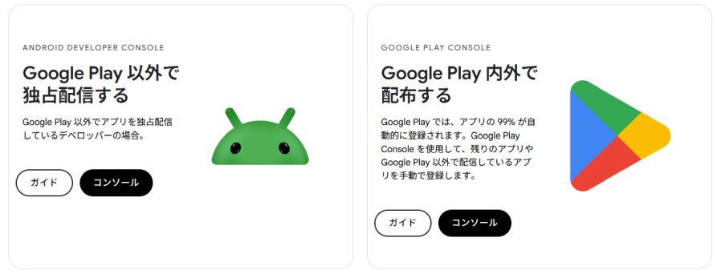

Android開発そのものの話ではなくアカウントの話。

以前、Google Play Consoleアカウントに本人確認が必要になったので放置したという話をした。

* [android: Google Play Consoleの更新について - hiro99ma blog](https://blog.hirokuma.work/2024/11/20241111-and.html)
* [android: Google Play Consoleのアカウント期限当日 - hiro99ma blog](https://blog.hirokuma.work/2024/12/20241209-and.html)
* [android: Google Play Consoleで本人確認が必要 - hiro99ma blog](https://blog.hirokuma.work/2024/12/20241212-and.html)

あれから開いてもいなかったのだが、最近Androidのアプリもちょっとやっていたので(公開予定はない)調べていた。  
すると、2026年9月30日から一部の国でapkのインストールが難しくなり、2027年からは全体にそれを反映するというブログが書かれていた。
2025年8月のブログだから、1年前には通知していたよということだな。

* [Android Developers Blog: A new layer of security for certified Android devices](https://android-developers.googleblog.com/2025/08/elevating-android-security.html?m=1)

いつからか知らないが、Google Play Consoleアカウントに加えて「Android Developer Consoleアカウント」というものが増えていた。
Google Playに公開しないならAndroid Developer Consoleアカウントを作ってね、ということらしい。

Google Playに公開しないのにアカウントを作って何の意味があるかというと、それが先ほどの「apkのインストールが難しくなり」になる。
どうやら開発としてUSBケーブルなどでインストールする場合を除き、署名されていようといまいとapkファイルでのインストール手順が面倒になるということだ。
あまり読んでいないけど、端末でapkインストールを許可するを選択し、それから1日以上経過させて、それでようやくできるようになる。  
セキュリティ目的と言われると文句も言いづらいところだ。できなくなるわけではないし。先行して数カ国で実施されるのも被害が多い国だからなんだろう。

Google Play以外にも配布方法はあるので、そういう手順を踏まずにインストールできるようにするapkを作ることができるのがAndroid Developer Consoleだ。
開発者側が首に縄をつけられることになるのだが、自分の庭で好き勝手するなと言われればそれまでだ。  
このAndroid Developer Consoleは、限定20人公開 or それ以外という大きな区分がある。途中で変更できない。  
限定20人の方だと旧Google Play Consoleアカウント程度の情報量でアカウントを作ることが出来たのでそうした。

* [Android Developer Console に登録する  -  Android developer verification  -  Android Developers](https://developer.android.com/developer-verification/guides/android-developer-console?hl=ja)

仕事で作ってみました、と手軽にapkだけ渡したいこともあるだろうし、そもそもGoogle Play Consoleに残っているので今さらか、と諦めた。  
Google Play Consleとは全く別に作られるようで、同じGoogleアカウントを使うことが出来た。

## Android端末にAndroid OS以外の選択肢

それが嫌ならAndroid OS以外にするという選択肢もある。やったことないけど。  
昔は電話ではないAndroid端末がしばしばあったのでAOSPを直接ビルドしてインストールしたりしていたが、
電話として使うとなるとキャリアが対応してくれなかったら困るので試したことはない。  
新しく買い替えたら古いやつをやってみようと思ったのだが、値段が高くなって安易に壊せないのよなあ。

私がよく見かけるのはGrapheneOS。
なぜかTwitterでよく流れてくるからというだけなので、よく知らないが興味はある。

* [GrapheneOS: the private and secure mobile OS](https://grapheneos.org/)

AOSPをビルドしたりして自分でインストールできる利点は、システムアプリを自作できることだ。
普通だと権限的にユーザーが作ることが出来ないアプリをインストールできるのは楽しいものだ。  
せっかく自分でお金出して端末を買ったのに、それをいじくる権利がないというのは悔しいものだよ。
