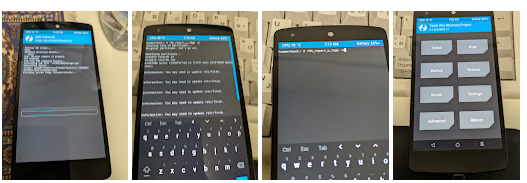
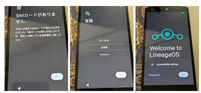

捨てようとしていたNexus5だったが、AOSPベースの別OSがあるそうなのでインストールしてみようと思った。

* [\[ROM\]\[UNOFFICIAL\]\[16 QPR2\]\[VoLTE\] LineageOS 23.2 for Nexus 5 (hammerhead) - XDA Forums](https://xdaforums.com/t/rom-unofficial-16-qpr2-volte-lineageos-23-2-for-nexus-5-hammerhead.4776691/)

細かく手順を書こうと思ったのだが、Gemini(無料)に質問すると

## Nexus5をWindows11が認識しない

Nexus5をWindows11マシンに接続したのだが、デバイスマネージャーが認識していなかった。  
Android StudioのSDK ManagerでGoogle USB Driverをインストールして、デバイスマネージャーでドライバを読み込ませた。
渡しの場合はこういうディレクトリに入っていた。

`C:\Users\<username>\AppData\Local\Android\Sdk\extras\google\usb_driver`

## リカバリーモード用のROMを焼く

音量ボタン下押し＋電源オンでブートローダーモード？になる。
デバイスを認識していると`fastboot`コマンド(Android Studioをインストールしたら入ってる)を使う。

```cmd
>fastboot devices
xxxxxxxxxxxxxxxx         fastboot

>fastboot flash recovery twrp-3.7.0_9-HH.R.17-MADV_WIPEONFORK.img
Sending 'recovery' (21530 KB)                      OKAY [  0.884s]
Writing 'recovery'                                 OKAY [  1.584s]
Finished. Total time: 3.231s
```

リカバリーモードで再起動。ちょっと画面がかっこよくなる。



リカバリーモードだと`adb`の方が使えるようになる。

```cmd
>adb devices
* daemon not running; starting now at tcp:5037
* daemon started successfully
List of devices attached
xxxxxxxxxxxxxxxx        recovery

>adb push hh_repart_v_16gb /
hh_repart_v_16gb: 1 file pushed, 0 skipped. 9.9 MB/s (5278 bytes in 0.001s)

>adb shell
# chmod 0755 hh_repart_v_16gb
```

Nexus5を操作して「Advanced → Terminal」でターミナルモードにする。

## SideloadでROMを焼く

進行状況がNexus5の画面でもコンソールのパーセントでも見えるので安心だろう。

```cmd
>adb sideload lineage-23.2-20260926-UNOFFICIAL-hammerhead_gms_go_2gb-signed.zip
serving: 'lineage-23.2-20260926-UNOFFICIAL-hammerhead_gms_go_2gb-signed.zip'  (~37%)
```

焼き終わるとNexus5の画面が点く(長いので自動消灯されてた)ので、再起動する方のボタンをタップ。

## 最初の起動が長い

再起動させたのだが、3つの丸がくるくる回って起動中っぽいことを表している。
が5分くらい経ってもそのまま回り続けている。  
体感的には10分くらいして起動した。

2回目以降は30秒くらいか、もっとかからないか、そのくらいだ。

## 動作はきついが楽しい

Nexus5のRAMは2GBらしい。
なのでアプリが急に落ちることもあるのだが、初心に帰ったような楽しさがある。  
FTPサイトからFirefox 157(armeabi-v7a)をインストールできたし、Googleアカウントなしでもやっていけそうな気がする(Chromeもアカウントなしで使える)。



