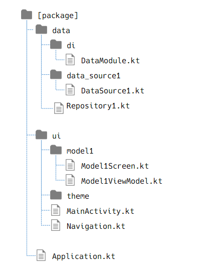

# Android開発

Android Studio を使った Jetpack Compose でのアプリを作ろうとしたときの調査メモを残すページ。  
BLE Peripheral デバイスの動作確認をするためのテスト用 Central アプリを作りたいという観点で書いていく。

## よく使うページ

* アプリ
  * Android Developers
    * [Jetpack Compose を使ってみる](https://developer.android.com/develop/ui/compose/documentation?hl=ja)
      * いろいろリンクがあるので見てみるとよさそう
    * [Codelabs](https://developer.android.com/courses/android-basics-compose/course?hl=ja)
      * 一通りやるとよい
* BLE
  * Android Developers
    * [Bluetooth Low Energy  -  Connectivity  -  Android Developers](https://developer.android.com/develop/connectivity/bluetooth/ble/ble-overview?hl=ja)
  * [Android Bluetooth Low Energy #android開発 - Qiita](https://qiita.com/sacred-sanctuary/items/b710d9bf37d0cd362648)
    * スキャンから接続、切断まで(Service や Characteristic は記事の対象外)
  * [The Ultimate Guide to Android Bluetooth Low Energy - Punch Through](https://punchthrough.com/android-ble-guide/)
    * 長いこと BLE をやっているので他の記事もよい

## アプリの実装タイプ

XML で画面を設計して View で実装していく従来のタイプと、Jetpack Compose を使用するタイプがある。  
正式な呼び名はわからないので、前者を View ベースアプリ、後者を Compose アプリと呼ぶことにする。  
Android では後者に力を入れている。

ただバージョン1.0がリリースされたのが[比較的最近(2021年7月末)](https://android-developers-jp.googleblog.com/2021/08/jetpack-compose-announcement.html)のため
ネットでの情報や公開されているソースコードでは View ベースアプリのものもかなり多い。  
また、Compose アプリは Kotlin が必須になるため、Java で開発している現場では乗り換えにくいなどという事情もあるかもしれない。

ここでは Compose アプリについて書いていく。

## アプリの構成

[アプリアーキテクチャ](https://developer.android.com/topic/architecture?hl=ja)の通りにするのが無難。  
`ViewModel` を持たなくてもよいが、データを `ViewModel` に持つと Activity が作り直されてもデータが保持できるようなので使う方が無難。

* [UI Layer](https://developer.android.com/topic/architecture/ui-layer?hl=ja)
  * UI elements
    * 画面の表示に専念
    * `@Composable`関数で画面を作る
    * 画面遷移も `@Composable`関数で作る
    * 入力した文字のように一時的に保持したり更新したいデータは`by remember{MutableStateOf()}`にしておく
  * [State holders](https://developer.android.com/topic/architecture/ui-layer/stateholders?hl=ja)
    * UI elements で表示するデータの元ネタ
    * `ViewModel`を使う
    * データは UI State `data class` を作って、UI には `StateFlow` で提供する
      * 画面回転などで Activity が作り直されると UI elements で持つ `MutableStateOf` の値は破棄されるが `ViewModel` 
* [Domain Layer(optional)](https://developer.android.com/topic/architecture/domain-layer?hl=ja)
* [Data Layer](https://developer.android.com/topic/architecture/data-layer?hl=ja)
  * Repository
    * State holders が扱うデータ
  * Data sources
    * データの供給元
    * データベースやインターネットなど

下図は [architecture-templates/base](https://github.com/android/architecture-templates/tree/c52e325d74b42379d41723a692f3b0e21fb86755/app/src/main/java/android/template)を参考にしたが、
特に決まった構成はないので参考までに。

### アプリアーキテクチャは必須ではない

アプリアーキテクチャは従った方が無難というだけであり、評価アプリのように用途が限定的だったりシンプルさの方が求められるのであれば、例えば Activity に全部実装するということも可能である。

## 各説明

* [UI Layer](uilayer/index.md)
* Data Layer
* [BLE操作](ble/index.md)

## メモ

これを書いている時点で知識が足りないので、理解が進んだら更新する。

* UI state の更新コストがよくわかっていない
  * TextField への文字入力を保持するのは Codelabs では UI layer に `MutableStateOf` を持っていたが ViewModel の説明前だったからか？
* Data Layer での Data sources をどう配置するか
  * `local` があるのはオンライン系の Data sources を `remote` 以下に置きたいからか？
    * パッケージ名よりもクラス名の方に付けたい？([このガイドにおける命名規則 - データレイヤについて](https://developer.android.com/topic/architecture/data-layer?hl=ja#naming-conventions))
* [architecture-samples](https://github.com/android/architecture-samples/tree/130f5dbebd0c7b5ba195cc08f25802ed9f0237e5/app/src/main/java/com/example/android/architecture/blueprints/todoapp)の構成はまた違うので、自分でルールを作るしかないのか。
