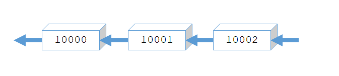
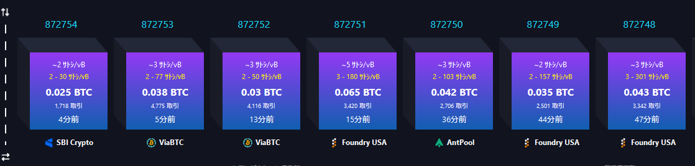

# ブロック

_最終更新日: 2024/11/30_

## はじめに

「ブロックチェーン」という名前が示すように、Bitcoin はブロックというものが重要である。

## 概要

おおざっぱにいえば、ブロックは Bitcoin を転送することを承認された[トランザクション](transactions.md)のデータの塊だ。  
承認を "confirm" と表現するので、英文だと "confirmation" や "confirmed" のような単語をよく見かけるだろう。

例えば、これは 10万ブロック目の情報である。

* [10万ブロック目](https://mempool.space/ja/block/100000)

最初にブロックの概要があり、続けて承認されたトランザクション情報が載っている。  
最初のトランザクションはブロックを承認したトランザクション(coinbaseトランザクションと呼ばれる)なので、それ以外に承認されたのが 3トランザクション存在することになる。

ブロックの情報は隠されていないため、ブロックチェーンエクスプローラーと呼ばれるいくつかのサイトで可視化された情報を閲覧することができる。  
上に載せた [mempool.space](https://mempool.space) も著名なサイトの一つである。  
ブロックだけでなく Bitcoinネットワーク自体も閉じたネットワークではなく誰でも参加できるようになっているため、個人でエクスプローラーのようなサイトを作ることもできるしウォレットアプリを作ることもできる。  
Public Blockchain と呼ばれるゆえんである。

### チェーン

ブロックのデータには前ブロックの情報を一部含んでいる。  
「ハッシュ値」というもので、あるデータ全体を指し示す代わりに計算によって一意とされる値を計算したものである。  
前のブロックのハッシュ値を次のブロックが持っているので、それがチェーンのようにつながっているということで「ブロックチェーン」という呼び名になっている。  
ハッシュ値から元のデータを得ることはできず、元データを少しでも変更するとハッシュ値が全然違った値になるという"性質"を持った演算である。

### 改ざんすることを考えてみる

前ブロックのハッシュ値を持っているので、もしデータの改ざんをしたかったら前ブロックのハッシュ値についても何かしないといけない。  
真っ先に思いつくのは前ブロックと同じハッシュ値を持つブロックを作ってしまう、ということになりそうだが、特定のハッシュ値を得るための計算式は今のところ分かっていないため難しい。

1つ前の世代だけであればがんばってハッシュ値が同じになるデータを作ることができるかもしれない。  
しかし、ブロックはデータ構造でもあるのでそれを無視できない。  
つまり一部のデータは変更できずにハッシュ値を計算して矛盾が無いようにしないと意味が無い。

1つ前のブロックだけ改ざんするのが難しいなら、その前の前のブロックも改ざんしてしまえ、と考えるかもしれない。  
しかしそうするとさらにその前のブロックも改ざんしないといけなくなる。  
となると先頭のブロックまで改ざんしないとうまくいかなくなる。

### 検証

そして、ブロックのデータ検証はどこか中央機関が行っているわけではなく、Bitcoin ネットワークに参加している全員が行っている。  
単に Bitcoin ウォレットを持っているだけだと全部の検証はしないだろうが、一般的に Bitcoin ノードと呼ばれるソフトウェアを使っているのであれば何かしらの検証を行う。  
多数が早めに検証して OK だったブロックが、そのネットワークで承認されたものとして伝播していく。  
アプリはそのブロックデータが本当に正しいかどうかを検証し、正しければ受け入れる。

「承認」するアプリと「検証だけ」のアプリは結構別物で、普通の Bitcoin アプリは「検証だけ」を行う。  
検証する元になるブロックデータを生み出すのは「承認」するアプリである。マイニングともいう。  
もし出回っている「承認されたブロック」が自分で正しくないと思えば拒否すればよい。

### 承認

ブロックのデータを作り、それが検証を通れば基本的にはブロックは承認に足りると見なされることになる。  
あとは Bitcoin ノードの多数がそれを検証してくれないと Bitcoin ネットワークとして承認されたことにならない。

検証で OK となるブロックは正解が 1つしかないという訳ではない。  
例えばブロックに含めるトランザクション(承認するトランザクション)の順番に決まりはないし、いくつトランザクションを含めないといけないかという決まりもない。  
もしトランザクションたちが同じだったとしても、ブロックのデータをある計算式で計算した結果が一定値を下回らないといけないのだが、その計算にはハッシュ計算があるため狙った値を作り出すことはできない(今の数学ではできないと判断されている)ため、検証が OK になるパターンは複数あると考えられる。  
答が複数あるようなものなので、どれが最終的に"正解"と見なされるかは「早い者勝ち」ということになっている。  
つまり、この値が正解なんです、というのを素早く多数に広められた者が勝つのだ。

承認できるブロックデータを作り出すことは数学的にできない以上、いまのところ力業で行うしかない。  
これが「マイニング」と呼ばれるもので、手当たり次第に値を入れて計算し、満たさなければまた違う値を入れて計算し、というのをひたすら繰り返すことになる。  
この地味さと答がなかなか見つからないところが金を発掘しているように見えるのかもしれない。

### マイニングの成功は難しい

マイニングはもはや個人でやれるものではなく、お仕事として成り立っている状況だ。  
ひたすら計算するだけなので、計算する能力がブロックを掘り出すことができる力に直結する。  
ここにはマイニングに成功している上位 20チーム程が並んでいる。

* [mining pool](https://mempool.space/ja/graphs/mining/pools)

最低でも毎秒 1E([エクサ](https://ja.wikipedia.org/wiki/%E3%82%A8%E3%82%AF%E3%82%B5)。100京)回の計算能力がある。  
だがそれでも成功するのは 0.2% 程度しかない世界である。

### 承認は 10分程度

ブロックの承認はだいたい 10分程度で行われる。  
早い者勝ちなのに時間の目安があることに疑問があるかもしれないが、これは 10分程度になるように調整されているためである。  
少し前に「ブロックのデータをある計算式で計算した結果が一定値を下回らないといけない」と書いたが、この「一定値」が小さくなればなるほど許容される値が少なくなるため、それを利用して難易度を調整している。

もちろん目安にしか過ぎないため、数分も経たずにブロックが生成されたり、30分以上経っても承認されないこともしばしばある。  
例えばこれは直近で生成された数ブロックだが、まちまちになっていることがわかる。

## 構成

| item | size | unit |
|---|---|---|
| version | 4 | `int32_t` |
| prev | 32 | `char[32]` |
| merkle_root | 32 | `char[32]` |
| time | 4 | `unixtime` |
| nBits | 4 | `uint32_t` |
| nonce | 4 | `uint32_t` |
| txn_count | m | [`compact size`](value.md) |
| txs | | `tx[txn_count]` |

`version`～`nonce` までの 80 byte をブロックヘッダと呼ぶ。

## おわりに
