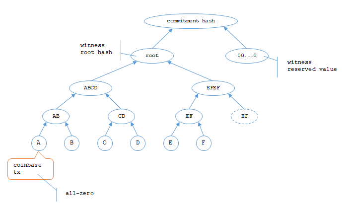

## はじめに

「ブロックチェーン」という名前が示すように、Bitcoin はブロックというものが重要である。

## 概要

おおざっぱにいえば、ブロックは Bitcoin を転送することを承認された[トランザクション](transactions.md)のデータの塊だ。  
承認を "confirm" と表現するので、英文だと "confirmation" や "confirmed" のような単語をよく見かけるだろう。

例えば、これは 10万ブロック目の情報である。

* [10万ブロック目](https://mempool.space/ja/block/100000)

最初にブロックの概要があり、続けて承認されたトランザクション情報が載っている。  
最初のトランザクションはブロックを承認したトランザクション(coinbaseトランザクションと呼ばれる)なので、それ以外に承認されたのが 3トランザクション存在することになる。

ブロックの情報は隠されていないため、ブロックチェーンエクスプローラーと呼ばれるいくつかのサイトで可視化された情報を閲覧することができる。  
上に載せた [mempool.space](https://mempool.space) も著名なサイトの一つである。  
ブロックだけでなく Bitcoinネットワーク自体も閉じたネットワークではなく誰でも参加できるようになっているため、個人でエクスプローラーのようなサイトを作ることもできるしウォレットアプリを作ることもできる。  
Public Blockchain と呼ばれるゆえんである。

### チェーン

ブロックのデータには前ブロックの情報を一部含んでいる。  
「ハッシュ値」というもので、あるデータ全体を指し示す代わりに計算によって一意とされる値を計算したものである。  
前のブロックのハッシュ値を次のブロックが持っているので、それがチェーンのようにつながっているということで「ブロックチェーン」という呼び名になっている。  
ハッシュ値から元のデータを得ることはできず、元データを少しでも変更するとハッシュ値が全然違った値になるという"性質"を持った演算である。


### 改ざんすることを考えてみる

前ブロックのハッシュ値を持っているので、もしデータの改ざんをしたかったら前ブロックのハッシュ値についても何かしないといけない。  
真っ先に思いつくのは前ブロックと同じハッシュ値を持つブロックを作ってしまう、ということになりそうだが、特定のハッシュ値を得るための計算式は今のところ分かっていないため難しい。

1つ前の世代だけであればがんばってハッシュ値が同じになるデータを作ることができるかもしれない。  
しかし、ブロックはデータ構造でもあるのでそれを無視できない。  
つまり一部のデータは変更できずにハッシュ値を計算して矛盾が無いようにしないと意味が無い。

1つ前のブロックだけ改ざんするのが難しいなら、その前の前のブロックも改ざんしてしまえ、と考えるかもしれない。  
しかしそうするとさらにその前のブロックも改ざんしないといけなくなる。  
となると先頭のブロックまで改ざんしないとうまくいかなくなる。

### 検証

そして、ブロックのデータ検証はどこか中央機関が行っているわけではなく、Bitcoin ネットワークに参加している全員が行っている。  
単に Bitcoin ウォレットを持っているだけだと全部の検証はしないだろうが、一般的に Bitcoin ノードと呼ばれるソフトウェアを使っているのであれば何かしらの検証を行う。  
多数が早めに検証して OK だったブロックが、そのネットワークで承認されたものとして伝播していく。  
アプリはそのブロックデータが本当に正しいかどうかを検証し、正しければ受け入れる。

「承認」するアプリと「検証だけ」のアプリは結構別物で、普通の Bitcoin アプリは「検証だけ」を行う。  
検証する元になるブロックデータを生み出すのは「承認」するアプリである。マイニングともいう。  
もし出回っている「承認されたブロック」が自分で正しくないと思えば拒否すればよい。

### 承認

ブロックのデータを作り、それが検証を通れば基本的にはブロックは承認に足りると見なされることになる。  
あとは Bitcoin ノードの多数がそれを検証してくれないと Bitcoin ネットワークとして承認されたことにならない。

検証で OK となるブロックは正解が 1つしかないという訳ではない。  
例えばブロックに含めるトランザクション(承認するトランザクション)の順番に決まりはないし、いくつトランザクションを含めないといけないかという決まりもない。  
もしトランザクションたちが同じだったとしても、ブロックのデータをある計算式で計算した結果が一定値を下回らないといけないのだが、その計算にはハッシュ計算があるため狙った値を作り出すことはできない(今の数学ではできないと判断されている)ため、検証が OK になるパターンは複数あると考えられる。  
答が複数あるようなものなので、どれが最終的に"正解"と見なされるかは「早い者勝ち」ということになっている。  
つまり、この値が正解なんです、というのを素早く多数に広められた者が勝つのだ。

承認できるブロックデータを作り出すことは数学的にできない以上、いまのところ力業で行うしかない。  
これが「マイニング」と呼ばれるもので、手当たり次第に値を入れて計算し、満たさなければまた違う値を入れて計算し、というのをひたすら繰り返すことになる。  
この地味さと答がなかなか見つからないところが金を発掘しているように見えるのかもしれない。

### マイニングの成功は難しい

マイニングはもはや個人でやれるものではなく、お仕事として成り立っている状況だ。  
ひたすら計算するだけなので、計算する能力がブロックを掘り出すことができる力に直結する。  
ここにはマイニングに成功している上位 20チーム程が並んでいる。

* [mining pool](https://mempool.space/ja/graphs/mining/pools)

最低でも毎秒 1E([エクサ](https://ja.wikipedia.org/wiki/%E3%82%A8%E3%82%AF%E3%82%B5)。100京)回の計算能力がある。  
だがそれでも成功するのは 0.2% 程度しかない世界である。

### 承認は 10分程度

ブロックの承認はだいたい 10分程度で行われる。  
早い者勝ちなのに時間の目安があることに疑問があるかもしれないが、これは 10分程度になるように調整されているためである。  
少し前に「ブロックのデータをある計算式で計算した結果が一定値を下回らないといけない」と書いたが、この「一定値」が小さくなればなるほど許容される値が少なくなるため、それを利用して難易度を調整している。

もちろん目安にしか過ぎないため、数分も経たずにブロックが生成されたり、30分以上経っても承認されないこともしばしばある。  
例えばこれは直近で生成された数ブロックだが、まちまちになっていることがわかる。


### nonce だけでは不足

nonce は 4byte、約43億通りある。  
今のハッシュレートが約 800EH/s あるので、43億通りの計算などはそれこそ一瞬で終わる。  
にもかかわらずブロックの生成が 1時間近く行われないことを考えると、変化させるのが nonce だけでは足りないということになる。

変化させることができる箇所はブロックヘッダのタイムスタンプか、 coinbaseトランザクションか、あとはトランザクションの並びを変えるくらいしかない。  
coinbaseトランザクションにはいくつか自由に使ってよい領域があるので、そこを変化させてようやく条件を見つけられる、ということになっているのだろう。

## 構成

* 参照
  * [Block Headers](https://developer.bitcoin.org/reference/block_chain.html#block-headers)

| item | size | unit |
|---|---|---|
| version | 4 | `int32_t` |
| previous block header hash | 32 | `char[32]` |
| Merkle root hash | 32 | `char[32]` |
| time | 4 | `unixtime` |
| nBits | 4 | `uint32_t` |
| nonce | 4 | `uint32_t` |
| txn_count | - | [`compact size`](value.md) |
| txs | - | `tx[txn_count]` |

`version`～`nonce` までの 80 byte をブロックヘッダと呼ぶ。

## ブロックデータの取得例

ここではデータの取得に mempool.space を使う。  
`bitcoind` などでもよい。

### ブロックヘッダデータからハッシュ値を求める

ブロックハッシュを指定して取得する。  
ハッシュ値が分からない場合はブロック高から取得する。

ここでは10万ブロック目(`100,000`) を題材にする。

#### [GET BlockHeight](https://mempool.space/ja/docs/api/rest#get-block-height)

```console
$ curl -sSL "https://mempool.space/api/block-height/100000"
000000000003ba27aa200b1cecaad478d2b00432346c3f1f3986da1afd33e506
```

#### [GET Block Header](https://mempool.space/ja/docs/api/rest#get-block-header)

```console
$ curl -sSL "https://mempool.space/api/block/000000000003ba27aa200b1cecaad478d2b00432346c3f1f3986da1afd33e506/header"
0100000050120119172a610421a6c3011dd330d9df07b63616c2cc1f1cd00200000000006657a9252aacd5c0b2940996ecff952228c3067cc38d4885efb5a4ac4247e9f337221b4d4c86041b0f2b5710
```

文字数が 160 なので HEX データとしては 80 バイトということがわかる。

```console
$ curl -sSL "https://mempool.space/api/block/000000000003ba27aa200b1cecaad478d2b00432346c3f1f3986da1afd33e506/header" | wc -c
160
```

せっかくなので HEX データを分解しておく。

```bin
<version>
01000000

<previous block header hash>
50120119172a610421a6c3011dd330d9df07b63616c2cc1f1cd0020000000000

<Merkle root hash>
6657a9252aacd5c0b2940996ecff952228c3067cc38d4885efb5a4ac4247e9f3

<time>
37221b4d

<nBits>
4c86041b

<nonce>
0f2b5710
```

### ハッシュ値

ブロックヘッダのデータを SHA-256 し、その結果をさらに SHA-256 する。  
その結果をバイトデータとして逆順にした値がそのブロックのハッシュ値になる。

これは ciphereditor で計算式を作っている。  
一番上の Message にヘッダのデータ(HEX文字列)を入力すると一番下の Transformed Data にハッシュ値が出力される。

* [ciphereditor](https://ciphereditor.com/share#blueprint=eyJ0eXBlIjoiYmx1ZXByaW50IiwicHJvZ3JhbSI6eyJ0eXBlIjoicHJvZ3JhbSIsIm9mZnNldCI6eyJ4IjowLCJ5IjoxMDB9LCJmcmFtZSI6eyJ4IjotMTYwLCJ5IjotOTYsIndpZHRoIjozMjAsImhlaWdodCI6MTkyfSwiY2hpbGRyZW4iOlt7InR5cGUiOiJvcGVyYXRpb24iLCJuYW1lIjoiQGNpcGhlcmVkaXRvci9leHRlbnNpb24taGFzaC9oYXNoIiwiZXh0ZW5zaW9uVXJsIjoiaHR0cHM6Ly9jZG4uY2lwaGVyZWRpdG9yLmNvbS9leHRlbnNpb25zL0BjaXBoZXJlZGl0b3IvZXh0ZW5zaW9uLWhhc2gvMS4wLjAtYWxwaGEuMS9leHRlbnNpb24uanMiLCJwcmlvcml0eUNvbnRyb2xOYW1lcyI6WyJtZXNzYWdlIiwiYWxnb3JpdGhtIiwiaGFzaCJdLCJmcmFtZSI6eyJ4IjotMTYwLCJ5IjotMjI0LCJ3aWR0aCI6MzIwLCJoZWlnaHQiOjM5MH0sImNvbnRyb2xzIjp7Im1lc3NhZ2UiOnsidmFsdWUiOnsidHlwZSI6ImJ5dGVzIiwiZGF0YSI6IkFRQUFBRkFTQVJrWEttRUVJYWJEQVIzVE1ObmZCN1kyRnNMTUh4elFBZ0FBQUFBQVpsZXBKU3FzMWNDeWxBbVc3UCtWSWlqREJuekRqVWlGNzdXa3JFSkg2Zk0zSWh0TlRJWUVHdzhyVnhBPSJ9LCJ2aXNpYmlsaXR5IjoiZXhwYW5kZWQifSwiYWxnb3JpdGhtIjp7InZhbHVlIjoic2hhMjU2In0sImhhc2giOnsiaWQiOiI2IiwidmFsdWUiOnsidHlwZSI6ImJ5dGVzIiwiZGF0YSI6IkFJUk82NGNUNjJLOE05ODB5Z3o2ZXZMdUZTcHJGbmlQMC9MK3BwaGg4OGc9In19fX0seyJ0eXBlIjoib3BlcmF0aW9uIiwibmFtZSI6IkBjaXBoZXJlZGl0b3IvZXh0ZW5zaW9uLWhhc2gvaGFzaCIsImV4dGVuc2lvblVybCI6Imh0dHBzOi8vY2RuLmNpcGhlcmVkaXRvci5jb20vZXh0ZW5zaW9ucy9AY2lwaGVyZWRpdG9yL2V4dGVuc2lvbi1oYXNoLzEuMC4wLWFscGhhLjEvZXh0ZW5zaW9uLmpzIiwicHJpb3JpdHlDb250cm9sTmFtZXMiOlsibWVzc2FnZSIsImFsZ29yaXRobSIsImhhc2giXSwiZnJhbWUiOnsieCI6LTE1OCwieSI6MTk0LCJ3aWR0aCI6MzIwLCJoZWlnaHQiOjMxOH0sImNvbnRyb2xzIjp7Im1lc3NhZ2UiOnsiaWQiOiI4IiwidmFsdWUiOnsidHlwZSI6ImJ5dGVzIiwiZGF0YSI6IkFJUk82NGNUNjJLOE05ODB5Z3o2ZXZMdUZTcHJGbmlQMC9MK3BwaGg4OGc9In19LCJhbGdvcml0aG0iOnsidmFsdWUiOiJzaGEyNTYifSwiaGFzaCI6eyJpZCI6IjEwIiwidmFsdWUiOnsidHlwZSI6ImJ5dGVzIiwiZGF0YSI6IkJ1VXovUnJhaGprZlAydzBNZ1N3MG5qVXF1d2NDeUNxSjdvREFBQUFBQUE9In0sInZpc2liaWxpdHkiOiJleHBhbmRlZCJ9fX0seyJ0eXBlIjoib3BlcmF0aW9uIiwibmFtZSI6IkBjaXBoZXJlZGl0b3IvZXh0ZW5zaW9uLWVzc2VudGlhbHMvcmV2ZXJzZXIiLCJleHRlbnNpb25VcmwiOiJodHRwczovL2Nkbi5jaXBoZXJlZGl0b3IuY29tL2V4dGVuc2lvbnMvQGNpcGhlcmVkaXRvci9leHRlbnNpb24tZXNzZW50aWFscy8xLjAuMC1hbHBoYS4xL2V4dGVuc2lvbi5qcyIsInByaW9yaXR5Q29udHJvbE5hbWVzIjpbImRhdGEiLCJ0cmFuc2Zvcm1lZERhdGEiXSwiZnJhbWUiOnsieCI6LTE1NywieSI6NTM1LCJ3aWR0aCI6MzIwLCJoZWlnaHQiOjI3MH0sImNvbnRyb2xzIjp7ImRhdGEiOnsiaWQiOiIxMyIsInZhbHVlIjp7InR5cGUiOiJieXRlcyIsImRhdGEiOiJCdVV6L1JyYWhqa2ZQMncwTWdTdzBualVxdXdjQ3lDcUo3b0RBQUFBQUFBPSJ9fSwidHJhbnNmb3JtZWREYXRhIjp7InZhbHVlIjp7InR5cGUiOiJieXRlcyIsImRhdGEiOiJBQUFBQUFBRHVpZXFJQXNjN0tyVWVOS3dCREkwYkQ4Zk9ZYmFHdjB6NVFZPSJ9LCJ2aXNpYmlsaXR5IjoiZXhwYW5kZWQifX19LHsidHlwZSI6InZhcmlhYmxlIiwiYXR0YWNobWVudHMiOlsiNiIsIjgiXX0seyJ0eXBlIjoidmFyaWFibGUiLCJhdHRhY2htZW50cyI6WyIxMCIsIjEzIl19XX19)

結果は `000000000003ba27aa200b1cecaad478d2b00432346c3f1f3986da1afd33e506` でブロック高から取得した値と一致している。

## Merkle tree

Merkle tree は 2回出てくる。

* ブロックヘッダの Merkle root hash 
* coinbase トランザクションの commitment hash

順番としては、まず coinbase トランザクションを作ることになるため commitment hash が先である。

### commitment hash

マークルツリーの leaf というか node というかに WTXID を使用する(TXID ではなく)。
バイト並びを逆転させていない値を使用する。  
ブロックヘッダに続くトランザクションデータは先頭が coinbase トランザクション(報酬などが載っている特殊なトランザクション)になるが、そこは代わりにオールゼロのデータを`WTXID`として使用する。  
トランザクション数が奇数の場合、最後の WTXID と同じデータを追加して偶数にしてツリー構造を作る。  


WTXID `A` と `B` から `AB = sha256(sha256(A || B))` を得る(`||` はデータの連結)。  
これを続けて `root` まで計算した後、さらに `sha256(sha256(root || 00...0))` した結果が commitment hash である。



* [Extensible commitment structure](https://github.com/bitcoin/bips/blob/master/bip-0141.mediawiki#extensible-commitment-structure)

これで coinbase トランザクションが確定したので Merkle root hash を求めることができる。

### ブロックヘッダの Merkle root hash

Merkle root hash は ブロックヘッダ以降のトランザクションをマークルツリー構造に落とし込んだルートの値を使って計算する。
こちらは WTXID ではなく TXID を使う。

## nonce

自分でマイニングするとしよう。

次のブロックのヘッダとトランザクションを決めなくてはならない。  
ヘッダのサイズが決まっていて、ブロックのサイズも決まっているので、報酬を重視するならトランザクションの中でも手数料が高いものから順にブロックサイズいっぱいになるまで詰め込むだろう。  
トランザクションが決まったら Merkle root hash の計算ができる。  
前のブロックは分かるので previous block header hash は決まるし、nBits は Bitcoinプロトコルで取得する。  
あとは nonce である。

nonce はブロックヘッダのハッシュ値を変化させるためだけに存在する値である。  
nBits から算出した値より小さくなるブロックヘッダのハッシュ値になることがブロックとして承認される条件なので、その値になるように nonce を変化させる。  
ハッシュ値なので nonce を 1 変化させたらどうなる、ということがわからず力業で nonce を手当たり次第に変化させて計算させることになる。  
ブロックの生成間隔がまちまちだという話をしたが、条件を満たす nonce がなかなか見つからなかったということになる。

例えばこれを書いている時点では nBits=`386053475` で、計算すると目標値(target という)が `0x2b5630000000000000000000000000000000000000000` になる。  
けっこう桁数が多いので何とかなりそうな気がするかもしれないが、ハッシュ値なので数値がこれを下回るというよりも、ハッシュ値の頭にゼロが連続でいくつ以上並ぶ値を見つける感じになる。  
今回だと `00000000000000000002b5630000000000000000000000000000000000000000` のように 0 が 19個以上、ビット数でいえば 78 bit より多くの 0 が続かないといけない。
前のブロックヘッダのハッシュがパラメータに含まれているので事前に計算もできず、ブロックが承認されてから一斉にマイナーたちは次ブロックの作業をし始める。  
いやはや大変だ。

なお、実際に[選ばれたブロック](https://mempool.space/ja/block/000000000000000000004b3b1e4ac2f472255a1196e0535e5581704d527a9beb)は `000000000000000000004b3b1e4ac2f472255a1196e0535e5581704d527a9beb` だった。
並べてみるとちゃんと下回っていることが分かる。

```hex
target: 00000000000000000002b5630000000000000000000000000000000000000000
conf:   000000000000000000004b3b1e4ac2f472255a1196e0535e5581704d527a9beb
```

nBits からは difficulty という別の指標を得ることもできる。  
Bitcoin の用語としてはそちらの方がメジャーだろう。

## 関連ページ

* [トランザクション](./transactions.md)
* [スクリプト](./script.md)
* [アドレス](./address.md)
