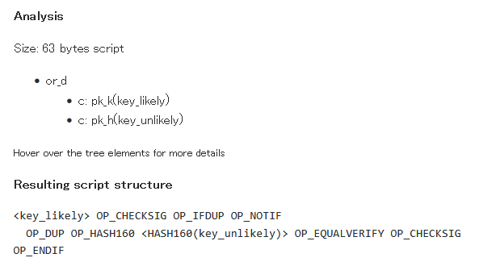
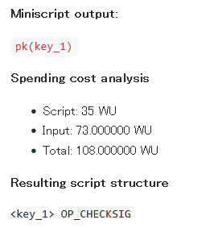
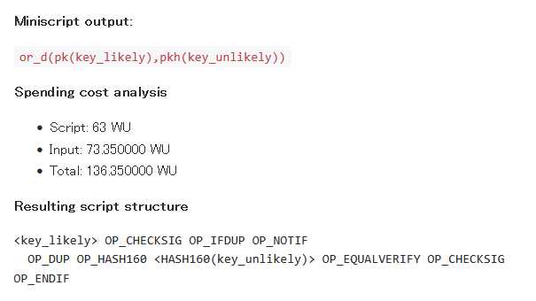

## 概要

Miniscriptという、Bitcoinスクリプトを構造的に書くための言語が[BIP-0379](https://github.com/bitcoin/bips/blob/master/bip-0379.md)にある。
ここではその仕様とデモ実装を紹介する。

仕様については Miniscriptを書くユーザーが必要な情報もあるが、それ以上に Miniscriptを実装するための情報が多い。
私は書くだけのつもりなので実装仕様については読み飛ばした。

この実装を使った[sipaサイト](https://bitcoin.sipa.be/miniscript/)では最初に"policy"というものが出てくるので混乱するかもしれないが、構成はこうなっている。

* Introduction
* Policy to Miniscript compiler
  * "policy" は BIP-379 に出てこない
* Analyze a Miniscript
  * Miniscriptを解析する
* Miniscript reference
  * [BIP-379 Specification](https://github.com/bitcoin/bips/blob/master/bip-0379.md#specification)と同じような内容
* Satisfactions and malleability

Miniscriptで書くことによって自分で直接Bitcoinスクリプトを書くよりも間違いを減らしやすい。
また解析もできるため最適化したり動的にスクリプトを解くウォレットにできるかもしれない。  
[Bitcoin Optech](https://bitcoinops.org/en/topics/miniscript/)の記載がわかりやすかったのでGoogle翻訳した文章を載せる。

> MiniScriptを使用すると、ソフトウェアはスクリプトを自動的に分析できます。これには、そのスクリプトで保護されているビットコインを使用するために、証人データを生成する必要があるものを決定するなどがあります。 MiniScriptがウォレットに何をする必要があるかを伝えると、ウォレット開発者は、あるスクリプトテンプレートから別のテンプレートに切り替えるときに新しいコードを記述する必要はありません。

「証人データ」は"witness data"で、つまり redeem するのにどういうデータを witenss に置かないといけないのかわかるようになるということだろう。  
例えばこれは公開鍵に対する署名が必要なちょっと複雑なスクリプトを Miniscript で作って解析したものである。



Bitcoinスクリプトに変換した結果が一番下にあるが、いきなりこのスクリプトを書くのは難しいだろう。  
これが Miniscript だと、「スクリプトを解く条件が 2つあってどちらか片方だけでよいので `or系`」「署名チェックを条件にしたいので `pk系`」のように決めていって `or_d(pk(key_likely),pkh(key_unlikely))` のように書ける。  
それでもいきなり Miniscript にするのは難しいので "policy" で「こうしたい」を書いて Miniscript に変換することもできるようになっている。
"policy" は BIP-379 には書かれていないので、sipa氏の親切から生まれたのだろうか。

BitcoinスクリプトをMiniscriptに変換できそうに思うが、少なくともこのデモページにはなかった([ChatGPT](https://chatgpt.com/share/6897e2ef-f3b0-8010-8fd7-0d1377368867))。

## サイト

* [Miniscript](https://bitcoin.sipa.be/miniscript/)
* [repository: github.com/sipa/miniscript](https://github.com/sipa/miniscript)

## 仕様

[demoサイト](https://bitcoin.sipa.be/miniscript/)の"Miniscript reference"を見ていく。

### P2WSH or Tapscript?

P2WSHとTapScriptで使用できる命令が異なるところがある。
ここで関係するのはMultiSigのところで、P2WSHまでは `OP_CHECKMULTISIG` のようなMultiSig専用の命令がいくつかあったが、
TapScriptではそれらは使用できなくなって代わりに [`OP_CHECKSIGADD`](https://opcodeexplained.com/opcodes/OP_CHECKSIGADD.html#op-checksigadd) が使えるようになった。
署名と公開鍵のチェックをする `OP_CHECKSIG` にカウント値をインクリメントする機能が加わったような命令である。  
Miniscriptでは `multi()` がP2WSH用、`multi_a()` がTapScript用となっている。

### Translation table

"translation table"という表が載っている。  
左列から順に、表記の意味、Miniscriptでの表記(fragment)、対応するBitcoinスクリプトとなっている。
Bitcoinスクリプトで使用できるものにすべて割り当てがあるわけではないが、よほど複雑なことをしようとしなければ事足りると思われる。

`pk(key)` など関数のように表記する fragment と、その前にコロンで区切って `s:pk(key)` のように表記する wrapper がある。  
wrapper が複数ある場合は `tar` コマンドのオプションのようにつなげて書く。

"key" に相当するデータは、P2WSH では 33バイト(`02` か `03` で始まる)、TapScript では 32バイト(x-only表現)として扱う。

真ん中の列にイコールの表記があるものはシンタックスシュガーだそうだ。
ここから下にも表がいくつか出てくるが、シンタックスシュガーの方は省略するとのこと。
わざわざそう書いているのは、記載がないからシンタックスシュガーだと対象外になるのでは？という心配をさせないためだろう。

ハッシュのpreimage、つまり元値は 32バイトのみとする。
いろいろ理由は書いてあるが、ちょっと英語が難しい。。。不正なことをしやすくなるのを避けるためだと読み取った。  
Merkleツリーの時のように `SHA256(A || B)` なんかはあり得そうだが、そういうのをやりたかったら自分でBitcoinスクリプトを書けば良いだけだろう。

### Correctness properties

Miniscriptは、Bitcoinスクリプトに変換する全体だけでなく、例えばOR条件の一部だけでもそう呼ぶので、それらをタイプ分けしている。

* `B` : Base expression(基本式)
  * 入力はスタックの最上部から受け取る
  * Bitcoinスクリプトの全体として使え、最後の結果(true/false)をスタックに残す
* `V` : Verify expression(検証式)
  * 入力はスタックの最上部から受け取る
  * `OP_CHECKSIG` に対する `OP_CHECKSIGVERIFY` のように最後の結果がスタックに残らない。失敗したらその場で終わる。
  * Miniscriptではラッパーで `v:` を付けるなど。
* `K` : Key expression(キー式)
  * 入力はスタックの最上部から受け取る
  * 公開鍵をスタックに push するための式で、ラッパーの `c:` を付けることで `B` タイプになることができる
  * 例として `pk_h(key)` が挙げられているが、変換した `OP_DUP OP_HASH160 <HASH160(key)> OP_EQUALVERIFY` はスタックに積まれた `key` を HASH160 演算した結果が埋め込まれた値と等しいかどうかチェックしているだけで、署名チェックするのは `c:pk_h(key)` になる。
* `W` : Wrapped expression(ラップされた式)
  * 入力はスタックの最上部の1つ下から受け取る
  * 条件を満たす場合は非ゼロ値、満たさない場合はゼロ値をスタックに積む。積む位置は最上部かその1つ下。
  * `OP_SWAP` のような、使われているスクリプトを見て「ああ、こういうときに使うんだ」と思うようなタイプ(個人の感想です)

それとは別に 5タイプの modifier で追加の特性を保証する。  
Miniscript の使用者よりもコンパイル側で考慮する内容なので一般ユーザーは気にしなくてよさそう。

* `z` : Zero-arg(ゼロ引数)
  * スタックを消費しない
* `o` : One-arg(1引数)
  * スタックを1つだけ消費する
* `n` : Nonzero(非ゼロ)
  * スタックから最低でも1つは消費する
  * 入力の最上位スタックがゼロである必要はありません？
    * 例えば `sha256(h)` は `SIZE <20> EQUALVERIFY SHA256 <h> EQUAL` で、
      * スタックの一番上のデータを `OP_SIZE` でデータ長をスタックに push、`0x20` を push、`OP_EQUALVERIFY` で pop しつつ比較して結果は残さない(失敗したらここで終わり)
      * 一番上の値を pop して SHA256 した結果を push、`<h>` を push、`OP_EQUAL` で 2つを pop しつつ比較して結果(true/false)を残す
    * ゼロ値(false)も残ることがあるじゃないか！と思うのだが、条件を満たしたときにスタックに残るのは非ゼロである、ということらしい([ChatGPT](https://chatgpt.com/share/68980c03-e288-8010-a9c8-a7e18feb99cf))
* `d` : Dissatisfable
  * 何を言っているのかさっぱりわからなかった...。
* `u` : Unit(単位)
  * この式が成功した場合、スタックには 1つの値が積まれる

### Detecting timelock mixing

`nSequence` や `nTimeLock` の話。  
"mixing" は、これらがブロック表現と時間表現の両方を取り得るので、それらが混ざることを言っている。

混ざらないように書こう！

### Resource limitations

Bitcoinスクリプトのリソース制約について。
大きいスクリプトを書かない限りは関係しないが、チェックするときにスクリプトが正しいかどうかだけでなくサイズも気にしないといけないので知っておいて損はない。

絶対的なコンセンサスアルゴリズムによる制約と、ノード毎に異なる standardness の制約がある。  
standardness は Bitcoin Core ではオプションによって変更できるそうだ。btcd などもそうなのだろう。  
[chatbtc](https://chat.bitcoinsearch.xyz/?author=holocat&question=Bitcoin%25E3%2582%25B9%25E3%2582%25AF%25E3%2583%25AA%25E3%2583%2597%25E3%2583%2588%25E3%2581%25AE%25E5%2588%25B6%25E7%25B4%2584%25E3%2581%25AB%25E3%2581%25AF%25E3%2582%25B3%25E3%2583%25B3%25E3%2582%25BB%25E3%2583%25B3%25E3%2582%25B5%25E3%2582%25B9%25E3%2581%25AE%25E3%2582%2582%25E3%2581%25AE%25E3%2581%25A8standardness%25E3%2581%25AE%25E3%2582%2582%25E3%2581%25AE%25E3%2581%258C%25E3%2581%2582%25E3%2582%258B%25E3%2581%25A8%25E6%2580%259D%25E3%2581%2586%25E3%2581%258C%25E3%2580%2581%25E5%2585%25A8%25E9%2583%25A8%25E5%2588%2597%25E6%258C%2599%25E3%2581%2597%25E3%2581%25A6%25E3%2581%25BB%25E3%2581%2597%25E3%2581%2584%25E3%2580%2582)にも質問した。

おそらく Miniscriptコンパイラがチェックしてくれるだろう。

* ★コンセンサスルール: 10,000 バイトを超える(over 10,000 bytes)スクリプトはコンセンサスルールによって無効(P2WSHまで)
  * Tapscriptの場合は最大標準トランザクションサイズ(100k vbyte)による制約になるため、400,000 バイト未満(less than 400,000 bytes)
* ★コンセンサスルール: 520 バイトを超える(over 520 bytes)スクリプトはコンセンサスルールによって無効(P2SH)
* ★コンセンサスルール: push しない系の命令の総数と、すべての `multi()` に与える鍵の総数を合計した値が 201 を超える(above 201)とコンセンサスルールによって無効(P2WSHまで)
  * "non-push opcodes" は `OP_5` や `OP_PUSHDATA1` のオペコード本体も数に入れないのだろうか。バイト数を見ているわけじゃないし入れないのだろう。
  * 鍵の数(the number of keys)であって鍵のバイト数ではないだろう
* ☆Standardness: `pk(key)`(P2PK)、`pkh(key)`(P2PKH)、`multi(k,...)`(n<=3) <b>以外</b>のスクリプトは標準の観点から無効
  * これはこう読めばよいのか？
    * P2PK は `pk(key)` しか認めない
    * P2PKH は `pkh(key)` しか認めない
    * `multi(...)` では n<=3 までしか認めない
      * MultiSig は公開鍵が 15 まで認めているが、あれは P2SH フォーマットの場合だけ
  * "bare" というのは、スクリプトをそのまま scriptPubKey の場所に置くことを指すそうだ
  * "bare script" であることと "standard transaction" であることは別で、scriptPubKey のところに書けば標準かどうかは関係なく "bare" になるそうだ
* ☆Standardness: 3,600 バイトを超える(over 3600 bytes)は標準の観点から無効(P2WSH、nested in P2SH)
* ☆Standardness: scriptSig が 1,650 バイトを超える(over 1650 bytes)は標準の観点から無効(P2SH)
  * わざわざ "serialized scriptSig" と書いているのはなんだろう？
* ☆Standardness: witness stack がスクリプトを除いて 100 を超える(over 100 stack elements)、標準の観点から無効(P2WSH, nested in P2SH)
* ★コンセンサスルール: スタック数が 1,000 を超える(exceed 1000 elements)スクリプトはコンセンサスルールにより無効

列挙してみたものの、なかなか難しいものだ。

ただ、こういうのがない状態でがんばってスクリプトを作り、それを使う側と使われる側が協議して "内容は大丈夫" とお互いに認めて、
実際に展開しようとしたらこれらのチェックのどれかに引っかかって展開できなかった、というのは十分あり得ると思う。  
regtest で試したとしても、スクリプトそのものの間違いは確認できてもリソース制約についてはわかりづらいだろう。

また、これらの制約は静的に判断するものだけでなく、動的に判断するものもあるそうだ。  
例えば実行する `or_b(X, Y)` は、`X` の評価までだったら大丈夫なものの `Y` まで評価したら超してしまう、などということもあり得るということだ。  
ツールがチェックしてくれそうな気はするが、わざわざそれを記載しているということは覚えておかねばなるまい。  
どんなに便利なツールがあったとしても最終的にはトランザクションを展開した人しか責任を持てないのだ。

### Security properties

ここまでの内容を満たすことで保証できるものとできないものが書いてあるのだと思う。
"completeness"なんてめったに聞かない単語なのだが、検証界隈でよく使われる用語なのだろうか。

また、署名チェックがないスクリプトは脆弱だとも書かれている。
確かに、ほとんど見たことはない。
Lightning Networkの [anchor](https://github.com/lightning/bolts/blob/master/03-transactions.md#to_local_anchor-and-to_remote_anchor-output-option_anchors)くらいではなかろうか。

### "policy"

"Policy to Miniscript compiler" の "Supported policies:" 以下に policy というものの書き方が載っている。  
いきなりMiniscriptを書くというのは難しいので、さらに 1つ層をもうけたというところか。

## ビルド

### C++

```console
$ git clone https://github.com/sipa/miniscript.git
$ cd miniscript
$ make

$ echo "pk(key_1)" | ./miniscript
X    108.0000000000    35 pk(key_1) pk(key_1)
```

オリジナルをビルドしたコマンドで出力が少ないので、forkして[sipaサイト](https://bitcoin.sipa.be/miniscript/)で出力している項目を追加した。  
policy のコンパイルと Miniscript のコンパイルのコマンドも分けた。

```console
$ git clone https://github.com/hirokuma/miniscript.git
$ cd miniscript
$ make

#
# policy to miniscript and asm
#
$ echo "or(99@pk(key_likely),pk(key_unlikely))" | ./policy
<<Spending cost>>
script_size=   63
input_size=    73.3500000000
total_cost=   136.3500000000

<<miniscript output>>
or_d(pk(key_likely),pkh(key_unlikely))

<<Resulting script structure>>
<key_likely> OP_CHECKSIG OP_IFDUP OP_NOTIF
  OP_DUP OP_HASH160 <HASH160(key_unlikely)> OP_EQUALVERIFY OP_CHECKSIG
OP_ENDIF

<<Resulting script (hex)>>
2102504b626b65795f6c696b656c7900000000000000000000000000000000000000ac736476a914504b686b65795f756e6c696b656c79000000000088ac68

#
# miniscript to asm
#
$ echo "or_d(pk(key_likely),pkh(key_unlikely))" | ./miniscript
count=0
scriptlen=63
maxops=8
type=B
safe=yes
nonmal=yes
dissat=unique
input=-
output=1
timelock_mix=no
miniscript=or_d(pk(key_likely),pkh(key_unlikely))

<<Resulting script structure>>
<key_likely> OP_CHECKSIG OP_IFDUP OP_NOTIF
  OP_DUP OP_HASH160 <HASH160(key_unlikely)> OP_EQUALVERIFY OP_CHECKSIG
OP_ENDIF

<<Resulting script (hex)>>
2102504b626b65795f6c696b656c7900000000000000000000000000000000000000ac736476a914504b686b65795f756e6c696b656c79000000000088ac68
```

### JavaScript/WASM

JavaScriptとWASMのコードも生成できる。

```console
$ sudo apt install emscripten
$ make miniscript.js
```

これらのファイルが生成された後であれば、ローカルのブラウザで `index.html` を開くと[sipaサイト](https://bitcoin.sipa.be/miniscript/)と同じことができた。

知識がないので、ここは調べていない。

## Policy の例

"policy" はBIP-379にはないが、Miniscriptを一から書くのも大変なので便利そうだ。

### A single key

公開鍵 `key_1` による署名を要求する。

```
# Policy
pk(key_1)

# Miniscript
pk(key_1)
```

Bitcoinスクリプトで解くときはこうなる(未確認)。
`<<～>>` は redeem する witness スタックである。

```
<<signature with key_1>>
<key_1>
OP_CHECKSIG
```

#### 計算

* Policy to Miniscript: `pk(key_1)` --> `pk(key_1)`
  * Script
    * `<key_1>`: 1 + 33
    * OP_CHECKSIG`* 1
    * 合計: 35
  * Input
    * witness
      * stack#0: `<signature>`: 1 + 2 + (2+32～33) + (2+32～33) + 1 = 72～74
      * 合計: 72～74(平均 73)
  * Total
    * 35 + 73 = 108



### One of two keys

#### equally likely

公開鍵 `key_1` か `key_2` による署名を要求する。
1-of-2 MultiSig のように見えるが、witness のデータは2つ必要である。

面白いのは「鍵の確率は等しい(equally likely)」の記述だ。

```
# Policy
or(pk(key_1),pk(key_2))

# Miniscript
or_b(pk(key_1),s:pk(key_2))
```

Bitcoinスクリプトで解くときはこうなる(未確認)。
`<<～>>` は redeem する witness スタックである。

```
<<signature A>>
<<signature B>>
<key_1> OP_CHECKSIG OP_SWAP <key_2> OP_CHECKSIG OP_BOOLOR
```

まず `<<signature B>>` と `<key_1>` で `OP_CHECKSIG` され、結果 true/false がスタックに載る(`<<signature B>>` と `<key_1>` は消える)。  
`OP_SWAP` することでスタック上の `<<signature A>>` と結果を入れ替えて `<<signature A>>` を上にする。  
`<<signature A>>` と `<key_2>` で `OP_CHECKSIG` され、結果 true/false がスタックに載る(`<<signature A>>` と `<key_2>` は消える)。  
スタックにはそれぞれの `OP_CHECKSIG` の結果 2つが載っている。  
[`OP_BOOLER`](https://opcodeexplained.com/opcodes/OP_BOOLOR.html#op-boolor) はスタック上の2つを取り除いて OR した結果をスタックに載せる。  
これでスタック上には `<<signature B>>` と `<key_1>` か `<<signature A>>` と `<key_2>` かのどちらか片方でも署名チェックが成功していれば true、どちらも失敗していれば false が載っている。

書く順番が `key_1`、`key_2` なのでスタックする署名もその順番と考えそうだがそうではないことに注意しよう。

TapScript ならそれぞれの script path にしてしまえばよいと思う。
いや、P2WSH でもこういうスクリプトを使うことはないような？ まあ、サンプルにあれこれいうのは野暮だろう。

#### one likely, one unlikely

こちらは確率が高い鍵とそうでない鍵があるパターン。  
Policy の `N@` は、そちらの Policy の方がデフォルトよりも `N` 倍高い確率で選択されるという意味である。  
2倍までだとどちらでもよいからなのか等確率と同じMiniscriptになった。  
それ以外にも、平均的なトランザクションサイズの計算にも使われる。
likelyが発生する確率が高いと平均的なトランザクションサイズにもそれが反映されるというわけである。

```
# Policy
or(99@pk(key_likely),pk(key_unlikely))

# Miniscript
or_d(pk(key_likely),pkh(key_unlikely))
```

Bitcoinスクリプトで解くときはこうなる(未確認)。
`<<～>>` は redeem する witness スタックである。

```
OP_FALSE
<<key_unlikely>>
<<signature B>>
<key_likely> OP_CHECKSIG OP_IFDUP OP_NOTIF
  OP_DUP OP_HASH160 <HASH160(key_unlikely)> OP_EQUALVERIFY OP_CHECKSIG
OP_ENDIF
```

最初の `OP_CHECKSIG` までは同じだが、そちらは失敗するのが分かっているので `<witness>` はダミーで良いはず。  
違いはその次で、`<key_likely>` の署名である確率が高いから、もしその署名チェックに失敗したときだけ続きを行うよう `OP_NOTIF` で囲んでいる。  
[`OP_IFDUP`](https://opcodeexplained.com/opcodes/OP_IFDUP.html#op-ifdup) は、スタック最上部が非ゼロならそれを複製、そうでなければ何もしない命令。
なので、

* 最初の署名チェックが成功したら、成功値を複製、`OP_NOTIF` でそれを取り除き、`OP_ENDIF`までスキップして最終的に true だけが残る
* 署名チェックに失敗したら、失敗値はそのまま、`OP_NOTIF` でそれを取り除いて分岐内の処理をする

となる。

しかしこのスクリプトは `<key_unlikely>` をスタックに載せるようになっていないので witness スタックの方で載せることになる。
`<<key_unlikely>>` を `OP_DUP` で複製し、`OP_HASH160` で SHA256 + riepmd160 し(複製したデータは消える)、スクリプトに埋め込んであった`<HASH160(key_unlikely)>` をスタックに載せ、`OP_EQUALVERIFY` で `<HASH160(key_unlikely)>` とを `OP_EQUALVERIFY` で比較する(両方ともスタックから消える)。
[`OP_EQUALVERIFY`](https://opcodeexplained.com/opcodes/OP_EQUALVERIFY.html#op-equalverify) は不一致なら即座にスクリプトが失敗終了する。  
成功したらその結果はスタックに載せずに続けるので、`<<signature A>>` と `<key_unlikely>` で署名チェックする。  
その結果がそのままスクリプトの結果になる。

なぜスクリプトに `<key_unlikely>` を直接埋め込まないかというと、おそらくそちらの方が確率が高い方の鍵だった場合のサイズが小さくなるからだ。

#### 計算

* Policy to Miniscript: `or(99@pk(key_likely),pk(key_unlikely))` --> `or_d(pk(key_likely),pkh(key_unlikely))`
  * Script
    * `<key_likery>`: 1 + 33
    * `OP_CHECKSIG OP_IFDUP OP_NOTIF OP_DUP OP_HASH160`: 5
    * `<HASH160(key_unilikely)>`: 1 + 20
    * `OP_EQUALVERIFY OP_CHECKSIG OP_ENDIF`: 3
    * 合計: 63
  * Input
    * witness パターン#0(likely)
      * stack#0: `<signature>`: 1 + 2 + (2+32～33) + (2+32～33) + 1 = 72～74
      * 合計: 72～74(平均 73)
    * witness パターン#1(unlikely)
      * stack#0: `OP_FALSE`: 1
      * stack#1: `<key_unilikely>`: 1 + 33
      * stack#2: `<signature_unlikely>`: 1 + 2 + (2+32～33) + (2+32～33) + 1 = 72～74
      * 合計: 35 + 73(平均) = 108
    * 合計: ((73 * 99) + (108 * 1)) / 100 = 73.35
      * policy の優先度 `99@` が影響している
  * Total
    * 63 + 73.35 = 136.35



* Analyze

miniscript: `or_d(pk(key_likely),pkh(key_unlikely))`


Analyze された結果の上にカーソルを当てると情報がホバーされる。  
その情報がかなり難解である。

scriptlen はそのままスクリプトの長さだろう。
分岐命令があるので合計してもあわないが、そこは気にしなくてよい。

max stack size はスクリプトを解くときに使用するスタックの最大サイズだろう。
"key_unlikely"を通る経路の方はスタックが多くなるので、そちらが 4 ということだと思う。
"key_likely"は witness stack には署名だけだが、解く際には"key_likely"もスタックに載せるので合計で 2になる。

max ops は関数コメントが "Return the maximum number of ops needed to satisfy this script non-malleably."。  
`Ops` 構造体の中身からすると、OPコードのカウントをしているようだ。  
"key_likely"の経路がぜろということは `OP_CHECKSIG` は数に入っていない？

そして type。  
最初の 1文字は "Correctness properties" にある `B`, `V`, `K`, `W` だろう。
次の `o`, `n`, `d` までは載っている。  
それ以降の `m`, `u`, `s`, `k` がわからない。`u` は Unit かもしれないが後ろ過ぎないか。  
ただ [`Props()`](https://github.com/sipa/miniscript/blob/6806dfb15a1fafabf7dd28aae3c9d2bc49db01f1/js_bindings.cpp#L22-L35) には載っている。

プロパティは主にMiniscriptを処理する側の情報なので、深追いしないことにした。

* `or_d()`
  * type: `Bdemusk`
  * scriptlen: 63
  * max ops: 8
  * max stack size: 4
* `c: pk_k(key_likely)`
  * type: `Kondemusk`
  * scriptlen: 34
  * max ops: 0
  * max stack size: 2
* `c: pk_h(key_unlikely)`
  * type: `Kndemusk`
  * scriptlen: 24
  * max ops: 3
  * max stack size: 3

### A user and a 2FA service need to sign off, but after 90 days the user alone is enough

```
# Policy
and(pk(key_user),or(99@pk(key_service),older(12960)))

# Miniscript
and_v(v:pk(key_user),or_d(pk(key_service),older(12960)))

# Bitcoin Script
<key_user> OP_CHECKSIGVERIFY <key_service> OP_CHECKSIG OP_IFDUP OP_NOTIF
  <a032> OP_CHECKSEQUENCEVERIFY
OP_ENDIF
```

### A 3-of-3 that turns into a 2-of-3 after 90 days

```
# Policy
thresh(3,pk(key_1),pk(key_2),pk(key_3),older(12960))

# Miniscript
thresh(3,pk(key_1),s:pk(key_2),s:pk(key_3),sln:older(12960))

# Bitcoin Script
<key_1> OP_CHECKSIG OP_SWAP <key_2> OP_CHECKSIG OP_ADD OP_SWAP <key_3>
OP_CHECKSIG OP_ADD OP_SWAP OP_IF
  0
OP_ELSE
  <a032> OP_CHECKSEQUENCEVERIFY OP_0NOTEQUAL
OP_ENDIF
OP_ADD 3 OP_EQUAL
```

### The BOLT #3 to_local policy

```
# Policy
or(pk(key_revocation),and(pk(key_local),older(1008)))

# Miniscript
andor(pk(key_local),older(1008),pk(key_revocation))

# Bitcoin Script
<key_local> OP_CHECKSIG OP_NOTIF
  <key_revocation> OP_CHECKSIG
OP_ELSE
  <f003> OP_CHECKSEQUENCEVERIFY
OP_ENDIF
```

### The BOLT #3 offered HTLC policy

```
# Policy
or(pk(key_revocation),and(pk(key_remote),or(pk(key_local),hash160(H))))

# Miniscript
t:or_c(pk(key_revocation),and_v(v:pk(key_remote),or_c(pk(key_local),v:hash160(H))))

# Bitcoin Script
<key_revocation> OP_CHECKSIG OP_NOTIF
  <key_remote> OP_CHECKSIGVERIFY <key_local> OP_CHECKSIG OP_NOTIF
    OP_SIZE <20> OP_EQUALVERIFY OP_HASH160 <h> OP_EQUALVERIFY
  OP_ENDIF
OP_ENDIF
1
```

### The BOLT #3 received HTLC policy

```
# Policy
or(pk(key_revocation),and(pk(key_remote),or(and(pk(key_local),hash160(H)),older(1008))))

# Miniscript
andor(pk(key_remote),or_i(and_v(v:pkh(key_local),hash160(H)),older(1008)),pk(key_revocation))

# Bitcoin Script
<key_remote> OP_CHECKSIG OP_NOTIF
  <key_revocation> OP_CHECKSIG
OP_ELSE
  OP_IF
    OP_DUP OP_HASH160 <HASH160(key_local)> OP_EQUALVERIFY OP_CHECKSIGVERIFY
    OP_SIZE <20> OP_EQUALVERIFY OP_HASH160 <h> OP_EQUAL
  OP_ELSE
    <f003> OP_CHECKSEQUENCEVERIFY
  OP_ENDIF
OP_ENDIF
```

## miniscriptコンパイラの内部動作

* 名前はおそらく17文字まで([compiler.h](https://github.com/sipa/miniscript/blob/6806dfb15a1fafabf7dd28aae3c9d2bc49db01f1/compiler.h#L19))
  * 説明文には16文字とあるのだが...
* 公開鍵は `0x02` + `PKb` + 名前([compiler.h](https://github.com/sipa/miniscript/blob/6806dfb15a1fafabf7dd28aae3c9d2bc49db01f1/compiler.h#L23-L28))
  * `"pk(key_1)"` ==> `21`(データ長) + `02504b626b65795f31000000000000000000000000000000000000000000000000`(公開鍵) + `ac`(`OP_CHECKSIG`)
* PubKeyHash は ``PKh` + 名前([compiler.h](https://github.com/sipa/miniscript/blob/6806dfb15a1fafabf7dd28aae3c9d2bc49db01f1/compiler.h#L30-L35))

## その他

P2WSH と TaspScript で大きい違いがあるのは MultiSig の扱いで、TapScript には `OP_CHECKMULTISIG` のような MultiSig 関係の命令がない。
その代わりに `CHECKSIGADD` で公開鍵に対して署名チェックが正常だったらインクリメントする命令が追加され、チェックが成功した数を比較するスクリプトを書く。


## リンク

* [Miniscript - Bitcoin Optech](https://bitcoinops.org/en/topics/miniscript/)
* [rust-bitcoin/rust-miniscript: Support for Miniscript and Output Descriptors for rust-bitcoin](https://github.com/rust-bitcoin/rust-miniscript)
* 開発日記
  * [btc: miniscript - hiro99ma blog](https://blog.hirokuma.work/2025/03/20250307-btc.html)
  * [btc: miniscript (2) - hiro99ma blog](https://blog.hirokuma.work/2025/03/20250308-btc.html)
  * [btc: miniscript (3) - hiro99ma blog](https://blog.hirokuma.work/2025/03/20250311-btc.html)
  * [btc: Output Descriptors - hiro99ma blog](https://blog.hirokuma.work/2025/02/20250224-btc.html)
  * [btc: Output Descriptors (2) - hiro99ma blog](https://blog.hirokuma.work/2025/02/20250225-btc2.html)
  * [btc: Output Descriptors (3) - hiro99ma blog](https://blog.hirokuma.work/2025/03/20250301-btc.html)
  * [btc: Output Descriptors (4) - hiro99ma blog](https://blog.hirokuma.work/2025/03/20250302-btc.html)
  * [btc: Output Descriptors (5) - hiro99ma blog](https://blog.hirokuma.work/2025/03/20250303-btc.html)
