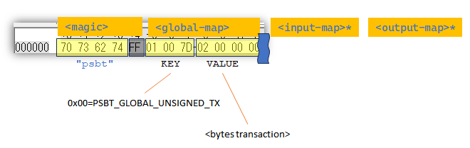

## はじめに

"Partially Signed Bitcoin Transaction"の略。

ときどき、署名だけを他の人にやってもらいたいという状況がある。
MultiSig のようなこともあれば、鍵を持たせないアプリでトランザクションだけ作って署名はウォレットで行う、ということもあるだろう。

PSBT はそういったときに使用できるデータフォーマットである。  
これがないときは各アプリでフォーマットを決めていたので共通性がなかった。

現在(2025/08/19)のところ version 0([BIP-174](https://github.com/bitcoin/bips/blob/master/bip-0174.mediawiki)、以下 PSBTv0) と version 2([BIP-370](https://github.com/bitcoin/bips/blob/master/bip-0370.mediawiki)、以下 PSBTv2) の 2つがある。version 1 はない。

詳細は各人で確認するのが良い。自分でデータを作るよりもツールやAPIなどでやった方がよいだろう。  
たとえば C言語系なら [libwally-core/psbt](https://wally.readthedocs.io/en/latest/psbt.html) が使えるだろう(Pythonのラッパーもあると思う)。
スクロールバーを見ると分かるが、非常に項目が多い。  
[bitcoinjs-lib](https://github.com/bitcoinjs/bitcoinjs-lib)はトランザクションを作るときはだいたい PSBT 関連の構造体を使っていたように思う。

などなど、API で見てしまうと切りがない。  
ここでは私が気になったところだけにする。

## PSBTv0 と PSBTv2 の違い

[BIP-370](https://github.com/bitcoin/bips/blob/master/bip-0370.mediawiki#abstract)に

> which allows for inputs and outputs to be added to the PSBT after creation.

と書かれているので、後からでも INPUT/OUTPUT を追加できるようにしたのが PSBTv2 と思われる。  
ただしフォーマットに互換性はないとのこと。

今のところ(2025/08/21)、PSBTv2 に対応しているアプリやサービスは少ない。  
Bitcoin Core もまだ対応していないので、主に PSBTv0 を見ていく。

### PSBTv0

"psbt" ヘッダで始まる key-value 式のバイナリデータである。  
大きく `<global-map>`、`<input-map>`、`<output-map>` の 3つに分かれる。  
それぞれセパレータとして `0x00` を終わりに置く。
`<input-map>` と `<output-map>` は複数置くことができる。

* [Structure - Partially Signed Bitcoin Transaction](https://learnmeabitcoin.com/technical/transaction/psbt/#structure)



#### Roles

"partially" といっているように、ちょっとずつデータを埋めながら完成させていくことができる。
そうすると、今どこまでできあがっていて次に何するのかが分かりづらい。  

[Roles](https://github.com/bitcoin/bips/blob/master/bip-0174.mediawiki#user-content-Roles)

* Creator
* Updater
* Signer
* Combiner
* Input Finalizer
* Transaction Extractor

Bitcoin Core では `analyzepsbt` で確認できる。

## bitcoin-cli

v29.0 で "psbt" をコマンド名に含むものを洗い出した。

今のところ bitcoind は PSBTv2 をサポートしていないそうだ([Implement BIP 370 PSBTv2 by achow101 · Pull Request #21283 · bitcoin/bitcoin · GitHub](https://github.com/bitcoin/bitcoin/pull/21283))。

`bitcoin-cli` コマンドで使用する PSBT データは Base64 エンコードした文字列データが多い。

### 使用例

regtest でウォレットを持っている状態で PSBT を作って展開までしようとする。  
しかし input に対して output の amount が小さくお釣りの output もないため残額が fee になってしまい、
fee の上限を超えたため展開には失敗して終わる。

```console
$ bitcoin-cli listunspent
....

# listunspentの結果から"txid"と"vout"を選ぶ
$ TXIN="...."
$ VOUT=...

# 送金先アドレス
$ ADDR=`bitcoin-cli getnewaddress`

$ PSBT=`bitcoin-cli createpsbt '[{"txid":"'$TXIN'","vout":'$VOUT'}]' '[{"'$ADDR'":0.00001}]'`
$ bitcoin-cli analyzepsbt $PSBT
{
  "inputs": [
    {
      "has_utxo": false,
      "is_final": false,
      "next": "updater"
    }
  ],
  "next": "updater"
}

$ PSBT2=`bitcoin-cli utxoupdatepsbt $PSBT`
$ bitcoin-cli analyzepsbt $PSBT2
{
  "inputs": [
    {
      "has_utxo": true,
      "is_final": false,
      "next": "updater",
      "missing": {
        "pubkeys": [
          "b4abcd7ffce2c069bbfa2ff3f0ed24c068bd09bd"
        ]
      }
    }
  ],
  "fee": 49.99999000,
  "next": "updater"
}

$ PROC=`bitcoin-cli walletprocesspsbt $PSBT2`
$ echo $PROC | jq .complete
true
$ bitcoin-cli analyzepsbt `echo $PROC | jq -r .psbt`
{
  "inputs": [
    {
      "has_utxo": true,
      "is_final": true,
      "next": "extractor"
    }
  ],
  "estimated_vsize": 110,
  "estimated_feerate": 454.54536363,
  "fee": 49.99999000,
  "next": "extractor"
}
$ bitcoin-cli sendrawtransaction `echo $PROC | jq -r .hex`
error code: -25
error message:
Fee exceeds maximum configured by user (e.g. -maxtxfee, maxfeerate)
```

### Rawtransactions

#### [analyzepsbt](https://developer.bitcoin.org/reference/rpc/analyzepsbt.html)

与えた PSBTv0 base64 文字列を簡易的に調べて現在の状態を教えてくれる。  
"next" はおそらく [Roles](https://github.com/bitcoin/bips/blob/master/bip-0174.mediawiki#user-content-Roles)。

input が未設定の場合は "extractor" になった。  
これは [Transaction Extractor](https://github.com/bitcoin/bips/blob/master/bip-0174.mediawiki#transaction-extractor) だろう。  
"must only accept a PSBT" と書いてあるが、これはいくつかの role にも書かれている。
Transaction Extractor では input の scriptSig や scriptWitness を確認するので、まだ input がない PSBT だと「次は Transaction Extractor だから input の設定が必要」という読み方をすれば良いか。

```console
$ PSBT=`bitcoin-cli createpsbt '[]' '[{"bcrt1qh5kmd2rq23l9qwykn6dtdkfhtvt550ux5ffd0y":0.0001}]'`
$ bitcoin-cli analyzepsbt $PSBT
{
  "estimated_vsize": 41,
  "estimated_feerate": -0.00243902,
  "fee": -0.00010000,
  "next": "extractor"
}
```

"extractor" は `walletprocesspsbt` に与えると成功してしまう。  
しかし input は空なので署名などもなく、`sendrawtransaction` しても失敗する。

```console
$ bitcoin-cli walletprocesspsbt $PSBT
{
  "psbt": "cHNidP8BACkCAAAAAAEQJwAAAAAAABYAFL0ttqhgVH5QOJaemrbZN1sXSj+GAAAAAAAA",
  "complete": true,
  "hex": "0200000000011027000000000000160014bd2db6a860547e5038969e9ab6d9375b174a3f8600000000"
}

$ bitcoin-cli sendrawtransaction 0200000000011027000000000000160014bd2db6a860547e5038969e9ab6d9375b174a3f8600000000
error code: -22
error message:
TX decode failed. Make sure the tx has at least one input.
```

`bitcoin-cli listunspent` の UTXO を input に追加した PSBT では ["updater"](https://github.com/bitcoin/bips/blob/master/bip-0174.mediawiki#updater) になった。  
「次は input を追加するか、redeemScript か witnessScript などを追加すること」という意味だろう。  
`listunspent` で取得した outPoint なのに "has_utxo" が false なのが気になる。「Whether a UTXO is provided」という意味なので UTXO であるかどうかだと思う。  
coinbase transaction の報酬だからかと思ったが、`sendtoaddres` で送金した UTXO を使っても同じだった。

```console
$ PSBT=`bitcoin-cli createpsbt '[{"txid":"1dcadd8c3096f1e7e127f10fe681c403f4782278c3225ae1820bf218cdfd4c58","vout":0}]' '[{"bcrt1qh5kmd2rq23l9qwykn6dtdkfhtvt550ux5ffd0y":0.0001}]'`
$ bitcoin-cli analyzepsbt $PSBT
{
  "inputs": [
    {
      "has_utxo": false,
      "is_final": false,
      "next": "updater"
    }
  ],
  "next": "updater"
}
```

#### [combinepsbt](https://developer.bitcoin.org/reference/rpc/combinepsbt.html)

#### [converttopsbt](https://developer.bitcoin.org/reference/rpc/converttopsbt.html)

#### [createpsbt](https://developer.bitcoin.org/reference/rpc/createpsbt.html)

`walletcreatefundedpsbt` と違って input は省略できないが空にしておくことはできる。  
しかし `bitcoin-cli` には input を追加するコマンドはないらしい。

```console
$ bitcoin-cli createpsbt '[]' '[{"bcrt1qyz7yq6m6rdqxaypzrz0qywj40448926dxz60eg":0.0001}]'
cHNidP8BACkCAAAAAAEQJwAAAAAAABYAFCC8QGt6G0BukCIYngI6VX1qcqtNAAAAAAAA
```

bitcoin

```console
$ bitcoin-cli createpsbt '[{"txid":"8514c2b50431b9a59be4ba5813a23f1559a6a43a1344950f1747f5d383dbd699","vout":0}]' '[{"bcrt1qyz7yq6m6rdqxaypzrz0qywj40448926dxz60eg":0.0001}]' 0 true
cHNidP8BAFICAAAAAZnW24PT9UcXD5VEEzqkplkVP6ITWLrkm6W5MQS1whSFAAAAAAD9////ARAnAAAAAAAAFgAUILxAa3obQG6QIhieAjpVfWpyq00AAAAAAAAA

$ bitcoin-cli -named createpsbt inputs='[{"txid":"8514c2b50431b9a59be4ba5813a23f1559a6a43a1344950f1747f5d383dbd699","vout":0}]' outputs='[{"bcrt1qyz7yq6m6rdqxaypzrz0qywj40448926dxz60eg":0.0001}]' replaceable=true
cHNidP8BAFICAAAAAZnW24PT9UcXD5VEEzqkplkVP6ITWLrkm6W5MQS1whSFAAAAAAD9////ARAnAAAAAAAAFgAUILxAa3obQG6QIhieAjpVfWpyq00AAAAAAAAA
```

これだけでは署名がないため `finalizepsbt` しても失敗("complete"=false)する。

```console
$ bitcoin-cli finalizepsbt cHNidP8BAFICAAAAAZnW24PT9UcXD5VEEzqkplkVP6ITWLrkm6W5MQS1whSFAAAAAAD9////ARAnAAAAAAAAFgAUILxAa3obQG6QIhieAjpVfWpyq00AAAAAAAAA
{
  "psbt": "cHNidP8BAFICAAAAAZnW24PT9UcXD5VEEzqkplkVP6ITWLrkm6W5MQS1whSFAAAAAAD9////ARAnAAAAAAAAFgAUILxAa3obQG6QIhieAjpVfWpyq00AAAAAAAAA",
  "complete": false
}
```

input が bitcoind のウォレットだった場合、`walletprocesspsbt` で署名することができる。  
こちらは regtest での実行例。

```console
$ bitcoin-cli walletprocesspsbt cHNidP8BAFICAAAAAZnW24PT9UcXD5VEEzqkplkVP6ITWLrkm6W5MQS1whSFAAAAAAD9////ARAnAAAAAAAAFgAUILxAa3obQG6QIhieAjpVfWpyq00AAAAAAAAA
{
  "psbt": "cHNidP8BAFICAAAAAZnW24PT9UcXD5VEEzqkplkVP6ITWLrkm6W5MQS1whSFAAAAAAD9////ARAnAAAAAAAAFgAUILxAa3obQG6QIhieAjpVfWpyq00AAAAAAAEAgwIAAAABAAAAAAAAAAAAAAAAAAAAAAAAAAAAAAAAAAAAAAAAAAD/////AlEA/////wIA8gUqAQAAABYAFKF4tU8/qXlx9NpgO2wsP4E4PwNbAAAAAAAAAAAmaiSqIant4vYcP3HR3v0/qZnfo2lTdVxpBol5mWK0i+vYNpdOjPkAAAAAAQEfAPIFKgEAAAAWABSheLVPP6l5cfTaYDtsLD+BOD8DWwEIawJHMEQCIAK6ZP4wGtznzftRc4xfDjWHkjri0XpjalfFJdtZsb81AiAqT1RkGfXFbkKkJAECE8eJYJX4V2aJrlXDV5zvV146MgEhA6NpGWa5VloKcla51LY18/XbmVrwCiz/gaj3iHdRgt08ACICA5M7j0nG3X9V3Gyo5qdUKsQZlRUrrcHx5URyRqfOL1H/GFZDv61UAACAAQAAgAAAAIAAAAAAAgAAAAA=",
  "complete": true,
  "hex": "0200000000010199d6db83d3f547170f9544133aa4a659153fa21358bae49ba5b93104b5c214850000000000fdffffff01102700000000000016001420bc406b7a1b406e9022189e023a557d6a72ab4d02473044022002ba64fe301adce7cdfb51738c5f0e3587923ae2d17a636a57c525db59b1bf3502202a4f546419f5c56e42a424010213c7896095f8576689ae55c3579cef575e3a32012103a3691966b9565a0a7256b9d4b635f3f5db995af00a2cff81a8f788775182dd3c00000000"
}
```

その結果を `finalizepsbt` に与えると成功する。
今回は HEXデータは `walletprocesspsbt` と同じなので特に finalize は必要なかった。

```console
$ bitcoin-cli finalizepsbt "cHNidP8BAFICAAAAAZnW24PT9UcXD5VEEzqkplkVP6ITWLrkm6W5MQS1whSFAAAAAAD9////ARAnAAAAAAAAFgAUILxAa3obQG6QIhieAjpVfWpyq00AAAAAAAEAgwIAAAABAAAAAAAAAAAAAAAAAAAAAAAAAAAAAAAAAAAAAAAAAAD/////AlEA/////wIA8gUqAQAAABYAFKF4tU8/qXlx9NpgO2wsP4E4PwNbAAAAAAAAAAAmaiSqIant4vYcP3HR3v0/qZnfo2lTdVxpBol5mWK0i+vYNpdOjPkAAAAAAQEfAPIFKgEAAAAWABSheLVPP6l5cfTaYDtsLD+BOD8DWwEIawJHMEQCIAK6ZP4wGtznzftRc4xfDjWHkjri0XpjalfFJdtZsb81AiAqT1RkGfXFbkKkJAECE8eJYJX4V2aJrlXDV5zvV146MgEhA6NpGWa5VloKcla51LY18/XbmVrwCiz/gaj3iHdRgt08ACICA5M7j0nG3X9V3Gyo5qdUKsQZlRUrrcHx5URyRqfOL1H/GFZDv61UAACAAQAAgAAAAIAAAAAAAgAAAAA="
{
  "hex": "0200000000010199d6db83d3f547170f9544133aa4a659153fa21358bae49ba5b93104b5c214850000000000fdffffff01102700000000000016001420bc406b7a1b406e9022189e023a557d6a72ab4d02473044022002ba64fe301adce7cdfb51738c5f0e3587923ae2d17a636a57c525db59b1bf3502202a4f546419f5c56e42a424010213c7896095f8576689ae55c3579cef575e3a32012103a3691966b9565a0a7256b9d4b635f3f5db995af00a2cff81a8f788775182dd3c00000000",
  "complete": true
}
```

#### [decodepsbt](https://developer.bitcoin.org/reference/rpc/decodepsbt.html)

`decodepsbt` はバイナリの PSBT構造を JSON フォーマットにして出力する。  
見やすいが、元の PSBT フォーマットと見比べるのは難しい。

#### [descriptorprocesspsbt](https://bitcoincore.org/en/doc/28.0.0/rpc/rawtransactions/descriptorprocesspsbt/)

#### [finalizepsbt](https://developer.bitcoin.org/reference/rpc/finalizepsbt.html)

全部の input に適切な処理がされていたら、`sendrawtransaction` でブロードキャストできる HEX文字列を出力する。  


#### [joinpsbts](https://developer.bitcoin.org/reference/rpc/joinpsbts.html)

#### [utxoupdatepsbt](https://developer.bitcoin.org/reference/rpc/utxoupdatepsbt.html)

### Wallets

#### [psbtbumpfee](https://developer.bitcoin.org/reference/rpc/psbtbumpfee.html)

#### [walletcreatefundedpsbt](https://developer.bitcoin.org/reference/rpc/walletcreatefundedpsbt.html)

#### [walletprocesspsbt](https://developer.bitcoin.org/reference/rpc/walletprocesspsbt.html)


## 関連ページ

* [BIP174 - PSBT version 0](https://github.com/bitcoin/bips/blob/master/bip-0174.mediawiki)
* [BIP370 - PSBT version 2](https://github.com/bitcoin/bips/blob/master/bip-0370.mediawiki)
* [Partially signed bitcoin transactions - Bitcoin Optech](https://bitcoinops.org/en/topics/psbt/)
* [PSBT - Partially Signed Bitcoin Transaction](https://learnmeabitcoin.com/technical/transaction/psbt/)
* [doc/psbt.md - v29.0](https://github.com/bitcoin/bitcoin/blob/v29.0/doc/psbt.md)
