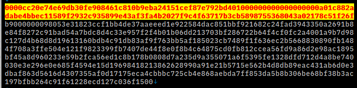
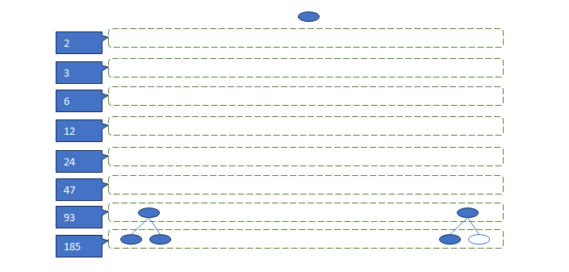
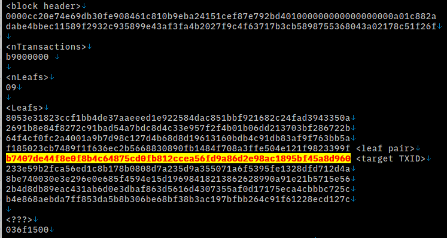
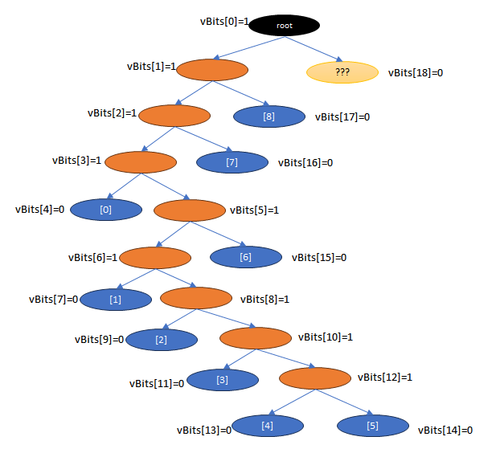
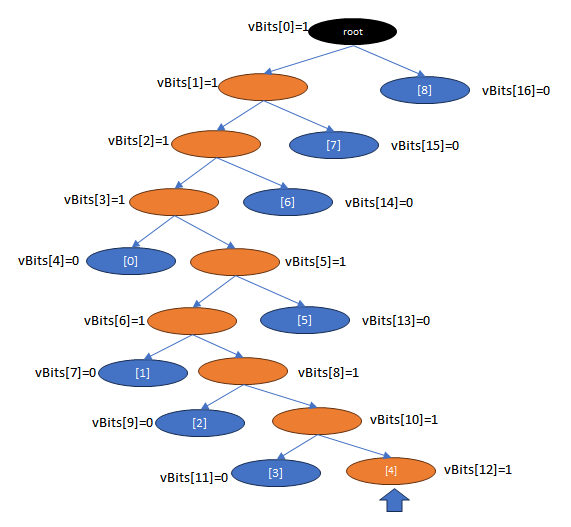

# txout proof

_最終更新日: 2025/06/19_

`bitcoin-cli` のコマンドに `gettxoutproof` と `verifytxoutproof` がある。  
指定した TXID(s) がこのブロックに取り込まれいますよ、という証明の出力と、それを検証するコマンドである。

* [gettxoutproof(v29.0.0)](https://bitcoincore.org/en/doc/29.0.0/rpc/blockchain/gettxoutproof/)
* [verifytxoutproof(v29.0.0)](https://bitcoincore.org/en/doc/29.0.0/rpc/blockchain/verifytxoutproof/)

```console
$ bitcoin-cli gettxoutproof '[\"<TXID>\", ...]' [blockhash]

$ bitcoin-cli verifytxoutproof <proof string>
```

どのブロックでも取得できるわけではないようで、2025/06/19 時点の Bitcoin Core v29.0.0 で 700,000 ブロックのトランザクションでは成功したが 650,000 ブロックでは失敗した。

[901,846ブロック](https://mempool.space/ja/block/000000000000000000019fda9794e3ead682f1b6a1cc68c3bd0d95a35f4db0b8) で確認しよう。  
[60d9...40b7](https://mempool.space/ja/tx/60d9a845bf9518ac982e6da8d96fa5ce2c81fbd05c87644c8b0f8e4fe47d40b7) を使う(誰のトランザクションかは知らない)。

```console
$ bitcoin-cli gettxoutproof "[\"60d9a845bf9518ac982e6da8d96fa5ce2c81fbd05c87644c8b0f8e4fe47d40b7\"]"
0000cc20e74e69db30fe908461c810b9eba24151cef87e792bd401000000000000000000a01c882adabe4bbec11589f2932c935899e43af3fa4b2027f9c4f63717b3cb5898755368043a02178c51f26fb9000000098053e31823ccf1bb4de37aaeeed1e922584dac851bbf921682c24fad3943350a2691b8e84f8272c91bad54a7bdc8d4c33e957f2f4b01b06dd213703bf286722b64f4cf0fc2a4001a9b7d98c127d4b68d8d19613160bdb4c91db83af9f763bb5af185023cb7489f1f636ec2b5668830890fb1484f708a3ffe504e121f9823399fb7407de44f8e0f8b4c64875cd0fb812ccea56fd9a86d2e98ac1895bf45a8d960233e59b2fca56ed1c8b178b0808d7a235d9a355071a6f5395fe1328dfd712d4a8be740030e3e296e0e685f4594e15d19698418213862628990a91e21b5715e562b4d8db89eac431ab6d0e3dbaf863d5616d4307355af0d17175eca4cbbbc725cb4e868aebda7ff853da5b8b306be68bf38b3ac197bfbb264c91f61228ecd127c036f1500

$ bitcoin-cli verifytxoutproof 0000cc20e74e69db30fe908461c810b9eba24151cef87e792bd401000000000000000000a01c882adabe4bbec11589f2932c935899e43af3fa4b2027f9c4f63717b3cb5898755368043a02178c51f26fb9000000098053e31823ccf1bb4de37aaeeed1e922584dac851bbf921682c24fad3943350a2691b8e84f8272c91bad54a7bdc8d4c33e957f2f4b01b06dd213703bf286722b64f4cf0fc2a4001a9b7d98c127d4b68d8d19613160bdb4c91db83af9f763bb5af185023cb7489f1f636ec2b5668830890fb1484f708a3ffe504e121f9823399fb7407de44f8e0f8b4c64875cd0fb812ccea56fd9a86d2e98ac1895bf45a8d960233e59b2fca56ed1c8b178b0808d7a235d9a355071a6f5395fe1328dfd712d4a8be740030e3e296e0e685f4594e15d19698418213862628990a91e21b5715e562b4d8db89eac431ab6d0e3dbaf863d5616d4307355af0d17175eca4cbbbc725cb4e868aebda7ff853da5b8b306be68bf38b3ac197bfbb264c91f61228ecd127c036f1500
[
  "60d9a845bf9518ac982e6da8d96fa5ce2c81fbd05c87644c8b0f8e4fe47d40b7"
]
```

ChatGPT に訊くと、txoutproof のデータは Bitcoin Core の [class CMerkleBlock](https://github.com/bitcoin/bitcoin/blob/v29.0/src/merkleblock.h#L125-L157) 相当だそうだ。

```
CMerkleBlock
 ├── CBlockHeader（80バイト）
 ├── varint: txn count
 ├── varint: number of hashes
 │    └── 32バイトのtxidハッシュ × N個
 ├── varint: flags bitvectorのバイト長
 │    └── flags（bool値をビットで表した配列）
```

確認しよう。

## gettxoutproof 関数

`src/rpc/txoutproof.cpp` の `gettxoutproof()` では[最後](https://github.com/bitcoin/bitcoin/blob/v29.0/src/rpc/txoutproof.cpp#L119-L123)に `CMerkleBock をシリアライズして文字列にしている様子がうかがえる。
おそらく [SERIALIZE_METHODS](https://github.com/bitcoin/bitcoin/blob/v29.0/src/merkleblock.h#L152) がやっているのだろう。  
`obj.header` と `obj.txn` はそれぞれメンバ変数の `CBlockHeader header` と `CPartialMerkleTree txn` だろう。

### CBlockHeader

この class にも [SERIALIZE_METHODS](https://github.com/bitcoin/bitcoin/blob/v29.0/src/primitives/block.h#L37) があるが、
雰囲気としては Block Header の 80バイトそのままである。

```console
$ bitcoin-cli getblockheader 000000000000000000019fda9794e3ead682f1b6a1cc68c3bd0d95a35f4db0b8 false
0000cc20e74e69db30fe908461c810b9eba24151cef87e792bd401000000000000000000a01c882adabe4bbec11589f2932c935899e43af3fa4b2027f9c4f63717b3cb5898755368043a02178c51f26f
```

画像のデータは `gettxoutproof` の出力で、黄色の部分が Block Header と一致した箇所である。  
この部分まで OK。



Merkle Root はこの中に入っているので、あとは必要な分の leaf データがあれば計算して一致するかどうか確認できる。

### CPartialMerkleTree

この class にも [SERIALIZE_METHODS](https://github.com/bitcoin/bitcoin/blob/v29.0/src/merkleblock.h#L89-L97) はある。  
ちょっと長い。

フォーマットは[コメント](https://github.com/bitcoin/bitcoin/blob/v29.0/src/merkleblock.h#L47-L53)に書いてあった。

#### トランザクション数: total_transactions (4 bytes)

[901,846ブロック](https://mempool.space/ja/block/000000000000000000019fda9794e3ead682f1b6a1cc68c3bd0d95a35f4db0b8) のトランザクション数は 185。  
16進数で `0xb9`。
Little Endian 4バイト値なので `0xb9000000`。

#### Merkle Tree の Leaf 数: number of hashes   (1-3 bytes)

トランザクション数が 185 なので、これの Merkle Root を求めようとするとこうなる。



一番下の段は 2つ。  
それ以降は相手となる leaf があればよいので 1つ。  
なので一番上まで行くのに leaf が 9つあればよい。

トランザクション数を Little Endian 4バイトとすると、次に出てくるのは `09`。  
その次から 32バイトで 9つ分区切ると、`036f1500` というデータが余る。
`varint` っぽいデータなので、いいんじゃないかな。

#### Merkle Tree の Leaf: hashes in depth-first order (<= 32*N bytes)

Leaf 数のところにも書いたが、続けて Merkle Tree の Leaf が続く。  
32バイトの TXID だが RPC order ではなく Internal Order である。

ここまででこんな感じ。  
黄色なのは `gettxoutproof` でリクエストした TXID である。



その 1つ前の `f185...399f` は[対となるTXID](https://mempool.space/ja/tx/9f3923981f124e50fe3f8a704f48b10f89308866b5c26e631f9f48b73c0285f1)だ。  
なので、それ以外の leaf は下から 2段目より上側の計算済みハッシュ値だ。

TapScript の Control Block だとハッシュ値をソートして Merkle Root を計算するが、ブロックの Merkle Root は右側・左側という配置がある。  
単にハッシュ値が並んでいるだけでは、どこから先に計算してよいかわからない。  
それを見分けているは、たぶん最後の余った 4バイトだろう。

#### number of bytes of flag bits (1-3 bytes)

`03` なので、次のデータが 3byteあるということ。

#### flag bits, packed per 8 in a byte, least significant bit first (<= 2*N-1 bits)

`vBits` というものらしい。

* [ビットコインにおけるブルームフィルターとマークルツリーパス - Pebble Coding](https://pebble8888.hatenablog.com/entry/2018/02/12/172819)

* depth-first order
* そのノードが対象のTXID の親 or そのものかどうかを記録していく
  * 0 の場合、それ以上探索しない
  * 1 の場合、子ブランチを再帰的に探索する

`6f1500` をデコードすると `0110_1111 0001_0101 0000_0000` ...  ではない。  
"packed per 8 in a byte, least significant bit first" とコメントにあるように、ビットのリトルエンディアン並びで、8bit 単位にならんでいるということだ。  
つまりここでは `1111_0110 1010_1000 0000_0000` という順番で見ていくのが正しい。  
値としてではなく、単にツリーをどうたどるかなのだ。

最初は merkle root の位置から始まる。  
これが `0` だった場合、トランザクションが 1つしかないパターンということだ。

TXID を参照するインデックス値 `k` を `0` にしておき、
`vBits[n]` が `0` だったら、 `vTxid[k]` を leaf にし、`k` はインクリメントし、次の leaf 探索に進む。  
`vBits[n]` が `1` だったら、その leaf からさらに深い方向に進む。  
これの繰り返しである。

また、トランザクション数からツリーの深さがわかるので、考慮する必要がある。  
1 個だったら merkle root と同じ(0 層としておく)。  
2 個だったら 1 層。  
3～4 個だったら 2 層。  
大ざっぱには、`log2(txs)` を切り上げた整数値になるのかな。  
そうやって数えて、最下層だった場合は `vBits[n]` が `1` でも `0` と同じ扱いにしてよいようだ。
最下層で `1` というのは検証対象の TXID ということになる。

そこを間違えるとこうやってずれて、merkle root の反対側で計算する値がなくなってしまった。



正しくはこうなる。
`vTxid[3]` と `vTxid[4]` が実際に存在する TXID で `vTxid[4]` が検証対象である。


