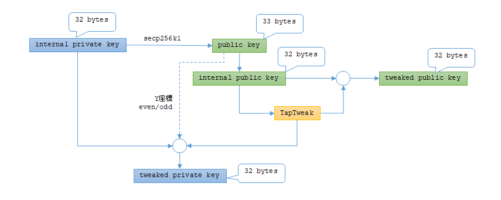
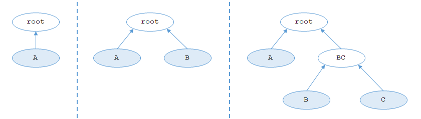

P2TR に関するトランザクションを作るための説明である。  
説明量が多かったのが BIP-341 だったのでタイトルにしたが関連する BIP は複数ある。
主なものを以下に列挙する。

* [BIP-340](https://github.com/bitcoin/bips/blob/master/bip-0340.mediawiki): シュノア署名
* [BIP-341](https://github.com/bitcoin/bips/blob/master/bip-0341.mediawiki): P2TR基本
* [BIP-342](https://github.com/bitcoin/bips/blob/master/bip-0342.mediawiki): tapscript
* [BIP-350](https://github.com/bitcoin/bips/blob/master/bip-0350.mediawiki): P2TRアドレス表記(bech32m)

## P2TR とは

Pay to Taproot。  
Bitcoin で新しく追加された方式(2025年03月現在)。

* トランザクションの全体の構造としては segwit と同じ。
* これまでは楕円曲線secp256k1での署名(ECDSA)だったがシュノア署名に変更された。
* アドレスとしてシングル鍵とスクリプトの違いがなくなった。
* スクリプトから支払う際、これまではスクリプト全体を載せていたが、P2TRスクリプトの場合は条件を満たすスクリプトだけで済む。
* witness version 1

## シュノア署名とスクリプト

シュノアは "Shnorr" で[人名](https://ja.wikipedia.org/wiki/%E3%82%AF%E3%83%A9%E3%82%A6%E3%82%B9%E3%83%BB%E3%82%B7%E3%83%A5%E3%83%8E%E3%82%A2)から来ている。  
楕円曲線の署名は ECDSA だがシュノア署名は何DSAなのかわからなかった。

いろいろシュノア署名について書いてあるサイトがあるが、
トランザクションを作る実装者目線としては MuSig というマルチシグのような動作がシングル鍵と同じトランザクションでできるのが大きいかなと思った。
シュノア署名は複数の署名を集約することができるからである。

それ以外はちょっとしたことだが、署名のサイズが固定になったというところか。  
ECDSA の場合は ASN.1 というフォーマットだったので、署名データの先頭に最上位ビットが立っているとマイナス値と見なされないようにするため `0x00` を付けていた。  
それが `R` と `S` のそれぞれにあったので署名サイズがトランザクションによって微妙に違う(0～+2)。  
シュノア署名になってそれを断ち切ることができたのか、きっちり 64バイトで済むようになった。  
署名型も "`SIGHASH_DEFAULT`" ならトランザクションから省略できるようになっている。

シュノア署名の影響か taproot の影響かわからないが、Bitcoin スクリプトの命令に変化が生じている。  
まず、署名を検証する命令の `OP_CHECKSIG` や `OP_CHECKSIGVERIFY` が tapscript で使われる場合はシュノア署名用になっている。  
またマルチシグ用の `OP_CHECKMULTISIG` や `OP_CHECKMULTISIGVERIFY` が tapscript では無効になった。`OP_RETURN` と同じ扱いになるそうだ。  
その代わりに `OP_CHECKSIGADD` が使えるようになり、マルチシグ命令ではなく署名の検証に成功した数を加算して M-of-N のマルチシグを自分でスクリプトを作って実現する方式になっている。  
この辺りは [BIP-342](https://github.com/bitcoin/bips/blob/master/bip-0342.mediawiki#design) を参考にするのが良い。

P2TR アドレス(witness version が 1の `scriptPubKey`)を見てもシングル鍵(Key Path Spend)かスクリプト(Script Path Spend)か区別がつかない。
見分けられるのは redeem するトランザクションが展開されたときで、witness stack が 1つならシングル鍵、2つ以上であればスクリプトである(0個は失敗する)。

## シングル鍵

P2TR のシングル鍵での支払いは Key Path Spend などと呼ばれる。  
(スクリプトの方は Script Path。)

今までは、秘密鍵から公開鍵を作り、公開鍵から送金先を指す `scriptPubKey` 向けのデータを作っていた。  
P2TR では今までの秘密鍵を "Internal Private Key"、そこから作った公開鍵を "Internal Public Key" と呼ぶようになった。  
Internal Public Key から P2TR 向けの加工をした Tweaked Public Key を作り、この Tweaked Public Key が表に出てくる公開鍵になる。
データ長は圧縮公開鍵のように `0x02` や `0x03` がない X座標だけになった 32バイトである。  
Tweaked Public Key を作る過程で出てきた値を使って Internal Private Key を加工して Tweaked Private Key になり、シュノア署名では Tweaked Private Key を使うことになる。  



`scriptPubKey` は [Witness Program](https://github.com/bitcoin/bips/blob/master/bip-0141.mediawiki#user-content-Witness_program) のルールが使われる。  
[Witness Version が 1](https://github.com/bitcoin/bips/blob/master/bip-0341.mediawiki#script-validation-rules) なので `OP_1` = `0x51`、
続けてデータ長 は 32 バイト = `0x20`、
そして Tweaked Public Key がそのまま 32バイト続く。  
そのおかげで署名の検証ではスクリプトに Public Key を載せずに済み、トランザクションサイズが少し小さくなっている。
以前は `scriptPubKey` には公開鍵を `HASH160` した値が載っていたので、
スクリプトには公開鍵が必要だったし、検証するときに公開鍵から `scriptPubKey` になることの確認が必要だったので、
サイズだけでなく検証の負荷もちょっと下がったのだと思う。

redeem する署名データは witness の最初のスタックに置く。
公開鍵は対象トランザクションの scriptPubKey が Tweaked Public Key なので witness に置かなくてよい。  
つまりスタックは 1つだけしか使わない。

署名データはシュノア署名したもので、署名タイプが `SIGHASH_DEFAULT` の場合は署名データの 64 バイトだけでよい。
`SIGHASH_ALL` などを使うといつものように署名データの末尾に署名タイプ値の 1 バイトを載せる。  
`SIGHASH_DEFAULT` も `SIGHASH_ALL` もトランザクションデータ全体を使うのは同じなので、特に `SIGHASH_ALL` を使う理由はないだろう。

## スクリプト

P2TR のスクリプトでの支払いは Script Path Spend などと呼ばれる。  
実は P2TR ではシングル鍵、スクリプトだけでなく、そのどちらかで支払うことができるというトランザクションも作ることができる。  
シングル鍵で説明した Tweaked Public Key などの作り方だが、全体としてはスクリプトがある場合の鍵の作り方があり、
上に載せたのはスクリプトが無い場合の方法になる。

redeem する witness はこうなる(個数は witness stack の数)。

* このスクリプトを解くためのデータ(必要な数だけ)
* スクリプト本体(1個)
* control block(1個)

Script Path Spend の場合はこのように witness stack が複数あるのが特徴である。

スクリプトの場合、基本的に `OP_IF` などの分岐をスクリプトに書かず、マークルツリーに置き換える。  
スクリプトをどうやってマークルツリーにするかというと、けっこう力業である。

例えば `OP_IF` のルートを通ると pubkey-A、`OP_ELSE` のルートを通ると pubkey-B を使うというスクリプトだった場合、いつもはこういうスクリプトだ。

```bitcoin
OP_IF
  <pubkey-A>
OP_ELSE
  <pubkey-B>
OP_ENDIF
OP_CHECKSIG
```

witness のスタックに `<signature> OP_1` を積めば `OP_IF` のルートを、`<signature> <空>` を積めば `OP_ELSE` のルートを通る。  
これを、

```bitcoin
<pubkey-A>
OP_CHECKSIG
```

と 

```bitcoin
<pubkey-B>
OP_CHECKSIG
```

に分け、それぞれをツリーのリーフにする(ハッシュ計算などはあるが)。  

このスクリプトを redeem する場合、witness stack に積むデータは `<signature>` だけなので
`witness[0]` には `<signature>` を置く。

その次にスクリプト本体を積む。  
マークルツリーにしたスクリプト全部ではなく、この redeem で解きたいスクリプトだけ載せる。
今回は `<pubkey-A> OP_CHECKSIG` か `<pubkey-B> OP_CHECKSIG` のどちらかを `witness[1]` に置く。

そして最後に control block というデータを `witness[2]` に積む。  
これには Internal Public Key や今回使ったスクリプトからマークルルートを求めるのに必要なデータである。
前段で解きたいスクリプトだけ載せ、それ以外のマークルルートまでの計算に必要なハッシュ値を載せる。

マークルツリーを作るとき、スクリプトが 1つや 2つの場合は平たく並べるが、
3つ以上ある場合はどのスクリプトが使われる可能性が高いかを考慮するのが良い。  
図の一番右のツリーでは、`A` のルートを使う場合はマークルルートを求めるのに `BC` のデータがあれば良いが、
`B` のルートを使う場合は `C` と `A` のデータが必要になってトランザクションが大きくなるからだ。



ブロックデータのマークルツリーは平たくしないと他の人が検証できないが、
P2TR のスクリプトはマークルルートが計算できるかどうかしか検証できないので構成は比較的自由である。

### マルチシグ

シュノア署名のところにも書いたが、今までのマルチシグ命令が使えなくなっている。  
それについては[いくつか提案](https://github.com/bitcoin/bips/blob/24b4354e64e162ad0154d54f12b29602fe562d9f/bip-0342.mediawiki#cite_note-5)されている。

大きくは `OP_CHECKSIGADD` を使って署名の検証が成功した数をチェックする方式と、もう1つがシュノア署名の集約を使って複数の署名を一度に検証する方式(いわゆる MuSig)だ。
ただし後者の場合、M-of-N で M≠N はできず N-of-N と同数だけしか成功しない。

前者の方式はそこそこ力業のスクリプトになる。  
たとえば A, B, C の 2-of-3 マルチシグにしたい場合、

* A と B が署名したスクリプト
* A と C が署名したスクリプト
* B と C が署名したスクリプト

でマークルツリーを作る。  
スタックに署名を積んだ順に処理するので、 A と B が B と A だとうまくいかない。
それを避けるには並びを決めておくか、全パターンのスクリプトを作るしかない。
仲間内ではスクリプトを共有するから確認すれば分かるだろう。

MuSig は方式として 3つ あるが、メジャーそうな MuSig2 の<a href="https://github.com/hirokuma/hirokuma.github.io/blob/main/bitcoin/musig/musig2_sequence.md">シーケンス図</a>を描いた。  
署名を集めたりする通信を行い、最終的にはシングル鍵で支払うのと同じ扱いになる。  
PSBT のフィールドに追加する[提案](https://github.com/bitcoin/bips/blob/master/bip-0373.mediawiki)も出ていて、Bitcoin Core に [Pull Request](https://github.com/bitcoin/bitcoin/pull/31247) もあったので、MuSig2 が使いやすくなるかもしれない。

## まとめ

BIP-341 周辺の P2TR について概要をまとめた。

## リンク

* [P2TR - Pay To Taproot](https://learnmeabitcoin.com/technical/script/p2tr/)
* [Taproot - Technical Explanation](https://learnmeabitcoin.com/technical/upgrades/taproot/)
* [デジタル署名～シュノア署名とECDSAの比較～ - Yuya - Spotlight](https://spotlight.soy/detail?article_id=z1mk21yed)
* 開発日記
  * [btc: BIP-341が難しい](https://blog.hirokuma.work/2025/01/20250112-btc.html)
  * [btc: BIP-341が難しい (2)](https://blog.hirokuma.work/2025/01/20250115-btc.html)
  * [btc: BIP-341が難しい (3)](https://blog.hirokuma.work/2025/01/20250116-btc.html)
  * [btc: BIP-341が難しい (4)](https://blog.hirokuma.work/2025/01/20250117-btc.html)
  * [btc: BIP-341が難しい (5)](https://blog.hirokuma.work/2025/01/20250118-btc.html)
  * [btc: bitcoinjs-lib を使う (1)](/2025/01/20250122-btc.html)
  * [btc: bitcoinjs-lib を使う (2)](/2025/01/20250123-btc.html)
  * [btc: bitcoinjs-lib を使う (3)](/2025/01/20250124-btc.html)
  * [btc: bitcoinjs-lib を使う (4)](/2025/01/20250125-btc.html)
  * [btc: libwally-core を使う (1)](/2025/01/20250126-btc.html)
  * [btc: libwally-core を使う (2)](/2025/01/20250127-btc.html)
  * [btc: libwally-core を使う (3)](/2025/01/20250128-btc.html)
  * [btc: libwally-core を使う (4)](/2025/01/20250129-btc.html)
  * [btc: MuSig](/2025/01/20250131-btc.html)
  * [btc: MuSigは難しい](/2025/02/20250201-btc.html)
  * [btc: libsecp256k1 は MuSig 2 だった](/2025/02/20250202-btc.html)
  * [btc: libwally-core で script path (1)](/2025/02/20250204-btc.html)
  * [btc: libwally-core で script path (2)](/2025/02/20250205-btc.html)

