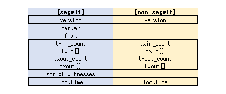
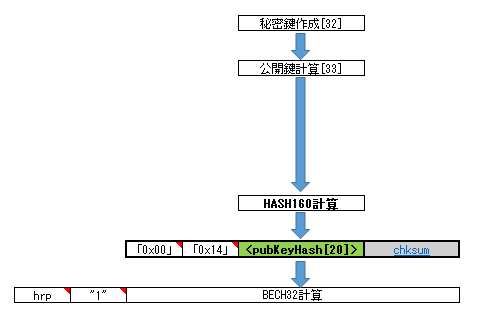
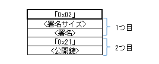
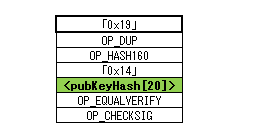

P2WPKH に関するトランザクションを作るための説明である。  

* [BIP-141](https://github.com/bitcoin/bips/blob/master/bip-0141.mediawiki): witness と P2WPKH, P2WSH
* [BIP-143](https://github.com/bitcoin/bips/blob/master/bip-0143.mediawiki): P2WPKH, P2WSH の署名検証
* [BIP-144](https://github.com/bitcoin/bips/blob/master/bip-0144.mediawiki): segwit トランザクション
* [BIP-173](https://github.com/bitcoin/bips/blob/master/bip-0173.mediawiki): bech32

## 概要

* segwit が有効になった最初の方式
  * segregated witness の略
* トランザクションに witness という領域を増やし、署名などを scriptSig から witness に移動させた
  * TXID は witness を除外して計算する
    * 全データを使って計算した方は WTXID という名前でブロックのマークルツリーなどで使われる
  * この除外が "segregated" の由来か
  * 署名を変更できてしまう件の対応だが、これに伴い署名前のトランザクションでも TXID を計算できるようになった
    * 当時 Lightning Network は mainnet で segwit が有効になるのを待っている状態だった(testnet3 では先に有効になっていた)
* サイズの計算では witness を 4分の1 サイズとみなす
  * 実際のバイト数とは違うので vbyte などという単位で呼ぶ
  * 逆に、従来部分を 4倍した weight という単位もある(WU)
    * vbyte は小数点が出てくるので、整数計算するなら WU で計算して 4 で割った方が無難かも。ビットshiftできるし。
  * 手数料も vbyte で計算する
    * scriptSig はトランザクションの中でも占める割合が大きいので P2PKH よりも少し低くできる
* nested in BIP-16 P2SH という P2SH 形式にして segwit 未対応アプリでも検証には失敗しないようにする形式もある
  * この方式は今はもう使われていないんじゃないかな？
  * nested ではない今では一般的に使われている方は native P2WPKH と呼ばれる
* witness version 0

## トランザクション

右が従来の segwit ではないトランザクション、左が segwit のトランザクションである。

marker が `0x00` で、この位置は従来のトランザクションでは `txin_count` になる。  
トランザクションとして `txin_count` がゼロになるのは認められないので、`version` の次のデータが `0x00` なら segwit のトランザクション、そうでないなら従来のトランザクションという判別をする。

## アドレス

最終的には bech32 というエンコードをしたデータに mainnet などのチェーン情報を表した Human Readable Part(HRP) を載せる。

scriptPubKey は witness version の `0x00`、データ長 20バイトの `0x14`、最後に公開鍵を HASH160計算した結果を連結する。  
このデータは witness program と呼ばれる。
「scriptPubKey には witness program が使用される」と認識しておくとよい。

HRP は mainnet なら `bc`、testnet なら `tb` になる。  
その次の `1` は Human Readable Part と Data Part の区切りである(bech32 では `1` を使わないので)。  
余談だが、Lightning Network でも bech32 が使われているが、オリジナルの bech32 エンコードは 90文字までなのにそれより長いデータ長になるのでちょっと面倒だ。
また、Human Readable Part に数値を載せられるので、区切りの探し方は「左からたどって最初に現れた`1`」ではなく「右からたどって最初に現れた`1`」になるのも面倒だ。

## Witness

署名などは scriptSig ではなく witness に配置する。
そのため witness は txin の一部のような扱いである。
トランザクションには witness 全体の個数やバイト数を書くところはなく、
最初は `txin[0]` が使用する witness の個数とデータ、その次は `txin[1]` が使用する witness の個数とデータ、のように並んでいる。

P2WPKH は P2PKH とほとんど同じである。
ただ scriptSig は 1つのパートだったが witness は各 Bitcoin スクリプトで使用するスタックごとに配置する。
P2WPKH では 2つの witness stack を使う。

## 署名

署名は従来と同じく ECDSA。  
署名するデータは [BIP-143](https://github.com/bitcoin/bips/blob/master/bip-0143.mediawiki#specification) に記載がある。
scriptCode は native P2WPKH ではこう決められている。

## まとめ

P2WPKH の概要をまとめた。

## リンク

* [Segregated Witness - Bitcoin Wiki](https://en.bitcoin.it/wiki/Segregated_Witness)
