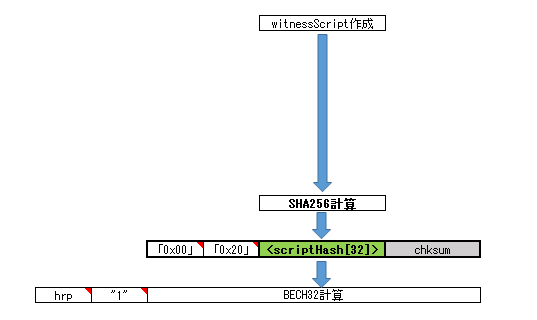

# P2WPKH

_最終更新日:2025/03/07_

P2WSH に関するトランザクションを作るための説明である。  
BIP は P2WPKH とほとんど同じである。

* [BIP-141](https://github.com/bitcoin/bips/blob/master/bip-0141.mediawiki): witness と P2WPKH, P2WSH
* [BIP-143](https://github.com/bitcoin/bips/blob/master/bip-0143.mediawiki): P2WPKH, P2WSH の署名検証
* [BIP-144](https://github.com/bitcoin/bips/blob/master/bip-0144.mediawiki): segwit トランザクション
* [BIP-173](https://github.com/bitcoin/bips/blob/master/bip-0173.mediawiki): bech32

## 概要

[P2WPKH の概要](p2wpkh.md#概要)を参照。  
P2WPKH のスクリプト版と思っておけば良い。

## トランザクション

[P2WPKH のトランザクション](p2wpkh.md#トランザクション)を参照。

## アドレス

アドレスの作り方は一部 P2WPKH と異なる。  
P2WPKH では公開鍵を HASH160 計算したが、P2WSH ではスクリプトを SHA256 計算する。

witness program もデータ長が 32バイトの `0x20` になるだけである。

## Witness

[P2WPKH の Witness](p2wpkh.md#witness)を参照。

scriptSig を使わず witness に配置するところも、スタックごとに分けるのも同じである。  
P2WPKH は形が決まっていたが、P2WSH はスクリプトを各自で作るためそれぞれ異なる。
スタックの最初はスクリプトを解くためのデータ、最後にスクリプトを載せる。

## 署名

[P2WPKH の署名](p2wpkh.md#署名)を参照。

scriptCode は witness の最後に載せるスクリプトと同じデータである。

## まとめ

P2WSH の概要をまとめた。

