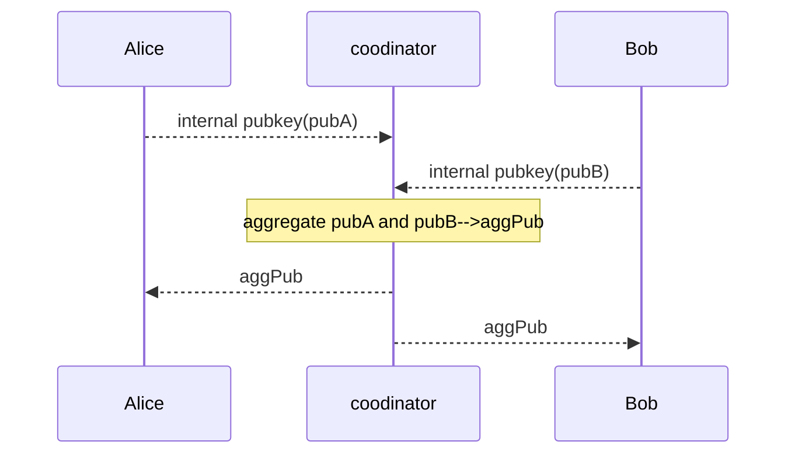

# MuSig2 Sequence

## Generate MultiSig pubkey

```mermaid
sequenceDiagram
  participant Alice
  participant coodinator
  participant Bob

  Alice-->>coodinator: internal pubkey(pubA)
  Bob-->>coodinator: internal pubkey(pubB)
  Note over coodinator: aggregate pubA and pubB-->aggPub
  coodinator-->>Alice: aggPub
  coodinator-->>Bob: aggPub
```

## Sign

```mermaid
sequenceDiagram
  participant Alice
  participant coodinator
  participant Bob

  Note over Alice,Bob: round 1
  Note over Alice: create secNonceA/pubNonceA
  Alice->>coodinator: pubNonceA
  Note over Bob: create secNonceB/pubNonceB
  Bob->>coodinator: pubNonceB
  Note over coodinator: aggregate pubNonceA and pubNonceB-->aggNonce
  coodinator-->>Alice: aggNonce
  coodinator-->>Bob: aggNonce

  Note over Alice,Bob: round 2
  Note over Alice: partial sign(sigA)
  Alice->>coodinator: sigA
  Note over coodinator: verify SigA
  Note over Bob: partial sign(sigB)
  Bob->>coodinator: sigB
  Note over coodinator: verify SigB
  Note over coodinator: aggregate sigA and sigB
  Note over coodinator: broadcast signed transaction
```
