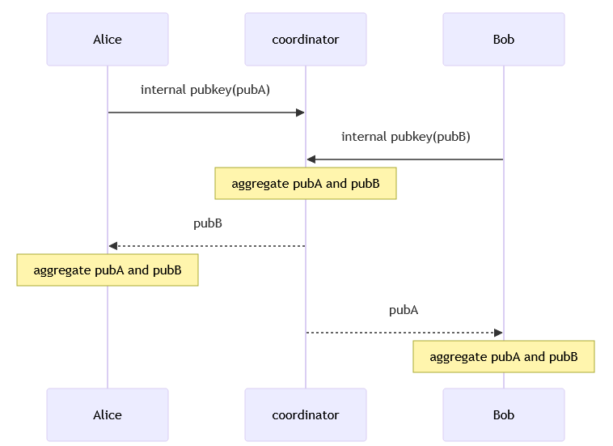
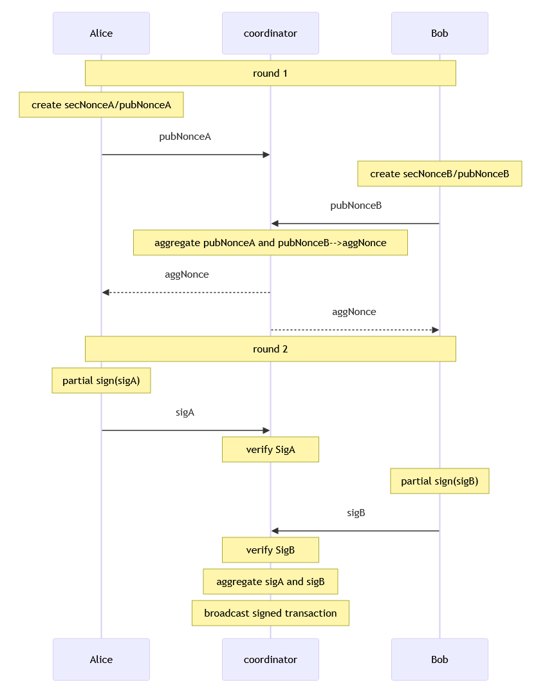

## Generate MultiSig pubkey

libsecp256k1 library returns `secp256k1_musig_keyagg_cache` when calculating public key aggregation. 
This value is used when calculating partial signatures.

## Sign

In libsecp256k1 library, calling `secp256k1_musig_nonce_process()` returns `secp256k1_musig_session`. 
This value is used when calculating partial signatures and aggregate signatures.

## リンク

* 開発日記
  * [btc: MuSig - hiro99ma blog](https://blog.hirokuma.work/2025/01/20250131-btc.html)
  * [btc: MuSigは難しい - hiro99ma blog](https://blog.hirokuma.work/2025/02/20250201-btc.html)
  * [btc: libsecp256k1 は MuSig 2 だった - hiro99ma blog](https://blog.hirokuma.work/2025/02/20250202-btc.html)
  
