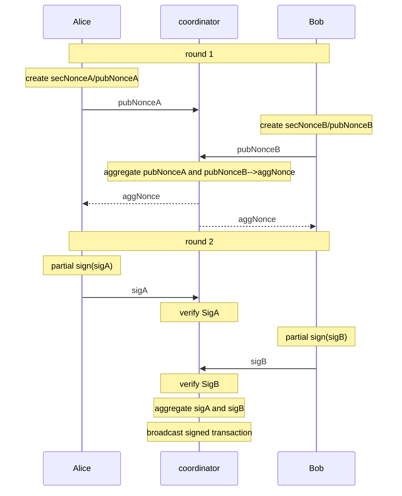

## Generate MultiSig pubkey

libsecp256k1 library returns `secp256k1_musig_keyagg_cache` when calculating public key aggregation. 
This value is used when calculating partial signatures.

## Sign

In libsecp256k1 library, calling `secp256k1_musig_nonce_process()` returns `secp256k1_musig_session`. 
This value is used when calculating partial signatures and aggregate signatures.

