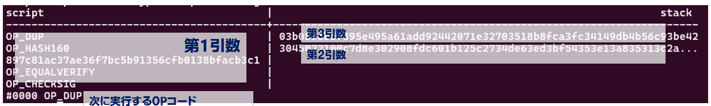
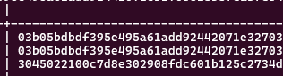
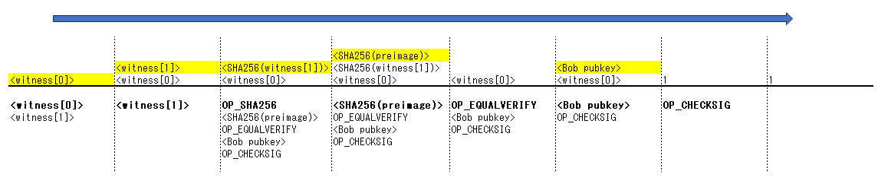

# tools: btcdeb

[repository](https://github.com/bitcoin-core/btcdeb)

_2025/03/12_: v0.3.20

## 用途

btcdeb は Bitcoinスクリプトのデバッガである。

## インストール

```console
$ sudo apt-get install libtool libssl-dev autoconf pkg-config
$ git clone https://github.com/bitcoin-core/btcdeb.git
$ cd btcdeb
$ ./autogen.sh
$ ./configure --prefix $HOME/.local --enable-dangerous
$ make
$ make install
```

* Releaseタグが 0.3.20 は 2020年10月と古かったので master 版を使用した(2025年3月現在)
  * 最後の commit は [2024年4月](https://github.com/bitcoin-core/btcdeb/commit/e2c2e7b9fe2ecc0884129b53813a733f93a6e2c7)である
* configure で `--prefix` でインストール先に `$HOME/.local` を指定している
* インストールされる実行ファイルは `btcc`, `btcdeb`, `tap`, `test-btcdeb`
* configure で `--enable-dangerous` を付けると署名関係の機能が有効になる

## コマンド

### btcc

OPコードをスクリプトの HEX文字列にコンパイルする。

```console
$ btcc
syntax: btcc <program>
e.g. btcc OP_DUP OP_HASH160 '[62e907b15cbf27d5425399ebf6f0fb50ebb88f18]' OP_EQUALVERIFY OP_CHECKSIG
```

ただ、このヘルプの通りに実行すると `62e9...` の 20バイトデータを push する `0x14` を付与したデータを push する `0x15` を付与している。

```console
$ btcc OP_DUP OP_HASH160 '[62e907b15cbf27d5425399ebf6f0fb50ebb88f18]' OP_EQUALVERIFY OP_CHECKSIG
76a9151462e907b15cbf27d5425399ebf6f0fb50ebb88f1888ac
```

`[]` で囲まなければ良い。
シングルクォーテーションは Linux のコマンドラインで処理されるので、あってもなくてもよい。

```console
$ OP_DUP OP_HASH160 897c81ac37ae36f7bc5b91356cfb0138bfacb3c1 OP_EQUALVERIFY OP_CHECKSIG
76a9151462e907b15cbf27d5425399ebf6f0fb50ebb88f1888ac
```

クォーテーションで囲む場所を間違えると OPコードを文字列を ASCIIコードとして HEX文字列にされてしまう。
スクリプトに文字列を使うことはほとんどないと思うので、クォーテーションで囲んだりしなくても良いだろう。

```console
$ btcc 'OP_DUP OP_HASH160 [62e907b15cbf27d5425399ebf6f0fb50ebb88f18] OP_EQUALVERIFY OP_CHECKSIG'
warning: opcode-like string was not an opcode: DUP OP_HASH160 [62e907b15cbf27d5425399ebf6f0fb50ebb88f18] OP_EQUALVERIFY OP_CHECKSIG
4c574f505f445550204f505f48415348313630205b363265393037623135636266323764353432353339396562663666306662353065626238386631385d204f505f455155414c564552494659204f505f434845434b534947
```

数値は、10進数になりそうなら10進数、16進数になりそうなら16進数で扱っているようだ。  
`[]` で囲んでいてもそのルールのようであったが、今ひとつ `[]` の使い方が分からない。

```console
$ btcc 144
029000

$ btcc 0x90
0190

$ btcc '0x90'
0190

$ btcc '[90]'
warning: ambiguous input 90 is interpreted as a numeric value; use 0x90 to force into hexadecimal interpretation
02015a

$ btcc a0
01a0

$ btcc '[a0]'
0201a0
```

桁数が多いと HEXとして扱うようなので HASH値は大丈夫だろう。

```console
# decimal
$ btcc OP_DUP OP_HASH160 112233445566778899 OP_EQUALVERIFY OP_CHECKSIG
warning: ambiguous input 112233445566778899 is interpreted as a numeric value; use 0x112233445566778899 to force into hexadecimal interpretation
76a908130eed5eb9bb8e0188ac

# hex
$ btcc OP_DUP OP_HASH160 00112233445566778899 OP_EQUALVERIFY OP_CHECKSIG
76a90a0011223344556677889988ac
```

### btcdeb

スクリプトデバッガである。  
基本的な使い方は、引数に Bitcoinスクリプトなどの情報を与え、ステップ実行していくことになる。  
終了コマンドはないので Ctrl+C で終わらせる。

コマンドだけで実行してもエラーにはならない。  
バージョンはよくわからない。以前のバージョン体系が残ったままなのかもしれない。

```console
$ btcdeb
btcdeb 5.0.24 -- type `btcdeb -h` for start up options
LOG: signing segwit taproot
notice: btcdeb has gotten quieter; use --verbose if necessary (this message is temporary)
0 op script loaded. type `help` for usage information
script  |  stack
--------+--------
btcdeb>
```

#### help

```console
btcdeb> help
step     Execute one instruction and iterate in the script.
rewind   Go back in time one instruction.
stack    Print stack content.
altstack Print altstack content.
vfexec   Print vfexec content.
exec     Execute command.
tf       Transform a value using a given function.
print    Print script.
help     Show help information.
btcdeb>
```

#### 引数

最初の `'[]'` で囲んだ 1まとまりが Bitcoinスクリプト、それ以降はスペース区切りごとにスタックに積まれるようだ。
`''` で囲まなかったり `[]` で囲まなかったりするとエラーになった。
`''` で囲むのはスペースがあってもひとまとまりにするためである。
環境変数などを使う場合は `""` で囲むこと。

第2引数以降は順番にスタックに積まれていく。
[ドキュメント](https://github.com/bitcoin-core/btcdeb/blob/master/doc/btcdeb.md)の最初にあるサンプルを実行するとこうなる。



この状態でステップ実行すると `OP_DUP` が行われ、一番上の `03b0...` のデータがスタックに積まれる。



#### ステップ実行の様子

ステップ実行はこのようになる。

<video controls>
  <source src="btcdeb-1.mp4" type="video/mp4" />
</video>

ステップ実行前に単語をダブルクリックして反転させているのは、見る場所を指しているだけで操作としての意味は無い。
秘密鍵は伝えていないので `OP_CHECKSIG` でエラーになって終わる。  
なお、"step" を "s" のような省略はできないが、Enter だけ入力すると前回と同じコマンドが実行される。

#### Raw Transaction データを使う

raw transaction がわかる場合は、そのデータを使うのが簡単である。

```console
$ txin="input transactionのHEXデータ"
$ tx="transactionのHEXデータ"
$ btcdeb --txin=$txin --tx=$tx
```

もし `$tx` のトランザクションに vin が複数ある場合は `-s` でどれなのかを指定する(デフォルトは `0`)。

#### print

表示されている "script" には現在の状況が出力されている。  
最初からどこまで進んだのか確認したい場合は "print" コマンドを使う。

```console
btcdeb> print
    #0000 OP_DUP
 -> #0001 OP_HASH160
    #0002 e1b85f2f9d795d7c84871330d1640314264e5f3a
    #0003 OP_EQUALVERIFY
    #0004 OP_CHECKSIG
```

この場合、次に "step" と入力すると `OP_HASH160` が実行される。

### tap

調査中

`tap` は Tapscript で使用することができる。
`btcdeb` でもできるようだが、まずは `tap` を使うことをお勧めされている。

* [Tapscript example using Tap](https://github.com/bitcoin-core/btcdeb/blob/master/doc/tapscript-example-with-tap.md)
* [Tapscript example](https://github.com/bitcoin-core/btcdeb/blob/master/doc/tapscript-example.md)

#### [Scenario](https://github.com/bitcoin-core/btcdeb/blob/e2c2e7b9fe2ecc0884129b53813a733f93a6e2c7/doc/tapscript-example-with-tap.md#scenario)

単に Tapscript の説明をしているだけである。  
最後の方で設定する変数をドキュメントで使っているので、そこだけ目を通せば良いだろう。  
`$privkey` と `$pubkey` は key path ルート用の internal key である。
pubkey は 圧縮された 33 byte ではなく x-only の 32 byte HEX文字列である。  
`$script_alice` に Alice 鍵で送金するスクリプト、`$script_bob` に Bob 鍵で送金スクリプトを設定する。
どちらもスペースを含んだ文字列なので、引数として使うときは `""` で囲む。

#### [Generating a Taproot commitment](https://github.com/bitcoin-core/btcdeb/blob/e2c2e7b9fe2ecc0884129b53813a733f93a6e2c7/doc/tapscript-example-with-tap.md#generating-a-taproot-commitment)

まず、鍵とスクリプトからアドレスを生成。
アドレスは regtest 用になっていた。
`-pbc` などとして HRP の変更は可能である。

```console
$ tap $pubkey 2 "${script_alice}" "${script_bob}"
tap 5.0.24 -- type `tap -h` for help
WARNING: This is experimental software. Do not use this with real bitcoin, or you will most likely lose them all. You have been w a r n e d.
LOG: sign segwit taproot
Internal pubkey: f30544d6009c8d8d94f5d030b2e844b1a3ca036255161c479db1cca5b374dd1c
2 scripts:
- #0: 029000b275209997a497d964fc1a62885b05a51166a65a90df00492c8d7cf61d6accf54803beac
- #1: a8206c60f404f8167a38fc70eaf8aa17ac351023bef86bcb9d1086a19afe95bd533388204edfcf9dfe6c0b5c83d1ab3f78d1b39a46ebac6798e08e19761f5ed89ec83c10ac
Script #0 leaf hash = TapLeaf<<0xc0 || 029000b275209997a497d964fc1a62885b05a51166a65a90df00492c8d7cf61d6accf54803beac>>
 → c81451874bd9ebd4b6fd4bba1f84cdfb533c532365d22a0a702205ff658b17c9
Script #1 leaf hash = TapLeaf<<0xc0 || a8206c60f404f8167a38fc70eaf8aa17ac351023bef86bcb9d1086a19afe95bd533388204edfcf9dfe6c0b5c83d1ab3f78d1b39a46ebac6798e08e19761f5ed89ec83c10ac>>
 → 632c8632b4f29c6291416e23135cf78ecb82e525788ea5ed6483e3c6ce943b42
Branch (#0, #1)
 → 41646f8c1fe2a96ddad7f5471bc4fee7da98794ef8c45a4f4fc6a559d60c9f6b
Tweak value = TapTweak(f30544d6009c8d8d94f5d030b2e844b1a3ca036255161c479db1cca5b374dd1c || 41646f8c1fe2a96ddad7f5471bc4fee7da98794ef8c45a4f4fc6a559d60c9f6b) = 620fc4000ba539753ffa0e5893b4243cb1cf0a258cf8a09a9038f5f1352607a9
Tweaked pubkey = a5ba0871796eb49fb4caa6bf78e675b9455e2d66e751676420f8381d5dda8951 (not even)
Resulting Bech32m address: bcrt1p5kaqsuted66fldx256lh3en4h9z4uttxuagkwepqlqup6hw639gsm28t6c
```

いろいろ出力されているが、P2TR script path のアドレスを求める計算過程である。
Tapscript から merkle tree の leaf になるハッシュ値を求め、
merkle root を計算し、internal pubkey を含めて tweak pubkey の計算をしてアドレスに変換している。  
アドレスの始まりは `bcrt1p` とセパレータ `1` の次が `p` なのは P2TR が segwit version 1 だからである(`p` は bech32m で `1`)。
segwit version 0 の P2WPKH と P2WSH は `bcrt1q` と `q` で、bech32 の `0` である。

最後の方に出力されている「not even」は pubkey が偶数ではない(最下位ビットに 1 が立っている)ことを表している。
この情報はパリティビット的に使われていて、tweaked private key や control block で使われる。

アドレスができたので、ドキュメントでは `bitcoin-cli sendtoaddress` で送金している。
`getrawtransaction` で取得した raw transaction を変数 `$txin` に格納しているのはこれから使うためである。  
`$vout` に `0` を代入しているのは送金先アドレスが `vout#0` 側だったためだ。
どちらになるかはランダムなので出力を確認すること。  
(そこまでやるなら TXID も変数に代入すれば良いのにと思った。)  
送金の準備ができていない場合は[ウォレットの作成](https://blog.hirokuma.work/bitcoin/01_basics/bitcoind.html#%E3%82%A6%E3%82%A9%E3%83%AC%E3%83%83%E3%83%88%E3%81%AE%E4%BD%9C%E6%88%90)を参照のこと。

#### [Taproot spend](https://github.com/bitcoin-core/btcdeb/blob/e2c2e7b9fe2ecc0884129b53813a733f93a6e2c7/doc/tapscript-example-with-tap.md#taproot-spend)

作成したアドレスへ送金されたトランザクションを単独鍵で送金する(key path spend)。  
コーディングせずに `tap` で署名された raw transaction を作る。

`bitcoin-cli testmempoolaccept` を使って送金できるかどうかの確認をする。  
このコマンドを知らなかったのだが [testmempoolaccept ](https://developer.bitcoin.org/reference/rpc/testmempoolaccept.html) は `sendrawtransaction` の展開しないバージョンと思えばよさそうだ。  
そうすることで、key path での spend ができることを確認して、同じトランザクションで script path での spend も確認できるというわけである。

また、鍵での spend を taproot send、スクリプトでの spend を tapscript send と呼んでいるようである。

まず、`createrawtransaction` で input に前節の送金先 outpoint(TXID と index)を、output に新しく作ったアドレスを指定する。
送金額はお釣りが出ないようにほどほどだ。  
この時点で、scriptSig も witness も空のトランザクションができるので `$tx` に代入しておく。
ただ、このコマンドラインの書き方だとシングルクォーテーションの中で `$vout` を使っているので変数が展開されないと思う。
変数の前後で `'` を入れ込んで

```console
$ txin=前のraw transaction
$ txid=INPUTのTXID
$ vout=INPUTのindex
$ send=`bitcoin-cli -regtest getnewaddress`
$ tx=`bitcoin-cli -regtest createrawtransaction '[{"txid":"'$txid'","vout":'$vout'}]' '[{"'$send'":0.0009}]'`
```

前回実行した `tap` のオプションに `--txin=$txin --tx=$tx` を付けると以下の分が増えていた。
TXID や vout が異なるのでドキュメントと一致はしない。

```log
input tx index = 0; tx input vout = 1; value = 100000
got witness stack of size 1
34 bytes (v0=P2WSH, v1=taproot/tapscript)
valid script
- generating prevout hash from 1 ins
[+] COutPoint(8c51c8dfcd, 1)
SignatureHashSchnorr(in_pos=0, hash_type=00)
- taproot sighash
sighash (little endian) = a64c91394cfed6ed9a7497af13793d818a351dea3c4a584c867a7b907d759862
NOTE: there is a placeholder signature at the end of the witness data for the resulting transaction below; this must be replaced with a 64 byte signature for the sighash given above
Resulting transaction: 02000000000101bc2165a4797d59358f31a0a20b2c94534bff89a38d958a2768ed66cddfc8518c0100000000fdffffff01905f0100000000001600145368d413b9816b53d18d79ba898c70765e9f113d0140000102030405060708090a0b0c0d0e0f000102030405060708090a0b0c0d0e0f000102030405060708090a0b0c0d0e0f000102030405060708090a0b0c0d0e0f00000000
```

最後の Resulting transaction は witness に 64 byte のスタックが 1つだけ載っていたが、
これはダミーの値が入っているだけで、この場所に署名した値を入れてくれという意味である。  
sighash も出力されているので、おそらくそれをデジタル署名すれば良いのだろう。

ここで `tap` に `--privkey=$privkey` を追加すると署名をしてくれるようだが、
もし btcdeb を署名できるようにしていないならエラーになる。

```
this feature requires that you compile with --enable-dangerous set; either provide a signature yourself, or recompile tap
```

`tf` が提案されているが、これもビルドオプションを付けていないので使えない。

```txt
btcdeb> tf -h
addr-to-scriptpubkey [address] convert a base58 encoded address into its corresponding scriptPubKey
add              [value1] [value2] add two values together
bech32-decode    [string]  decode [string] into a pubkey using bech32 encoding
bech32-encode    [pubkey]  encode [pubkey] using bech32 encoding
bech32m-encode   [pubkey]  encode [pubkey] using bech32m encoding
base58chk-decode [string]  decode [string] into a pubkey using base58 encoding (with checksum)
base58chk-encode [pubkey]  encode [pubkey] using base58 encoding (with checksum)
combine-pubkeys  [pubkey1] [pubkey2] combine the two pubkeys into one pubkey
echo             [*]       show as-is serialized value
hash160          [message] perform HASH160 (RIPEMD160(SHA256(message))
hash256          [message] perform HASH256 (SHA256(SHA256(message))
hex              [*]       convert into a hex string
int              [arg]     convert into an integer
len              [*]       show length of expression in bytes
jacobi-symbol    [n] ([k]) calculate the Jacobi symbol for n modulo k, where k defaults to the secp256k1 field size
prefix-compact-size [value] prefix [value] with its compact size encoded byte length
pubkey-to-xpubkey [pubkey] convert the given pubkey into an x-only pubkey, as those used in taproot/tapscript
reverse          [arg]     reverse the value according to the type
ripemd160        [message] perform RIPEMD160
sha256           [message] perform SHA256
scriptpubkey-to-addr [script]  convert a scriptPubKey into its corresponding base58 encoded address
sub              [value1] [value2] subtract value2 from value1
tagged-hash      [tag] [message] generate the [tag]ged hash of [message]
taproot-tweak-pubkey [pubkey] [tweak] tweak the pubkey with the tweak
tweak-pubkey     [value] [pubkey] multiply the pubkey with the given 32 byte value
verify-sig       [sighash] [pubkey] [signature] verify the given signature for the given sighash and pubkey (der)
verify-sig-compact [sighash] [pubkey] [signature] verify the given signature for the given sighash and pubkey (compact)

The inline operators have slightly different names; they are called: addr_to_spk add b32d b32e b32me b58cd b58ce combine_pubkeys echo hash160 hash256 hex int len jacobi_sym prefix_compact_size pubkey_to_xpubkey reverse ripemd160 sha256 spk_to_addr sub tagged_hash taproot_tweak_pubkey tweak_pubkey verify_sig verify_sig_compact
```

`configure --enable-dangerous` を追加してビルドした実行ファイルを使うと以下が増えていた。

```txt
combine-privkeys [privkey1] [privkey2] combine the two private keys into one private key
decode-wif       [string]  decode [string] into a private key using the Wallet Import Format
encode-wif       [privkey] encode [privkey] using the Wallet Import Format
get-pubkey       [privkey] get the public key corresponding to the given private key
get-xpubkey      [privkey] get the x-only public key corresponding to the given private key
multiply-privkeys [privkey1] [privkey2] multiply a privkey with another
sign             [sighash] [privkey] generate an ECDSA signature for the given message (sighash) using the given private key (der)
sign-compact     [sighash] [privkey] generate an ECSDA signature for the given message (sighash) using the given private key (compact)
sign_schnorr     [sighash] [privkey] generate a Schnorr signature for the given message (sighash) using the given private key (der)
taproot-tweak-seckey [privkey] [tweak] tweak the given private key with the tweak
```

結局署名できるようにビルドしないとダメだったので、`tap --privkey=$privkey` で試した。  
今度は最後に署名入りのトランザクションが出力され、`testmempoolaccept` も "allowed: true" になった。  
`btcdeb --txin=$txin --tx=$tx` で両方の raw transaction を指定してステップ実行すると成功で終わった。  
(`tap` ではできなかった。)

自分が勘違いしていたことに気付いた。  
key でも tapscript でも解くことができる場合、internal pubkey から tweaked pubkey を作るのに merkle root の結果を使うので署名するときは internal privkey で行うのかと思っていたのだ。  
実際は、internal key から tweaked privkey を作るときと同じく merkle root を使った tweak 値を使った tweaked privkey で署名するのだった。

#### [Tapscript spend](https://github.com/bitcoin-core/btcdeb/blob/e2c2e7b9fe2ecc0884129b53813a733f93a6e2c7/doc/tapscript-example-with-tap.md#tapscript-spend)

作成したアドレスへ送金されたトランザクションをスクリプトを解いて送金する(script path spend)。  
コーディングせずに `tap` で署名された raw transaction を作る。  
このスクリプトは Alice ルートと Bob ルートの 2つがあるのだが、
Alice ルートは INPUT トランザクションが 144 confirm 以上経過するという条件があるという理由で Bob ルートだけになっている
(regtest なので `generatetoaddress` するだけだと思うのだが)。

##### Bob ルート

Bob ルートのスクリプトは以下で、SHA256 の preimage と Bob 鍵での署名で解く。

```bitcoin
OP_SHA256
<SHA256(preimage)>
OP_EQUALVERIFY
<Bob pubkey>
OP_CHECKSIG
```



witness は 4つ使う。  
`[0]`, `[1]` がスクリプトを解くためのデータ、`[2]` がスクリプト、`[3]` が control block である。
なぜかここでは "control object" という名前になっている(BIP-341 では "control block")。  
バージョンとパリティ、internal pubkey と witness に載せたスクリプトから merkle root を求めるためのデータを置く場所である。
もしスクリプトが 1つしかないのであれば、そのまま merkle root になるので最後のデータは載せない。  
その辺りの詳細は [BIP-341](https://github.com/bitcoin/bips/blob/master/bip-0341.mediawiki) などを読むとよい。

key path spend のときの環境変数をそのまま使う。

```console
$ txin=前のraw transaction
$ txid=INPUTのTXID
$ vout=INPUTのindex
$ send=`bitcoin-cli -regtest getnewaddress`
$ tx=`bitcoin-cli -regtest createrawtransaction '[{"txid":"'$txid'","vout":'$vout'}]' '[{"'$send'":0.0009}]'`
```

そして同じく `tap` コマンドを使用するが、スクリプトを並べた最後にどのスクリプトで解くかを番号で指定する。
引数に並べた順でゼロオリジン(ゼロ始まり)で、Bob の方だから `1` である。

```console
$ tap --tx=$tx --txin=$txin $pubkey 2 "${script_alice}" "${script_bob}" 1
tap 5.0.24 -- type `tap -h` for help
WARNING: This is experimental software. Do not use this with real bitcoin, or you will most likely lose them all. You have been w a r n e d.
LOG: sign segwit taproot
targeting transaction vin at index #0
Internal pubkey: f30544d6009c8d8d94f5d030b2e844b1a3ca036255161c479db1cca5b374dd1c
1 spending argument present
- 1+ spend arguments; TAPSCRIPT mode
2 scripts:
- #0: 029000b275209997a497d964fc1a62885b05a51166a65a90df00492c8d7cf61d6accf54803beac
- #1: a8206c60f404f8167a38fc70eaf8aa17ac351023bef86bcb9d1086a19afe95bd533388204edfcf9dfe6c0b5c83d1ab3f78d1b39a46ebac6798e08e19761f5ed89ec83c10ac
Script #0 leaf hash = TapLeaf<<0xc0 || 029000b275209997a497d964fc1a62885b05a51166a65a90df00492c8d7cf61d6accf54803beac>>
 → c81451874bd9ebd4b6fd4bba1f84cdfb533c532365d22a0a702205ff658b17c9
Script #1 leaf hash = TapLeaf<<0xc0 || a8206c60f404f8167a38fc70eaf8aa17ac351023bef86bcb9d1086a19afe95bd533388204edfcf9dfe6c0b5c83d1ab3f78d1b39a46ebac6798e08e19761f5ed89ec83c10ac>>
 → 632c8632b4f29c6291416e23135cf78ecb82e525788ea5ed6483e3c6ce943b42
Branch (#0, #1)
 → 41646f8c1fe2a96ddad7f5471bc4fee7da98794ef8c45a4f4fc6a559d60c9f6b
Control object = (leaf), (internal pubkey = f30544d6009c8d8d94f5d030b2e844b1a3ca036255161c479db1cca5b374dd1c), ...
... with proof -> f30544d6009c8d8d94f5d030b2e844b1a3ca036255161c479db1cca5b374dd1cc81451874bd9ebd4b6fd4bba1f84cdfb533c532365d22a0a702205ff658b17c9
Tweak value = TapTweak(f30544d6009c8d8d94f5d030b2e844b1a3ca036255161c479db1cca5b374dd1c || 41646f8c1fe2a96ddad7f5471bc4fee7da98794ef8c45a4f4fc6a559d60c9f6b) = 620fc4000ba539753ffa0e5893b4243cb1cf0a258cf8a09a9038f5f1352607a9
Tweaked pubkey = a5ba0871796eb49fb4caa6bf78e675b9455e2d66e751676420f8381d5dda8951 (not even)
Pubkey matches the scriptPubKey of the input transaction's output #1
Resulting Bech32m address: bcrt1p5kaqsuted66fldx256lh3en4h9z4uttxuagkwepqlqup6hw639gsm28t6c
Final control object = c1f30544d6009c8d8d94f5d030b2e844b1a3ca036255161c479db1cca5b374dd1cc81451874bd9ebd4b6fd4bba1f84cdfb533c532365d22a0a702205ff658b17c9
Adding selected script to taproot inputs: a8206c60f404f8167a38fc70eaf8aa17ac351023bef86bcb9d1086a19afe95bd533388204edfcf9dfe6c0b5c83d1ab3f78d1b39a46ebac6798e08e19761f5ed89ec83c10ac
 → 45a8206c60f404f8167a38fc70eaf8aa17ac351023bef86bcb9d1086a19afe95bd533388204edfcf9dfe6c0b5c83d1ab3f78d1b39a46ebac6798e08e19761f5ed89ec83c10ac
appending control object to taproot input stack: c1f30544d6009c8d8d94f5d030b2e844b1a3ca036255161c479db1cca5b374dd1cc81451874bd9ebd4b6fd4bba1f84cdfb533c532365d22a0a702205ff658b17c9
Tapscript spending witness: [
 "000102030405060708090a0b0c0d0e0f000102030405060708090a0b0c0d0e0f000102030405060708090a0b0c0d0e0f000102030405060708090a0b0c0d0e0f",
 "a8206c60f404f8167a38fc70eaf8aa17ac351023bef86bcb9d1086a19afe95bd533388204edfcf9dfe6c0b5c83d1ab3f78d1b39a46ebac6798e08e19761f5ed89ec83c10ac",
 "c1f30544d6009c8d8d94f5d030b2e844b1a3ca036255161c479db1cca5b374dd1cc81451874bd9ebd4b6fd4bba1f84cdfb533c532365d22a0a702205ff658b17c9",
]
input tx index = 0; tx input vout = 1; value = 100000
got witness stack of size 3
34 bytes (v0=P2WSH, v1=taproot/tapscript)
Taproot commitment:
- control  = c1f30544d6009c8d8d94f5d030b2e844b1a3ca036255161c479db1cca5b374dd1cc81451874bd9ebd4b6fd4bba1f84cdfb533c532365d22a0a702205ff658b17c9
- program  = a5ba0871796eb49fb4caa6bf78e675b9455e2d66e751676420f8381d5dda8951
- script   = a8206c60f404f8167a38fc70eaf8aa17ac351023bef86bcb9d1086a19afe95bd533388204edfcf9dfe6c0b5c83d1ab3f78d1b39a46ebac6798e08e19761f5ed89ec83c10ac
- path len = 1
- p        = f30544d6009c8d8d94f5d030b2e844b1a3ca036255161c479db1cca5b374dd1c
- q        = a5ba0871796eb49fb4caa6bf78e675b9455e2d66e751676420f8381d5dda8951
- k        = 423b94cec6e38364eda58e7825e582cb8ef75c13236e4191629cf2b432862c63          (tap leaf hash)
  (TapLeaf(0xc0 || a8206c60f404f8167a38fc70eaf8aa17ac351023bef86bcb9d1086a19afe95bd533388204edfcf9dfe6c0b5c83d1ab3f78d1b39a46ebac6798e08e19761f5ed89ec83c10ac))
valid script
- generating prevout hash from 1 ins
[+] COutPoint(8c51c8dfcd, 1)
SignatureHashSchnorr(in_pos=0, hash_type=00)
- tapscript sighash
sighash (little endian) = 0a416d90a014762701f2985f9c06faf273256d94f3ebacd64e1eabc35bc8bdd5
NOTE: there is a placeholder signature at the end of the witness data for the resulting transaction below; this must be replaced with a 64 byte signature for the sighash given above
Resulting transaction: 02000000000101bc2165a4797d59358f31a0a20b2c94534bff89a38d958a2768ed66cddfc8518c0100000000fdffffff01905f010000000000160014c74a6770432fa9fbea938b8db2bb444f03f954990340000102030405060708090a0b0c0d0e0f000102030405060708090a0b0c0d0e0f000102030405060708090a0b0c0d0e0f000102030405060708090a0b0c0d0e0f45a8206c60f404f8167a38fc70eaf8aa17ac351023bef86bcb9d1086a19afe95bd533388204edfcf9dfe6c0b5c83d1ab3f78d1b39a46ebac6798e08e19761f5ed89ec83c10ac41c1f30544d6009c8d8d94f5d030b2e844b1a3ca036255161c479db1cca5b374dd1cc81451874bd9ebd4b6fd4bba1f84cdfb533c532365d22a0a702205ff658b17c900000000
```

control block(control object) は分解するとこういうデータである。
tweaked pubkey の Y座標が奇数なので parity bit が立っている。  
merkle leaf はスクリプトが Bob のものなので、反対側の leaf は Alice のスクリプトを "TapLeaf" で tagged hash 計算した値になっている。
この値からでは Alice のスクリプトが想像できないので、スクリプトを全部のセルよりは情報が隠されていてよい、というところである。

```
# version + parity bit
c1

# internal pubkey
f30544d6009c8d8d94f5d030b2e844b1a3ca036255161c479db1cca5b374dd1c

# merkle leaf[0]
c81451874bd9ebd4b6fd4bba1f84cdfb533c532365d22a0a702205ff658b17c9
```

`Tapscript spending witness` には仮の witness として `0001...0e0f` が差し込んである。  
解くためのデータはこちらでしていしないとわからないためである。

"Script #0" と "Script #1" はそれぞれ Alice スクリプトと Bob スクリプトである。  
merkle tree を作るときの leaf hash は Alice が `c814...`、Bob が `632c...` である。  
Tapscript の merkle tree は leaf が 2つあってそれをまとめた leaf を作る場合、左側の方が小さい値になるように並べ替える。
なので計算上は Bob, Alice の順で連結する。

まずは最後に出力された "Resulting transaction" の raw transaction を `btcdeb` で解こうとしている。  
もちろん仮の witness なのですぐに failure になるのだが、それより前にチェックしている内容の説明を行っている。
ここでは変数 `tx_bob に得られた "Resulting transaction" を代入している。

```console
$ btcdeb --txin=$txin --tx=$tx_bob
......
8 op script loaded. type `help` for usage information
script                                                             |                                                             stack
-------------------------------------------------------------------+-------------------------------------------------------------------
<<< taproot commitment >>>                                         |                                                               i: 0
Branch: c81451874bd9ebd4b6fd4bba1f84cdfb533c532365d22a0a702205f... | k: 632c8632b4f29c6291416e23135cf78ecb82e525788ea5ed6483e3c6ce94...
Tweak: f30544d6009c8d8d94f5d030b2e844b1a3ca036255161c479db1cca5... |
CheckTapTweak                                                      |
<<< committed script >>>                                           |
OP_SHA256                                                          |
6c60f404f8167a38fc70eaf8aa17ac351023bef86bcb9d1086a19afe95bd5333   |
OP_EQUALVERIFY                                                     |
4edfcf9dfe6c0b5c83d1ab3f78d1b39a46ebac6798e08e19761f5ed89ec83c10   |
OP_CHECKSIG                                                        |
#0000 Branch: c81451874bd9ebd4b6fd4bba1f84cdfb533c532365d22a0a702205ff658b17c9
```

script の列を見ると、まず "taproot commitment" でそもそもスクリプトを評価するに値するものなのかチェックする。  
チェックが通ったら "committed script" でスクリプトの評価を行う。

stack の列に `i` と `k` が載っている。
`i` は index、`k` は taproot commitment の値だそうな。  
この `632c...` は Bob スクリプトの leaf hash 値である。
次に実行されるのは "#0000" で `c814...` を `k` の leaf hash の相方として使って branch hash を求める処理である。  
`c814...` は witness の最後にある control block から取得しているはずだ。
step 実行するとこうなる。

```
btcdeb> step
- looping over path (0..0)
  - 0: node = c8...; taproot control node match -> k first
  (TapBranch(TapLeaf(0xc0 || a8206c60f404f8167a38fc70eaf8aa17ac351023bef86bcb9d1086a19afe95bd533388204edfcf9dfe6c0b5c83d1ab3f78d1b39a46ebac6798e08e19761f5ed89ec83c10ac) || Span<33,32>=c81451874bd9ebd4b6fd4bba1f84cdfb533c532365d22a0a702205ff658b17c9))
  - 0: k -> 6b9f0cd659a5c64f4f5ac4f84e7998dae7fec41b47f5d7da6da9e21f8c6f6441
script                                                             |                                                             stack
-------------------------------------------------------------------+-------------------------------------------------------------------
<<< taproot commitment >>>                                         |                                                               i: 1
Branch: c81451874bd9ebd4b6fd4bba1f84cdfb533c532365d22a0a702205f... | k: 41646f8c1fe2a96ddad7f5471bc4fee7da98794ef8c45a4f4fc6a559d60c...
Tweak: f30544d6009c8d8d94f5d030b2e844b1a3ca036255161c479db1cca5... |
CheckTapTweak                                                      |
<<< committed script >>>                                           |
OP_SHA256                                                          |
6c60f404f8167a38fc70eaf8aa17ac351023bef86bcb9d1086a19afe95bd5333   |
OP_EQUALVERIFY                                                     |
4edfcf9dfe6c0b5c83d1ab3f78d1b39a46ebac6798e08e19761f5ed89ec83c10   |
OP_CHECKSIG                                                        |
#0001 Tweak: f30544d6009c8d8d94f5d030b2e844b1a3ca036255161c479db1cca5b374dd1c
```

`i` が次に進んで `1` になり、`k` が `4164...` になっている。
`tap` を実行した結果にある "Branch (#0, #1)" の値と同じである。  
しかしトランザクションには merkle root の値は載っていないのでこれだけでは検証できない。

merkle root の値と internal pubkey の値を使って tweaked pubkey の計算をする。  
internal pubkey は control block に載っている。  
tweaked pubkey は P2TR の場合 witness program の後半 32バイトと同じなので
input のトランザクションから取得できる。  
つまり次に実行する "#0001" は以下を比較するものである。

* 計算した tweaked pubkey
  * control block から得た internal pubkey
  * 先ほど計算した merkle root
* input トランザクションから得た tweaked pubkey

step 実行するとこうなった。

```
btcdeb> step
- looping over path (0..0)
- q.CheckTapTweak(p, k, 1) == success
script                                                             |                                                             stack
-------------------------------------------------------------------+-------------------------------------------------------------------
OP_SHA256                                                          | 000102030405060708090a0b0c0d0e0f000102030405060708090a0b0c0d0e0...
6c60f404f8167a38fc70eaf8aa17ac351023bef86bcb9d1086a19afe95bd5333   |
OP_EQUALVERIFY                                                     |
4edfcf9dfe6c0b5c83d1ab3f78d1b39a46ebac6798e08e19761f5ed89ec83c10   |
OP_CHECKSIG                                                        |
#0002 CheckTapTweak
```

`q.CheckTapTweak()` をして成功になっているのは良いが、"#0002" として "CheckTapTweak" を実行することになっている？  
ということは、一番下に出力されるのは実行をした命令ということだろうか？  
しかしその理屈だと [Script debugger](https://github.com/bitcoin-core/btcdeb/blob/e2c2e7b9fe2ecc0884129b53813a733f93a6e2c7/doc/btcdeb.md#script-debugger) は `OP_DUP` なのでスタックには複製されたデータが載っていないといけないはずだがそうなっていない。
この段階で stack には `witness[0]` のデータが載っているので、実際はステップが 1つ進んでいると思っておくのがよさそうだ。  
つまりここでは "#0002 CheckTapTweak" は既に実行された命令が表示されていて、次に step 実行すると "OP_SHA256" が処理されるのだ。

```
btcdeb> step
                <> POP  stack
                <> PUSH stack 1c4672a4c6713bcb9495abba712be251bbeff723d79f001f81e5170b1d1627a5
script                                                             |                                                             stack
-------------------------------------------------------------------+-------------------------------------------------------------------
6c60f404f8167a38fc70eaf8aa17ac351023bef86bcb9d1086a19afe95bd5333   |   1c4672a4c6713bcb9495abba712be251bbeff723d79f001f81e5170b1d1627a5
OP_EQUALVERIFY                                                     |
4edfcf9dfe6c0b5c83d1ab3f78d1b39a46ebac6798e08e19761f5ed89ec83c10   |
OP_CHECKSIG                                                        |
#0003 OP_SHA256
```

次に step 実行すると hash 値がスタックに積まれ、さらに step 実行すると `OP_EQUALVERIFY` が処理され、不一致なので失敗する。

```
btcdeb> step
                <> PUSH stack 6c60f404f8167a38fc70eaf8aa17ac351023bef86bcb9d1086a19afe95bd5333
script                                                             |                                                             stack
-------------------------------------------------------------------+-------------------------------------------------------------------
OP_EQUALVERIFY                                                     |   6c60f404f8167a38fc70eaf8aa17ac351023bef86bcb9d1086a19afe95bd5333
4edfcf9dfe6c0b5c83d1ab3f78d1b39a46ebac6798e08e19761f5ed89ec83c10   |   1c4672a4c6713bcb9495abba712be251bbeff723d79f001f81e5170b1d1627a5
OP_CHECKSIG                                                        |
#0004 6c60f404f8167a38fc70eaf8aa17ac351023bef86bcb9d1086a19afe95bd5333
btcdeb> step
                <> POP  stack
                <> POP  stack
                <> PUSH stack
error: Script failed an OP_EQUALVERIFY operation
```

次にドキュメントでは、`-k<Bob privkey>` オプションと引数の最後に SHA256 の preimage を追加して実行している。
これによって "Tapscript spending witness" では preimage が先頭に追加されている。  
また、それ以降で Bob privkey での署名まで行われ、"Resulting transaction" 

```console
$ tap -k${bob_key} --tx=$tx --txin=$txin  $pubkey 2 "${script_alice}" "${script_bob}" 1 107661134f21fc7c02223d50ab9eb3600bc3ffc3712423a1e47bb1f9a9dbf55f
tap 5.0.24 -- type `tap -h` for help
WARNING: This is experimental software. Do not use this with real bitcoin, or you will most likely lose them all. You have been w a r n e d.
LOG: sign segwit taproot
targeting transaction vin at index #0
Internal pubkey: f30544d6009c8d8d94f5d030b2e844b1a3ca036255161c479db1cca5b374dd1c
2 spending arguments present
- 1+ spend arguments; TAPSCRIPT mode
  #0: 107661134f21fc7c02223d50ab9eb3600bc3ffc3712423a1e47bb1f9a9dbf55f
2 scripts:
- #0: 029000b275209997a497d964fc1a62885b05a51166a65a90df00492c8d7cf61d6accf54803beac
- #1: a8206c60f404f8167a38fc70eaf8aa17ac351023bef86bcb9d1086a19afe95bd533388204edfcf9dfe6c0b5c83d1ab3f78d1b39a46ebac6798e08e19761f5ed89ec83c10ac
Script #0 leaf hash = TapLeaf<<0xc0 || 029000b275209997a497d964fc1a62885b05a51166a65a90df00492c8d7cf61d6accf54803beac>>
 → c81451874bd9ebd4b6fd4bba1f84cdfb533c532365d22a0a702205ff658b17c9
Script #1 leaf hash = TapLeaf<<0xc0 || a8206c60f404f8167a38fc70eaf8aa17ac351023bef86bcb9d1086a19afe95bd533388204edfcf9dfe6c0b5c83d1ab3f78d1b39a46ebac6798e08e19761f5ed89ec83c10ac>>
 → 632c8632b4f29c6291416e23135cf78ecb82e525788ea5ed6483e3c6ce943b42
Branch (#0, #1)
 → 41646f8c1fe2a96ddad7f5471bc4fee7da98794ef8c45a4f4fc6a559d60c9f6b
Control object = (leaf), (internal pubkey = f30544d6009c8d8d94f5d030b2e844b1a3ca036255161c479db1cca5b374dd1c), ...
... with proof -> f30544d6009c8d8d94f5d030b2e844b1a3ca036255161c479db1cca5b374dd1cc81451874bd9ebd4b6fd4bba1f84cdfb533c532365d22a0a702205ff658b17c9
Tweak value = TapTweak(f30544d6009c8d8d94f5d030b2e844b1a3ca036255161c479db1cca5b374dd1c || 41646f8c1fe2a96ddad7f5471bc4fee7da98794ef8c45a4f4fc6a559d60c9f6b) = 620fc4000ba539753ffa0e5893b4243cb1cf0a258cf8a09a9038f5f1352607a9
Tweaked pubkey = a5ba0871796eb49fb4caa6bf78e675b9455e2d66e751676420f8381d5dda8951 (not even)
Pubkey matches the scriptPubKey of the input transaction's output #1
Resulting Bech32m address: bcrt1p5kaqsuted66fldx256lh3en4h9z4uttxuagkwepqlqup6hw639gsm28t6c
Final control object = c1f30544d6009c8d8d94f5d030b2e844b1a3ca036255161c479db1cca5b374dd1cc81451874bd9ebd4b6fd4bba1f84cdfb533c532365d22a0a702205ff658b17c9
Adding selected script to taproot inputs: a8206c60f404f8167a38fc70eaf8aa17ac351023bef86bcb9d1086a19afe95bd533388204edfcf9dfe6c0b5c83d1ab3f78d1b39a46ebac6798e08e19761f5ed89ec83c10ac
 → 20107661134f21fc7c02223d50ab9eb3600bc3ffc3712423a1e47bb1f9a9dbf55f45a8206c60f404f8167a38fc70eaf8aa17ac351023bef86bcb9d1086a19afe95bd533388204edfcf9dfe6c0b5c83d1ab3f78d1b39a46ebac6798e08e19761f5ed89ec83c10ac
appending control object to taproot input stack: c1f30544d6009c8d8d94f5d030b2e844b1a3ca036255161c479db1cca5b374dd1cc81451874bd9ebd4b6fd4bba1f84cdfb533c532365d22a0a702205ff658b17c9
Tapscript spending witness: [
 "107661134f21fc7c02223d50ab9eb3600bc3ffc3712423a1e47bb1f9a9dbf55f",
 "a8206c60f404f8167a38fc70eaf8aa17ac351023bef86bcb9d1086a19afe95bd533388204edfcf9dfe6c0b5c83d1ab3f78d1b39a46ebac6798e08e19761f5ed89ec83c10ac",
 "c1f30544d6009c8d8d94f5d030b2e844b1a3ca036255161c479db1cca5b374dd1cc81451874bd9ebd4b6fd4bba1f84cdfb533c532365d22a0a702205ff658b17c9",
]
input tx index = 0; tx input vout = 1; value = 100000
got witness stack of size 3
34 bytes (v0=P2WSH, v1=taproot/tapscript)
Taproot commitment:
- control  = c1f30544d6009c8d8d94f5d030b2e844b1a3ca036255161c479db1cca5b374dd1cc81451874bd9ebd4b6fd4bba1f84cdfb533c532365d22a0a702205ff658b17c9
- program  = a5ba0871796eb49fb4caa6bf78e675b9455e2d66e751676420f8381d5dda8951
- script   = a8206c60f404f8167a38fc70eaf8aa17ac351023bef86bcb9d1086a19afe95bd533388204edfcf9dfe6c0b5c83d1ab3f78d1b39a46ebac6798e08e19761f5ed89ec83c10ac
- path len = 1
- p        = f30544d6009c8d8d94f5d030b2e844b1a3ca036255161c479db1cca5b374dd1c
- q        = a5ba0871796eb49fb4caa6bf78e675b9455e2d66e751676420f8381d5dda8951
- k        = 423b94cec6e38364eda58e7825e582cb8ef75c13236e4191629cf2b432862c63          (tap leaf hash)
  (TapLeaf(0xc0 || a8206c60f404f8167a38fc70eaf8aa17ac351023bef86bcb9d1086a19afe95bd533388204edfcf9dfe6c0b5c83d1ab3f78d1b39a46ebac6798e08e19761f5ed89ec83c10ac))
valid script
- generating prevout hash from 1 ins
[+] COutPoint(8c51c8dfcd, 1)
SignatureHashSchnorr(in_pos=0, hash_type=00)
- tapscript sighash
sighash (little endian) = 683969510c01013c294eceb1971588ccba7af9be073879db1b5243845d1c0205
sighash: 683969510c01013c294eceb1971588ccba7af9be073879db1b5243845d1c0205
privkey: 81b637d8fcd2c6da6359e6963113a1170de795e4b725b84d1e0b4cfd9ec58ce9
pubkey: 4edfcf9dfe6c0b5c83d1ab3f78d1b39a46ebac6798e08e19761f5ed89ec83c10
signature: 95e8e7ffa3f8d9ad976d1ed62c2214813fe08d5d65e6becf0584e02c8bca65320145ada870ed3f538b96fad0db98f88732570ec323ac614e88ed0d8e73badd3c
Resulting transaction: 02000000000101bc2165a4797d59358f31a0a20b2c94534bff89a38d958a2768ed66cddfc8518c0100000000fdffffff01905f010000000000160014749b0061e363d888a7bf9453a518735aca75415a044095e8e7ffa3f8d9ad976d1ed62c2214813fe08d5d65e6becf0584e02c8bca65320145ada870ed3f538b96fad0db98f88732570ec323ac614e88ed0d8e73badd3c20107661134f21fc7c02223d50ab9eb3600bc3ffc3712423a1e47bb1f9a9dbf55f45a8206c60f404f8167a38fc70eaf8aa17ac351023bef86bcb9d1086a19afe95bd533388204edfcf9dfe6c0b5c83d1ab3f78d1b39a46ebac6798e08e19761f5ed89ec83c10ac41c1f30544d6009c8d8d94f5d030b2e844b1a3ca036255161c479db1cca5b374dd1cc81451874bd9ebd4b6fd4bba1f84cdfb533c532365d22a0a702205ff658b17c900000000
```

"Resulting transaction" のデータを `bitcoin-cli decoderawtransaction` すると witness はこうなっていた。  
preimage である `1076...` の前に "signature" に `95e8...` が追加されている。

```
      "txinwitness": [
        "95e8e7ffa3f8d9ad976d1ed62c2214813fe08d5d65e6becf0584e02c8bca65320145ada870ed3f538b96fad0db98f88732570ec323ac614e88ed0d8e73badd3c",
        "107661134f21fc7c02223d50ab9eb3600bc3ffc3712423a1e47bb1f9a9dbf55f",
        "a8206c60f404f8167a38fc70eaf8aa17ac351023bef86bcb9d1086a19afe95bd533388204edfcf9dfe6c0b5c83d1ab3f78d1b39a46ebac6798e08e19761f5ed89ec83c10ac",
        "c1f30544d6009c8d8d94f5d030b2e844b1a3ca036255161c479db1cca5b374dd1cc81451874bd9ebd4b6fd4bba1f84cdfb533c532365d22a0a702205ff658b17c9"
      ],
      "sequence": 4294967293
```

`bitcoin-cli testmempoolaccept` も成功するので大丈夫だろう。

```console
$ bitcoin-cli testmempoolaccept '["02000000000101bc2165a4797d59358f31a0a20b2c94534bff89a38d958a2768ed66cddfc8518c0100000000fdffffff01905f010000000000160014749b0061e363d888a7bf9453a518735aca75415a044095e8e7ffa3f8d9ad976d1ed62c2214813fe08d5d65e6becf0584e02c8bca65320145ada870ed3f538b96fad0db98f88732570ec323ac614e88ed0d8e73badd3c20107661134f21fc7c02223d50ab9eb3600bc3ffc3712423a1e47bb1f9a9dbf55f45a8206c60f404f8167a38fc70eaf8aa17ac351023bef86bcb9d1086a19afe95bd533388204edfcf9dfe6c0b5c83d1ab3f78d1b39a46ebac6798e08e19761f5ed89ec83c10ac41c1f30544d6009c8d8d94f5d030b2e844b1a3ca036255161c479db1cca5b374dd1cc81451874bd9ebd4b6fd4bba1f84cdfb533c532365d22a0a702205ff658b17c900000000"]'
[
  {
    "txid": "6a96f9144c6de9136efd6e8ffe6f72430536dfa1f2832a8de2b3da1d6323c44a",
    "wtxid": "64f291bea1583ecbdc15e8d9c2cb137606f0fb7c47884aacace489e7ac14f0de",
    "allowed": true,
    "vsize": 142,
    "fees": {
      "base": 0.00010000,
      "effective-feerate": 0.00070422,
      "effective-includes": [
        "64f291bea1583ecbdc15e8d9c2cb137606f0fb7c47884aacace489e7ac14f0de"
      ]
    }
  }
]
```

##### Alice ルート

Alice ルートはドキュメントにないので自分でやってみよう。

スクリプトは `OP_CHECKSEQUENCEVERIFY`(以下 `OP_CSV`) で confirm が満たしているかどうかチェックした後、
`OP_CSV` が残したスタックを `OP_DROP` で削除した後 Alice 鍵で署名のチェックをする。  
HTLC でよくあるパターンだ。

```bitcoin
144 OP_CHECKSEQUENCEVERIFY OP_DROP
9997a497d964fc1a62885b05a51166a65a90df00492c8d7cf61d6accf54803be
OP_CHECKSIG
```

witness に置くのは Alice 鍵での署名だけで、それ以外は Bitcoin ノードが自分で判断する。  
するのだが、`btcdeb` はオフラインのツールなのでブロックチェーンを参照できない。
OP_CSV や OP_CLTV のような OPコードはどう扱うのだろうか。

実際にやってみる。  
`tap` では Alice のスクリプトを使うことと `-k` で Alice の鍵を指定するだけである。

```console
$ tap -k${alice_key} --tx=$tx --txin=$txin  $pubkey 2 "${script_alice}" "${script_bob}" 0
tap 5.0.24 -- type `tap -h` for help
WARNING: This is experimental software. Do not use this with real bitcoin, or you will most likely lose them all. You have been w a r n e d.
LOG: sign segwit taproot
targeting transaction vin at index #0
Internal pubkey: f30544d6009c8d8d94f5d030b2e844b1a3ca036255161c479db1cca5b374dd1c
1 spending argument present
- 1+ spend arguments; TAPSCRIPT mode
2 scripts:
- #0: 029000b275209997a497d964fc1a62885b05a51166a65a90df00492c8d7cf61d6accf54803beac
- #1: a8206c60f404f8167a38fc70eaf8aa17ac351023bef86bcb9d1086a19afe95bd533388204edfcf9dfe6c0b5c83d1ab3f78d1b39a46ebac6798e08e19761f5ed89ec83c10ac
Script #0 leaf hash = TapLeaf<<0xc0 || 029000b275209997a497d964fc1a62885b05a51166a65a90df00492c8d7cf61d6accf54803beac>>
 → c81451874bd9ebd4b6fd4bba1f84cdfb533c532365d22a0a702205ff658b17c9
Script #1 leaf hash = TapLeaf<<0xc0 || a8206c60f404f8167a38fc70eaf8aa17ac351023bef86bcb9d1086a19afe95bd533388204edfcf9dfe6c0b5c83d1ab3f78d1b39a46ebac6798e08e19761f5ed89ec83c10ac>>
 → 632c8632b4f29c6291416e23135cf78ecb82e525788ea5ed6483e3c6ce943b42
Branch (#0, #1)
 → 41646f8c1fe2a96ddad7f5471bc4fee7da98794ef8c45a4f4fc6a559d60c9f6b
Control object = (leaf), (internal pubkey = f30544d6009c8d8d94f5d030b2e844b1a3ca036255161c479db1cca5b374dd1c), ...
... with proof -> f30544d6009c8d8d94f5d030b2e844b1a3ca036255161c479db1cca5b374dd1c632c8632b4f29c6291416e23135cf78ecb82e525788ea5ed6483e3c6ce943b42
Tweak value = TapTweak(f30544d6009c8d8d94f5d030b2e844b1a3ca036255161c479db1cca5b374dd1c || 41646f8c1fe2a96ddad7f5471bc4fee7da98794ef8c45a4f4fc6a559d60c9f6b) = 620fc4000ba539753ffa0e5893b4243cb1cf0a258cf8a09a9038f5f1352607a9
Tweaked pubkey = a5ba0871796eb49fb4caa6bf78e675b9455e2d66e751676420f8381d5dda8951 (not even)
Pubkey matches the scriptPubKey of the input transaction's output #1
Resulting Bech32m address: bcrt1p5kaqsuted66fldx256lh3en4h9z4uttxuagkwepqlqup6hw639gsm28t6c
Final control object = c1f30544d6009c8d8d94f5d030b2e844b1a3ca036255161c479db1cca5b374dd1c632c8632b4f29c6291416e23135cf78ecb82e525788ea5ed6483e3c6ce943b42
Adding selected script to taproot inputs: 029000b275209997a497d964fc1a62885b05a51166a65a90df00492c8d7cf61d6accf54803beac
 → 27029000b275209997a497d964fc1a62885b05a51166a65a90df00492c8d7cf61d6accf54803beac
appending control object to taproot input stack: c1f30544d6009c8d8d94f5d030b2e844b1a3ca036255161c479db1cca5b374dd1c632c8632b4f29c6291416e23135cf78ecb82e525788ea5ed6483e3c6ce943b42
Tapscript spending witness: [
 "029000b275209997a497d964fc1a62885b05a51166a65a90df00492c8d7cf61d6accf54803beac",
 "c1f30544d6009c8d8d94f5d030b2e844b1a3ca036255161c479db1cca5b374dd1c632c8632b4f29c6291416e23135cf78ecb82e525788ea5ed6483e3c6ce943b42",
]
input tx index = 0; tx input vout = 1; value = 100000
got witness stack of size 2
34 bytes (v0=P2WSH, v1=taproot/tapscript)
Taproot commitment:
- control  = c1f30544d6009c8d8d94f5d030b2e844b1a3ca036255161c479db1cca5b374dd1c632c8632b4f29c6291416e23135cf78ecb82e525788ea5ed6483e3c6ce943b42
- program  = a5ba0871796eb49fb4caa6bf78e675b9455e2d66e751676420f8381d5dda8951
- script   = 029000b275209997a497d964fc1a62885b05a51166a65a90df00492c8d7cf61d6accf54803beac
- path len = 1
- p        = f30544d6009c8d8d94f5d030b2e844b1a3ca036255161c479db1cca5b374dd1c
- q        = a5ba0871796eb49fb4caa6bf78e675b9455e2d66e751676420f8381d5dda8951
- k        = c9178b65ff0522700a2ad26523533c53fbcd841fba4bfdb6d4ebd94b875114c8          (tap leaf hash)
  (TapLeaf(0xc0 || 029000b275209997a497d964fc1a62885b05a51166a65a90df00492c8d7cf61d6accf54803beac))
valid script
- generating prevout hash from 1 ins
[+] COutPoint(8c51c8dfcd, 1)
SignatureHashSchnorr(in_pos=0, hash_type=00)
- tapscript sighash
sighash (little endian) = 7b704722384b75aac51ee3951d6473b8dfddb69c96003f6366bb38e0a86ec4d0
sighash: 7b704722384b75aac51ee3951d6473b8dfddb69c96003f6366bb38e0a86ec4d0
privkey: 2bd806c97f0e00af1a1fc3328fa763a9269723c8db8fac4f93af71db186d6e90
pubkey: 9997a497d964fc1a62885b05a51166a65a90df00492c8d7cf61d6accf54803be
signature: 378405e48058a323a3bed54f8b9018556d9effb74df5ed038697539ece8937abc6f6870122811752fc525497b77081eaa15231a8751adfa291145e2f1ee6cdd2
Resulting transaction: 02000000000101bc2165a4797d59358f31a0a20b2c94534bff89a38d958a2768ed66cddfc8518c0100000000fdffffff01905f010000000000160014749b0061e363d888a7bf9453a518735aca75415a0340378405e48058a323a3bed54f8b9018556d9effb74df5ed038697539ece8937abc6f6870122811752fc525497b77081eaa15231a8751adfa291145e2f1ee6cdd227029000b275209997a497d964fc1a62885b05a51166a65a90df00492c8d7cf61d6accf54803beac41c1f30544d6009c8d8d94f5d030b2e844b1a3ca036255161c479db1cca5b374dd1c632c8632b4f29c6291416e23135cf78ecb82e525788ea5ed6483e3c6ce943b4200000000
```

`bitcoin-cli decoderawtransaction` した witness はこうなって署名が積まれていた。

```
      "txinwitness": [
        "378405e48058a323a3bed54f8b9018556d9effb74df5ed038697539ece8937abc6f6870122811752fc525497b77081eaa15231a8751adfa291145e2f1ee6cdd2",
        "029000b275209997a497d964fc1a62885b05a51166a65a90df00492c8d7cf61d6accf54803beac",
        "c1f30544d6009c8d8d94f5d030b2e844b1a3ca036255161c479db1cca5b374dd1c632c8632b4f29c6291416e23135cf78ecb82e525788ea5ed6483e3c6ce943b42"
      ],
      "sequence": 4294967293
```

なるほど、`tap` はデバッガではないので `OP_CSV` は気にしなくてよいのだった。  
では `btcdeb` でデバッグするとどうなるのだろう。
"Resulting transaction" を tx_alice という変数に入れておく。

```console
$ btcdeb --txin=$txin --tx=$tx_alice
btcdeb 5.0.24 -- type `btcdeb -h` for start up options
LOG: signing segwit taproot
notice: btcdeb has gotten quieter; use --verbose if necessary (this message is temporary)
input tx index = 0; tx input vout = 1; value = 100000
got witness stack of size 3
34 bytes (v0=P2WSH, v1=taproot/tapscript)
Taproot commitment:
- control  = c1f30544d6009c8d8d94f5d030b2e844b1a3ca036255161c479db1cca5b374dd1c632c8632b4f29c6291416e23135cf78ecb82e525788ea5ed6483e3c6ce943b42
- program  = a5ba0871796eb49fb4caa6bf78e675b9455e2d66e751676420f8381d5dda8951
- script   = 029000b275209997a497d964fc1a62885b05a51166a65a90df00492c8d7cf61d6accf54803beac
- path len = 1
- p        = f30544d6009c8d8d94f5d030b2e844b1a3ca036255161c479db1cca5b374dd1c
- q        = a5ba0871796eb49fb4caa6bf78e675b9455e2d66e751676420f8381d5dda8951
- k        = c9178b65ff0522700a2ad26523533c53fbcd841fba4bfdb6d4ebd94b875114c8          (tap leaf hash)
  (TapLeaf(0xc0 || 029000b275209997a497d964fc1a62885b05a51166a65a90df00492c8d7cf61d6accf54803beac))
valid script
- generating prevout hash from 1 ins
[+] COutPoint(8c51c8dfcd, 1)
8 op script loaded. type `help` for usage information
script                                                             |                                                             stack
-------------------------------------------------------------------+-------------------------------------------------------------------
<<< taproot commitment >>>                                         |                                                               i: 0
Branch: 632c8632b4f29c6291416e23135cf78ecb82e525788ea5ed6483e3c... | k: c81451874bd9ebd4b6fd4bba1f84cdfb533c532365d22a0a702205ff658b...
Tweak: f30544d6009c8d8d94f5d030b2e844b1a3ca036255161c479db1cca5... |
CheckTapTweak                                                      |
<<< committed script >>>                                           |
9000                                                               |
OP_CHECKSEQUENCEVERIFY                                             |
OP_DROP                                                            |
9997a497d964fc1a62885b05a51166a65a90df00492c8d7cf61d6accf54803be   |
OP_CHECKSIG                                                        |
#0000 Branch: 632c8632b4f29c6291416e23135cf78ecb82e525788ea5ed6483e3c6ce943b42
btcdeb>
```

"taproot commitment" のあとに "commited script" が続くのは同じである。
Branch, Tweak, CheckTapTweak が成功するのも同じなので省略する。  
次に step 実行すると `OP_CSV` で確認する値がスタックに積まれる。

```
btcdeb> step
                <> PUSH stack 9000
script                                                             |                                                             stack
-------------------------------------------------------------------+-------------------------------------------------------------------
OP_CHECKSEQUENCEVERIFY                                             |                                                               9000
OP_DROP                                                            | 378405e48058a323a3bed54f8b9018556d9effb74df5ed038697539ece8937a...
9997a497d964fc1a62885b05a51166a65a90df00492c8d7cf61d6accf54803be   |
OP_CHECKSIG                                                        |
#0003 9000
```

そして step 実行すると・・・エラーになった。

```
btcdeb> step
error: Locktime requirement not satisfied
```

やはり時間について何かする必要があるのだろうか？  
その前にここで思い出してほしいのは、`decoderawtransaction` したときの witness と一緒に載せた sequence だ。
`4294967293` は 16進数で `0xFFFF_FFFD` と RBF できる値にしてあるだけで `OP_CSV` のことを考慮していない。
`OP_CSV` は [sequenceをチェックする](https://github.com/bitcoin/bips/blob/master/bip-0068.mediawiki) のだ。

しかし、sequence は witness ではなく txin にあるため値を変更すると書名も変わる。
なので `tap` のオプションで指定できるとよいのだが見つからない。
"sequence" で検索してもそれらしい記述を見つけられないのだが、どうしたらよいのだろうか？

##### bitcoinjs で作るとこう

自分での動作確認用に bitcoinjs-lib で評価アプリを作成した。

* [btcdeb-test](https://github.com/hirokuma/js-scriptpath/tree/e6ae1e2968e939743dbd63dcd4d26b80fb06a5bd)
  * アドレス作成して送金、1ブロック生成、keypath, Bob, Alice(1回目), 143ブロック生成、Alice(2回目)の順


## リンク

* 開発日記
  * [btc: btcdebを使う - hiro99ma blog](https://blog.hirokuma.work/2025/01/20250119-btc.html)
  * [btc: btcdebを使う (2) - hiro99ma blog](https://blog.hirokuma.work/2025/01/20250120-btc.html)
  * [btc: btcdebを使う (3) - hiro99ma blog](https://blog.hirokuma.work/2025/01/20250121-btc.html)
