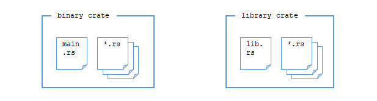
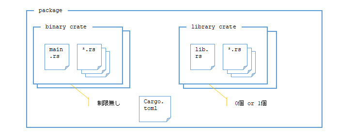
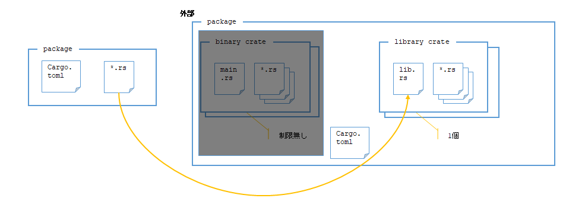

## 勉強中

## 概要

プログラムを複数のファイルに分割したときの取り扱い方について。  
Cargoを使う前提とする。

## 参考

* [肥大化していくプロジェクトをパッケージ、クレート、モジュールを利用して管理する - The Rust Programming Language 日本語版](https://doc.rust-jp.rs/book-ja/ch07-00-managing-growing-projects-with-packages-crates-and-modules.html)
* [Cargoのワークスペース - The Rust Programming Language 日本語版](https://doc.rust-jp.rs/book-ja/ch14-03-cargo-workspaces.html)

## クレート(crate)

コンパイルは「クレート」が最小単位となっている。



[バイナリクレート](https://doc.rust-lang.org/cargo/reference/cargo-targets.html#binaries)と[ライブラリクレート](https://doc.rust-lang.org/cargo/reference/cargo-targets.html#library)の種類が生まれるのはパッケージのようにも思うが、細かく区別する必要もないだろう。  
バイナリクレートは`cargo new --bin`(`--bin`はデフォルトなのでなくてもよい)で作られるタイプで`src/main.rs`がエントリーポイントと思っていて良いだろう。  
ライブラリクレートは`src/lib.rs`を持つ。

`cargo add`はクレートを追加する[Manifestコマンド](https://doc.rust-lang.org/cargo/commands/cargo-add.html)で、空のクレートを追加するのではなく`Cargo.toml`に依存関係を追加するコマンドである。
「`Cargo.toml` Manifestファイル」と書いてあるので、Manifestコマンドは`Cargo.toml`に関するコマンドだろう。

## パッケージ(package)

「パッケージ」は1つ以上のクレートを持つ。  
`cargo new`で作られるのはパッケージである。[packageコマンド](https://doc.rust-lang.org/cargo/commands/package-commands.html)という分類になっている。



ライブラリクレートは最大でも1つなので`src/lib.rs`があるかどうかでわかる。  
`Cargo.toml`では`[lib]`セクションでカスタマイズできる。

バイナリクレートも`src/main.rs`があるかどうかでわかるのだが、こちらは複数持つことができる。その場合は`src/bin/`にディレクトリを作って`main.rs`を置く。  
`src/main.rs`を持たずに`src/bin/*`に複数のディレクトリを作ってそれぞれに`main.rs`を持っても良い。  
`Cargo.toml`では`[[bin]]`セクションでカスタマイズできる。括弧が1つ多い。

## モジュール(module)

クレートやパッケージがどちらかといえば物理的？なのに対して、モジュールはどちらかといえば論理的なものだという印象を持った。  
たぶん`mod`で定義できるからそう感じるのだろう。

`mod <mod名> {...}`という書き方は`mod`の定義と宣言を兼ねている。  
`mod <mod名>;`とすると、このファイルで`mod名`というモジュールを使用するという宣言になる。

### `mod`の定義

同じファイルの中にあるので定義と使用する宣言を兼ねている。  
`use`はC++の`using`と`using namespace`を混ぜたような使い方になる。

```rust
mod world_mod1 {
    pub mod world_mod2 {
        pub fn world_func() {
            println!("abc world")
        }
    }
}

use world_mod1::world_mod2::world_func as w;
use world_mod1::world_mod2 as w2;
use world_mod1 as w3;

fn main() {
    world_mod1::world_mod2::world_func();
    w();
    w2::world_func();
    w3::world_mod2::world_func();
}
```

### `mod名`のファイルを作る

例えば`hello_mod.rs`というファイルを作り、その中に`hello_func()`という関数を作ったとする。

```rust
pub fn hello_func() {
    println!("Hello, abc!");
}
```

それと同じディレクトリにある`main.rs`から`hello_func()`を呼び出したい場合はこうなる。

```rust
mod hello_mod;

fn main() {
  hello_mod::hello_func();
}
```

つまり`mod <ファイル名> {}`で定義したのと同じ意味を持つことになる。

### ディレクトリを作ってその下に`mod名`のファイルを作る

同じディレクトリではなく別のディレクトリにしたい場合もある。  

`hello_func()`を含んだファイルを`hello_mod2.rs`とする。  
ディレクトリ`hello_mod1`を作って`hello_mod2.rs`を移動させる。

そうすると、なんとなく`main.rs`からは`mod hello_mod1::hello_mod2;`と書けばよさそうな気がするが、そうは書けない。  
`mod`に書けるのは単独のモジュール名だけで`::`は使えないのだった。  
その代わりに、`hello_mod1.rs`というファイルを`main.rs`と同じディレクトリに作り、その中で`pub mod hello_mod2;`と書く。

* [ファイルの階層構造 - Rust By Example](https://doc.rust-lang.org/stable/rust-by-example/ja/mod/split.html)

以前は`mod.rs`というファイルに書く方式だったが今ではこうらしい。

### モジュールツリー

モジュールは入れ子にできるので、モジュールツリーと呼ぶツリー構造として表すようになっている。  
ツリーのルートは`main.rs`や`lib.rs`である。  
`use world_mod1::world_mod2 as w2;`のように書いたあれは相対パスのような表現で、
これを絶対パスのような表現にすると`use crate::world_mod1::world_mod2 as w2;`とルートを表す`crate::`が頭に付く。

そうなると、モジュールとして扱えるのは今のクレートの中だけということになるのでは？  
もちろんそういうことはなく、外部で既に公開されている関数などを使うこともできる。

* [外部のパッケージを使う](https://doc.rust-jp.rs/book-ja/ch07-04-bringing-paths-into-scope-with-the-use-keyword.html#%E5%A4%96%E9%83%A8%E3%81%AE%E3%83%91%E3%83%83%E3%82%B1%E3%83%BC%E3%82%B8%E3%82%92%E4%BD%BF%E3%81%86)

「パッケージ」なのだ。  
とはいえ実行ファイルを取り込むこともできないだろうから、ライブラリクレートを含むパッケージのはずである。  
パッケージには最大で 1つまでしかライブラリクレートを持つことができないので、ライブラリクレートを持つパッケージのみ`use`で使えるようにできるのだろう。




