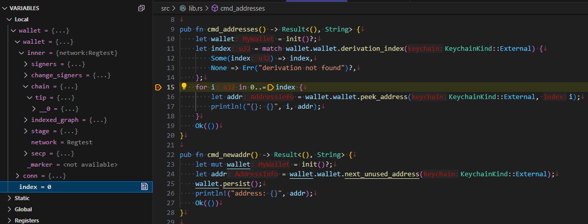

Visual Studio Code + CodeLLDB でのデバッグあれこれ。

## cargo run での実行

`launch.json` を新しく作ると `cargo run` するタイプの実行ができる。

```json
{
    "version": "0.2.0",
    "configurations": [
        {
            "name": "launch",
            "type": "lldb",
            "request": "launch",
            "cargo": {
                "args": [
                    "run",
                    "--bin=hello"
                ]
            },
            "args": []
        }
    ]
}
```

## コマンドライン引数の数が合わない

`env::args().collect().len()` でコマンドライン引数の数をきっちり決めたアプリを作っていると、
`cargo run` の形式でデバッグ実行すると引数があわない。  
これは末尾に自動的に引数が付与されてしまうからである。

自動的に付与されるのは外せなさそうなので、実行ファイルを直接 `program` で指定して実行することになりそう。

```json
{
    "version": "0.2.0",
    "configurations": [
        {
            "type": "lldb",
            "request": "launch",
            "name": "debug example",
            "program": "${workspaceFolder}/target/debug/example",
            "args": ["abc", "def"],
            "cwd": "${workspaceFolder}",
            "preLaunchTask": "rust: cargo build",
            "terminal": "integrated",
        }
    ]
```

`preLaunchTask` で実行前に行うタスクを指定できる。
vscode で候補を出して選ぶとよいだろう。

## ブレークポイントに止まらない

ブレークポイントに止まらないことがある。
これは lldb 側の問題で、シンボリックリンクのパスが挟まっているとダメらしい。  
回避案がこちらにある。

* [UbuntuのVSCodeでlldbを使ってRustコードをデバッグしたらブレークポイントが効かなくて困った - ま、そんなところで。](https://zv-louis.hatenablog.com/entry/2021/07/06/102907)

シンボリックリンクのディレクトリの中にあるディレクトリをさらにシンボリックリンクして。。。とかだと正式名称?がわからなくなってくる。  
`readlink -f <ディレクトリ名>` などで正式名称が取得できるので `"sourceMap": {"<readlink -f . したパス>": "pwd したパス"}` などでよいだろう。

```json
{
    "version": "0.2.0",
    "configurations": [
        {
            "type": "lldb",
            "request": "launch",
            "name": "debug example",
            "program": "${workspaceFolder}/target/debug/example",
            "args": [],
            "cwd": "${workspaceFolder}",
            "preLaunchTask": "rust: cargo build",
            "terminal": "integrated",
            "sourceMap": {"/mnt/wsl/usb-disk/rust/example": "/home/work/lesson/rust/example"}
        }
    ]
```

## デバッグで値をwatchしたい(調査中)

CodeLLDB は gdb みたいなものっぽくて、C/C++ のデバッグをしているような `$variants$` みたいな表示になっていてつらい。



なんかありそうな気はするのだけど、わからんのよね。  
Windows ではデバッグしやすいというコメントを見つけた。

一番近そうなのがこれだったが 7年も前だ。  
"LLDB Debugger" と "Native Debug" という vscode extension を使うようだけど、これで解決しているならたぶんもっと広まっていると思う。

* [How do I inspect local variables or use the watch window with Rust code using VSCode and LLDB? - Stack Overflow](https://stackoverflow.com/questions/48067874/how-do-i-inspect-local-variables-or-use-the-watch-window-with-rust-code-using-vs)

C/C++ はデバッガで扱えるし、スクリプト言語も有名どころであれば対応していると思う。  
つまり、デバッグ情報からオブジェクトの使い方を解釈して vscode の形式に変換してくれる何かが存在すれば何とかなる気がする。

rust-lldb というのはあるようだが、vscode で楽をしたいのよね。

* [Rustのコードを`rust-lldb`でデバッグする - Memory ice cubes](https://leaysgur.github.io/posts/2025/02/23/213809/)

