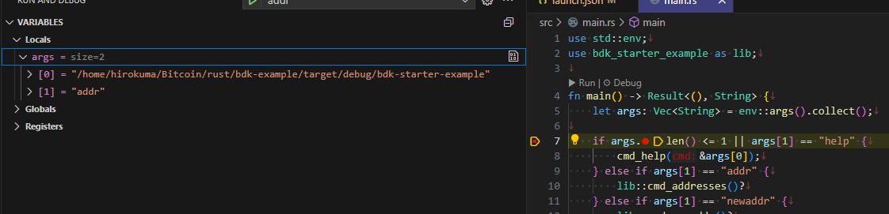

Visual Studio Code + CodeLLDB でのデバッグあれこれ。

## cargo run での実行

`launch.json` を新しく作ると `cargo run` するタイプの実行ができる。

```json
{
    "version": "0.2.0",
    "configurations": [
        {
            "name": "launch",
            "type": "lldb",
            "request": "launch",
            "cargo": {
                "args": [
                    "run",
                    "--bin=hello"
                ]
            },
            "args": []
        }
    ]
}
```

## コマンドライン引数の数が合わない

`env::args().collect().len()` でコマンドライン引数の数をきっちり決めたアプリを作っていると、
`cargo run` の形式でデバッグ実行すると引数があわない。  
これは末尾に自動的に引数が付与されてしまうからである。

自動的に付与されるのは外せなさそうなので、実行ファイルを直接 `program` で指定して実行することになりそう。

```json
{
    "version": "0.2.0",
    "configurations": [
        {
            "type": "lldb",
            "request": "launch",
            "name": "debug example",
            "program": "${workspaceFolder}/target/debug/example",
            "args": ["abc", "def"],
            "cwd": "${workspaceFolder}",
            "preLaunchTask": "rust: cargo build",
            "terminal": "integrated",
        }
    ]
```

`preLaunchTask` で実行前に行うタスクを指定できる。
vscode で候補を出して選ぶとよいだろう。

## ブレークポイントに止まらない

ブレークポイントに止まらないことがある。
これは lldb 側の問題で、シンボリックリンクのパスが挟まっているとダメらしい。  
回避案がこちらにある。

* [UbuntuのVSCodeでlldbを使ってRustコードをデバッグしたらブレークポイントが効かなくて困った - ま、そんなところで。](https://zv-louis.hatenablog.com/entry/2021/07/06/102907)

[lldbのsourceMap](https://github.com/vadimcn/codelldb/blob/master/MANUAL.md#source-path-remapping) は `{"<from>": "<to>"}` 形式らしい。  
複数指定できないのだろうか？  
もしかしたら、下に書いた "lldb-dap" にある配列形式が使えるかもしれない(未確認)。

シンボリックリンクのディレクトリの中にあるディレクトリをさらにシンボリックリンクして。。。とかだと正式名称?がわからなくなってくる。  
`readlink -f <ディレクトリ名>` などで正式名称が取得できるので `"sourceMap": {"<readlink -f . したパス>": "pwd したパス"}` などでよいだろう。

```json
{
    "version": "0.2.0",
    "configurations": [
        {
            "type": "lldb",
            "request": "launch",
            "name": "debug example",
            "program": "${workspaceFolder}/target/debug/example",
            "args": [],
            "cwd": "${workspaceFolder}",
            "preLaunchTask": "rust: cargo build",
            "terminal": "integrated",
            "sourceMap": {"/mnt/wsl/usb-disk/rust/example": "/home/work/lesson/rust/example"}
        }
    ]
```

## デバッグで値をwatchしたい

CodeLLDB は gdb みたいなものっぽくて、C/C++ のデバッグをしているような `$variants$` みたいな表示になっていてつらい。


lldp-dap でこの辺りを参考にして値が見えるようになった。  
全部の値なのかは分からないが、配列や文字列は参照できた。

* https://github.com/llvm/llvm-project/tree/main/lldb/tools/lldb-dap
* https://github.com/rust-lang/rust/tree/master/src/etc
* https://github.com/llvm/llvm-project/issues/134564#issuecomment-2825782949


### LLVM

lldb-dap の実行ファイルがないのでビルド済み LLVM からもらってくる。

* [Release LLVM 21.1.3 · llvm/llvm-project](https://github.com/llvm/llvm-project/releases/tag/llvmorg-21.1.3)
  * [Linux x86_64](https://github.com/llvm/llvm-project/releases/download/llvmorg-21.1.3/LLVM-21.1.3-Linux-X64.tar.xz)

`tar xf LLVM-21.1.3-Linux-X64.tar.xz` などで展開し、どこかに置く。  
どこがよいかよくわからんので `sudo mv LLVM-21.1.3-Linux-X64 /usr/local/LLVM-21.1.3` とした。

パスをいくつか通す。

```bash
LLVM_PATH=/usr/local/LLVM-21.1.3
export PATH=$LLVM_PATH/bin:$PATH
export LD_LIBRARY_PATH=$LLVM_PATH/lib:$LD_LIBRARY_PATH
export PYTHONPATH=`lldb -P`
```

`PYTHONPATH` は [lldb用](https://lldb.llvm.org/use/tutorials/implementing-standalone-scripts.html) の設定にあったので書いているが、必要かどうかよくわからない。

通した後で `lldb-dap` を実行してエラーにならず何も出力されなければひとまずOK。
Ctrl+Cで終わらせて良い。

### Python 3.10

私の環境では Python 3.10.12 が入っていたのだが、そうではない環境もあるだろう。  
そうすると `lldb-dap` を実行したとき、libpython3.10 なんとか so がない、みたいなエラーが出ると思う。  
環境変数 `PYTHONPATH` の先が `python3.10` なのでバージョン固定なのだろう。
`pyenv` をインストールして 3.10 の最新版を使えばよさそうだった。  
`lldb-dap` のときだけそのバージョンにすれば良いのだが、よくわからないので `pyenv global` で切り替えた。

```bash
export LD_LIBRARY_PATH=$LD_LIBRARY_PATH:`pyenv prefix`/lib
```

### rust の clone

[rust/src/etc/](https://github.com/rust-lang/rust/tree/master/src/etc) にあるファイルを使うのだが、
直接読み込むファイル以外にも必要そうだったのであきらめて git clone でまるまる持ってくる。

`git clone --depth=1 https://github.com/rust-lang/rust.git` などして適当に取ってくる。  
履歴管理しないので ZIP で持ってきても良い気がしてきたが、好みで。

このあとでパスを指定して参照するので、自分の隙な場所で良い。  
ここでは `/opt/rust` に置いた。

### vscode extension

Extension "lldb-dap" をインストール。

### launch.json

こういう感じで。

* `type` を `lldb-dap` にする
* `initCommands` を追加して設定
* `sourceMap` は [ブレークポイントに止まらない](#ブレークポイントに止まらない) を参考にして必要に応じて
  * [lldb-dapのsourceMap](https://github.com/llvm/llvm-project/blob/main/lldb/tools/lldb-dap/README.md#configuration-settings-reference) は `[string[2]]` なので `["<from>", "<to>"]` になるようだ。


```json
        {
            "name": "addr",
            "type": "lldb-dap",
            "request": "launch",
            "program": "${workspaceFolder}/target/debug/bdk-starter-example",
            "args": ["addr"],
            "initCommands": [
                "command script import /opt/rust/src/etc/lldb_lookup.py",
                "command source /opt/rust/src/etc/lldb_commands"
            ],
            "sourceMap": [
                ["/mnt/wsl/home2/xxx/Bitcoin/rust/bdk-example", "/home/xxx/Bitcoin/rust/bdk-example"]
            ],
            "cwd": "${workspaceFolder}"
        }
```

毎回設定するのは面倒なので、Settings に追加するのもよいだろう。

```json
    "lldb-dap.initCommands": [
        "command script import /opt/rust/src/etc/lldb_lookup.py",
        "command source /opt/rust//src/etc/lldb_commands"
    ]
```

### デバッグの実行

このように見える。


