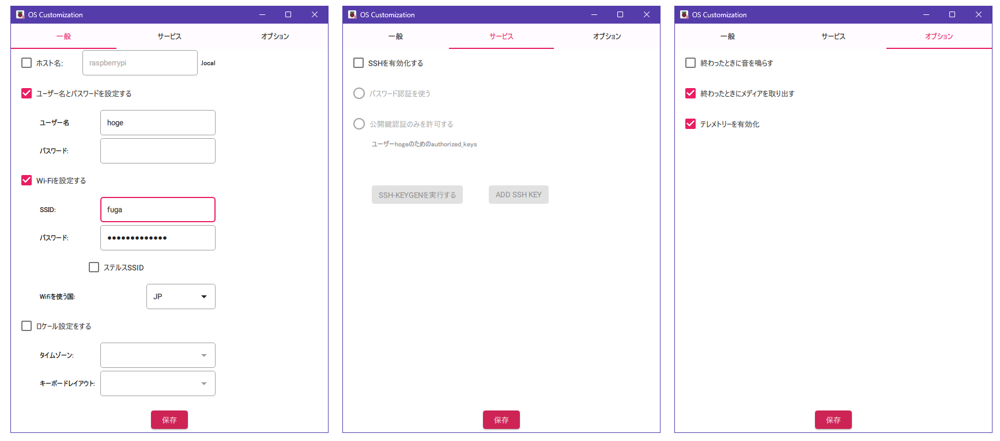

## 本体

うちにあってよく使いそうなものだけリンクを載せておく。

* [Buy a Raspberry Pi – Raspberry Pi](https://www.raspberrypi.com/products/)
  * [Pi4 Model B](https://www.raspberrypi.com/products/raspberry-pi-4-model-b/)
  * [Pi3 Model B+](https://www.raspberrypi.com/products/raspberry-pi-3-model-b-plus/)
  * [Pi3 Model B](https://www.raspberrypi.com/products/raspberry-pi-3-model-b/)

## Pi Imager

Raspbian OSは[Pi Imager](https://www.raspberrypi.com/software/)を使ってSDカードを作るのが楽だろう。  
これを使うと、OSイメージをダウンロードしてSDカードに展開するだけでなく、デフォルトのままにしたくないhostnameやログインアカウント、WiFi設定やSSH設定などのカスタマイズができる。

* <a href="images/imager1.png"></a>
* <a href="images/imager2.png"></a>

私はWindows版のv1.9.4を使ったのだが、いくつかうまくいかなかった。
詳しいことは調べていないのでやり方が悪かっただけかもしれない。

* SSHは有効になったが`authorized_keys`が設定されなかった
  * パスワード認証は設定できた
  * ログインしてから自分で`authorized_keys`や`sshd_config`を書き直した
* WiFiの設定ができていなかった
  * 有線LANで接続した
  * ログインして`wlan0`が無効になっていたので、`rfkill unblock`して`ifconfig up`したあと`raspi-config`で設定した

## ストレージの追加

SDカードではいろいろ足りないので外部ストレージを付けたくなる。  
その場合はUSBを使うことになるだろう。

Raspberry Pi3までは USB2.0のポートだけで、それ以降になるとUSB3.0のポートが加わる。  
なお、USB2.0は480Mbps、USB3.0は5Gbps、USB3.1 Gen2は10Gbpsとなっている。  
今では USB3.0という名称はなく、USB3.1 Gen1ということになっているのだとか。  
正式な情報を見たわけではないので、自分で調べた方がよいだろう。

### デバイス探し

SATA-USBケーブルに接続したSSDをRaspberry Pi3に挿すと`dmesg`にこのようなログが出る。  
Windowsで使っていたNTFSフォーマットのディスクで、ボリューム名は"Free"である。

```dmesg
usb-storage 1-1.2:1.0: USB Mass Storage device detected
usb-storage 1-1.2:1.0: Quirks match for vid 152d pid 0578: 1000000
scsi host0: usb-storage 1-1.2:1.0
scsi 0:0:0:0: Direct-Access     TIMELY                    0801 PQ: 0 ANSI: 6
sd 0:0:0:0: [sda] 234441648 512-byte logical blocks: (120 GB/112 GiB)
sd 0:0:0:0: [sda] Write Protect is off
sd 0:0:0:0: [sda] Mode Sense: 47 00 00 08
sd 0:0:0:0: [sda] Disabling FUA
sd 0:0:0:0: [sda] Write cache: enabled, read cache: enabled, doesn't support DPO or FUA
sd 0:0:0:0: Attached scsi generic sg0 type 0
 sda: sda1
sd 0:0:0:0: [sda] Attached SCSI disk
```

`dmesg`はいろいろなログがあるので`lsblk`の方がわかりやすいか。

```console
 $ lsblk -l
NAME      MAJ:MIN RM   SIZE RO TYPE MOUNTPOINTS
sda         8:0    0 111.8G  0 disk
sda1        8:1    0 111.8G  0 part
mmcblk0   179:0    0  14.8G  0 disk
mmcblk0p1 179:1    0   512M  0 part /boot/firmware
mmcblk0p2 179:2    0  14.3G  0 part /
```

### フォーマット

`sda`であることがわかるので`fdisk`でパーティションの確認をし、今回はパーティションを削除してLinuxパーティションだけ作る。

```console
$ sudo fdisk -l /dev/sda
Disk /dev/sda: 111.79 GiB, 120034123776 bytes, 234441648 sectors
Disk model:
Units: sectors of 1 * 512 = 512 bytes
Sector size (logical/physical): 512 bytes / 512 bytes
I/O size (minimum/optimal): 512 bytes / 512 bytes
Disklabel type: dos
Disk identifier: 0x59ac01ea

Device     Boot Start       End   Sectors   Size Id Type
/dev/sda1        2048 234438655 234436608 111.8G  7 HPFS/NTFS/exFAT

...(中略)...

Device     Boot Start       End   Sectors   Size Id Type
/dev/sda1        2048 234441647 234439600 111.8G 83 Linux
```

作ったパーティション`sda1`をext4でフォーマットする。

```console
$ sudo mkfs -t ext4 /dev/sda1
(略)
```

### UUID

`sda`だと物理過ぎてUSB接続の仕方などで名称が変わってしまうかもしれない。  
IDE接続の時はHDDのジャンパ接続で何かやっていたような気がするが、もう記憶にない。

ともかく、今はUUIDでディスクを識別することができるので、そちらにした方がよい。  
`blkid`では2つUUIDが出力されるが、`/etc/fstab`では`PARTUUID`を使っていた。
OSによって違うらしい。

```console
$ sudo blkid | grep sda
/dev/sda1: LABEL="Free" BLOCK_SIZE="512" UUID="CE04E7D004E7BA1B" TYPE="ntfs" PARTUUID="59ac01ea-01"
```

mount先ディレクトリを作っておけば`mount`できる。

```console
$ sudo mount -t ext4 PARTUUID="59ac01ea-01" /mnt/usb
```

ディレクトリのownerは使用するユーザやグループを設定すると良いだろう。  
hogeさんだけが使うならこんな感じでよいと思う。

```console
$ sudo chown hoge:hoge /mnt/usb
```

### fstab

再起動のたびに`mount`するのは面倒ならば`/etc/fstab`に書いておくとよい。 
項目のどれがなんだったかは忘れやすい([fstab](https://www.man7.org/linux/man-pages/man5/fstab.5.html))。  
項目間はタブ文字かスペースなので、特に4番目はコンマで区切るときにスペースをうっかり挟まないこと。

1. fs_spec: デバイス名 or `PARTUUID`
2. fs_file: マウントポイント
3. fs_vfstype: フォーマット
4. fs_mntops: オプション。特になければ`defaults`。USBだと外すことがあるから`defaults,nofail`が無難か？
5. fs_freq: dumpしない(`0`)かする(`1`)か。特になければ`0`。
6. fs_passno: fsckの順番？ rootファイルシステムは`1`、それ以外は`2`。

`/etc/fstab`に書いてあるデバイスに起動時接続できなかったらpanicになるんじゃなかったっけ・・・？  
心配になったが`findmnt`でチェックできるそうだ。

* [/etc/fstab を書き換えたあとはreboot前に必ずfindmntコマンドで検証しよう #Linux - Qiita](https://qiita.com/interu/items/2cb1d699f3afef2e1bb4)

```console
$ sudo findmnt --verify
Success, no errors or warnings detected
```
