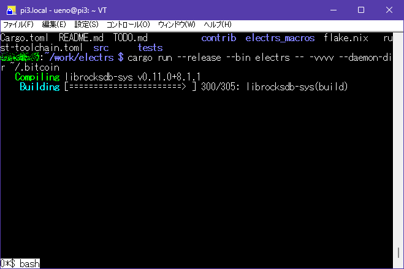
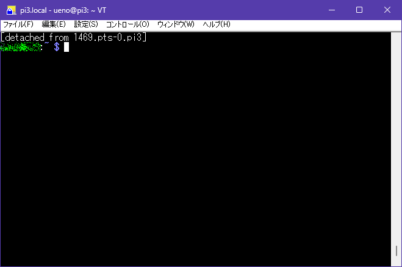

## 概要

sshでログインして作業し始めたけど、思ってたより時間がかかるコマンドがあって、ああでもログオフして次の機会にどうなったか確認したい、みたいな状況はしばしばある。  
Raspberry PiでSSHログインしてビルドし始めたけど1時間以上終わらない、とか。

## 最初から時間がかかると分かっている場合

いま、`cargo`でビルドしているのだが1時間以上経っても終わらない。
幸いなことにCtrl+Cで中断しても、再度`cargo build`すると続きからやってくれる。

まず`screen`を立ち上げる。

```console
$ screen
```

returnキーを押すと、一旦その状態から抜ける。  
見た目は分からないが`screen`実行中の状態である。



キーボードから`Ctrl+A,d`と入力するとデタッチして元のコンソールに戻る。  
デタッチしたIDも表示されるが、これ以上デタッチするのは増やさないとしよう。



あまり難しく考えず、このままSSHはクローズできる。  
そして次にSSHでログインした後、デタッチしたものが1つだけなら`screen -r`コマンドで戻してくれる。
