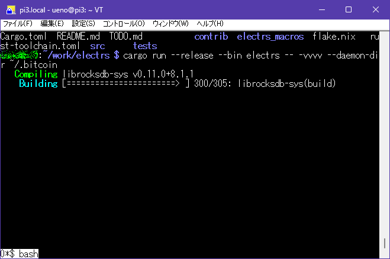
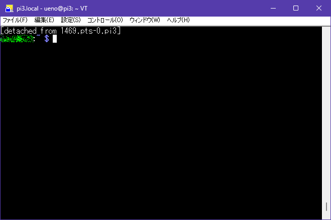
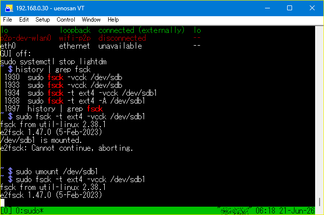

## 概要

sshでログインして作業し始めたけど、思ってたより時間がかかるコマンドがあって、ああでもログオフして次の機会にどうなったか確認したい、みたいな状況はしばしばある。  
Raspberry PiでSSHログインしてビルドし始めたけど1時間以上終わらない、とか。

ディスプレイやキーボードを直結して操作しているのであればディスプレイの電源だけ切っておくかで済むのだが、
サーバの操作をしている場合は操作側の端末をスリープさせたいけれどもそうするとコマンドも中断してしまう。
かといってバックグラウンドで動かすコマンドではないので操作しているセッションはなんとか維持しないといけない。

`screen`も`tmux`も(あるいは他の同系統のツールも)そういう状況で使用できるツールである(機能はもっとあるが)。  
現在実行中のコマンドをどうにかするのではなく、先にツールを立ち上げてから時間がかかるコマンドを実行するということは覚えておこう。

## screen

`screen`を実行する。

```shell
$ screen
```

returnキーを押すと、一旦その状態から抜ける。  
見た目は分からないが`screen`実行中の状態である。



キーボードから`Ctrl+A,d`と入力するとデタッチして元のコンソールに戻る(`Ctrl+A, Ctrl+d`でも`Ctrl+A``d`でも反応する)。



このままSSHはクローズできる。  

### screenに復帰

次にSSHでログインした後、デタッチしたものが1つだけなら`screen -r`コマンドで戻してくれる。

接続中のセッションがなければ`screen -ls`でエラーが返るようなので`$?`で判定できそう。

## tmux

`screen`と同じようなコマンドだが、もうちょっとわかりやすい(かもしれない)。

実行するとステータスバーが表示されて、今がtmux側？にいることがわかる。  
この状態で実行に長くかかるコマンドを実行するとよい。

```shell
$ tmux
```



元のシェルに戻る(デタッチ)は、`Ctrl+b`を押した後にCtrlを外して`d`だけ押す。
このままSSHはクローズできる。  

### tmuxに復帰

デタッチした状態からtmuxに戻るには`tmux attach`を実行する。  
そうするとステータスバーが表示された画面に戻る。

```shell
$ tmux attach
```

接続中のセッションがなかった場合 `tmux ls`がエラーを返すようなので、SSHで戻す使い方なら`.bashrc`などに仕込んでおいてもよさそう。

```shell
tmux ls > /dev/null 2>&1
if [[ $? -eq 0 ]]; then
  echo "You have tmux session: tmux attach"
fi
```
