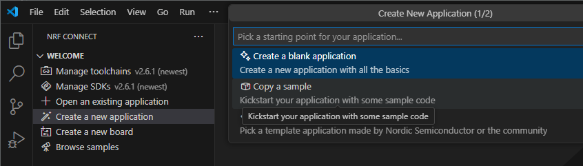
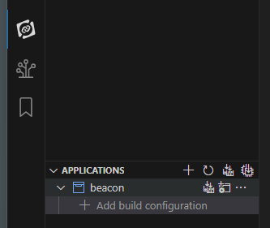
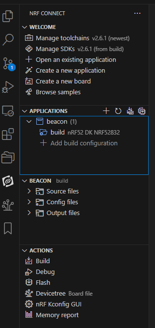
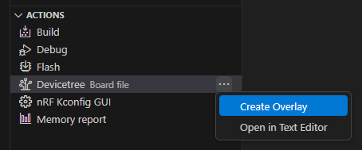

# サンプルアプリ

[サンプルアプリ](https://docs.nordicsemi.com/bundle/ncs-latest/page/nrf/samples.html)

[リポジトリ](https://github.com/nrfconnect/ncs-example-application)はSDKバージョンごとにtagが付けられている。
READMEでは`west`コマンドを使って扱うように書かれているが、vscode上からも扱うことができる。

今回は「beacon」を使う。  
"APPLICATIONS"の下に"beacon"が追加されるので"Add build configuration"をクリックする。
ここから先は使用する開発ボード次第になる。私は太陽誘電さんのnRF52832開発ボードを使うので、"nrf52dk_nrf52832"を選択した。

これで"Build Configuration"をクリックするとビルドが始まる。
そのうち終わるのだが、左側のツリーには build configuration が追加されてくれない。
Visual Studio Codeの「Developer: Reload Window」すると追加されている(インストール直後だけうまくいかないのかもしれない)。  
"ACTIONS"も増えているのが分かる。

PINアサインを変更するなら直接編集せずoverlayにする方がよいだろう。
[加賀デバイスさんの記事](https://www.kgdev.co.jp/column/nordic-column0025/)では最初からoverlayになっているので、Build Configurationを編集すると自動的にoverlayが作成されるのかもしれない。

最初から"clock", "bprot", "power"のアドレスが重なっているという警告が出ていた。
"bprot"は Block Protection機能らしいが、機能を有効にするならアドレスが衝突してはだめだろう。

### 参照

* [nRF Connect SDKによるBluetooth LE 簡単スタートアップ - 加賀デバイス株式会社](https://www.kgdev.co.jp/column/nordic-column0025/)
