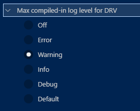

# ビルドについて

_最終更新日: 2024/11/08_

## よく参照するビルド済みファイル

ビルドしないと生成されないため、それまでは vscode でマクロを参照してもエラー表示になる。

* Kconfig
  * `<build>/zephyr/include/generated/autoconf.h`
  * `CONFIG_` が実際に展開されたヘッダファイルになっている
* Devicetree
  * `<build>/zephyr/include/generated/devicetree_generated.h`
  * エイリアスなどがマクロになって定義されたヘッダファイルになっている

## コンパイルでのマクロ追加

gcc の `-Dマクロ` の代わりに `prj.conf` に自分のマクロを書いてもビルドでエラーになる。

* Build Configuration の "Extra CMake arguments" (※できないかも)
  * `-Dマクロ` を列挙する
  * 試してみたがうまくいかなかった。使用できるマクロが限定されているのかも？
    * [Providing CMake options](https://docs.nordicsemi.com/bundle/ncs-latest/page/nrf/app_dev/config_and_build/cmake/index.html#providing_cmake_options)
* CMakeLists.txt に追加する
  * [add_definitions](https://cmake.org/cmake/help/latest/command/add_definitions.html)に `-Dマクロ` を列挙する
  * [add_compile_definitions](https://cmake.org/cmake/help/latest/command/add_compile_definitions.html#command:add_compile_definitions)に `VAR=value` の形で列挙する
  * 私があまり CMake 慣れしていないのもあり、設定したのを忘れそうなのであまり使わないようにしている
* Kconfig ファイルを作る
  * ファイルに残るのでわかりやすい
  * リポジトリにそのまま残るので、`prj.conf` を別にした方が良いのかも？
    * Build Configuration で使用する `prj.conf` を指定するので "Extra CMake arguments" とあまり変わらないのか
    * ファイルに残るという点を行かす場合に使うとよいだろう

### Kconfig ファイルを作る場合

例えば `CONFIG_DEBUG_ENABLED`(取り得る値は bool) を追加する場合、プロジェクトのルートディレクトリに `Kconfig` ファイルを作って以下のように記述する。

```kconfig
source "Kconfig.zephyr"

menu "Debug Mode"

config DEBUG_ENABLED
	bool "Debug Enabled"
	default y

endmenu
```

これで `prj.conf` に `CONFIG_DEBUG_ENABLED=y` のように書くことができる。  
確認は Prisitine Build してから `<build>/zephyr/include/generated/autoconf.h` を開いて検索すると良い。

## LOG_LEVEL メニューの作り方

自作の各モジュールごとにログレベルを変更したいことがあるだろう。  
その場合、Kconfig に独自のログレベル設定を追加し、実装ではそのマクロ値を使うとよい。

[LOG_MODULE_REGISTER()](https://docs.nordicsemi.com/bundle/ncs-2.6.1/page/zephyr/services/logging/index.html#c.LOG_MODULE_REGISTER) で第2引数を設定しなければデフォルトのログレベル(`CONFIG_LOG_DEFAULT_LEVEL`)が使用され、指定すればその値が使用される。  

* ログレベル
  * 0: ログなし
  * 1: エラー
  * 2: 警告
  * 3: 情報
  * 4: デバッグ

```c
#define LOG_LEVEL_NONE 0U
#define LOG_LEVEL_ERR  1U
#define LOG_LEVEL_WRN  2U
#define LOG_LEVEL_INF  3U
#define LOG_LEVEL_DBG  4U
```

Kconfig に `LOG_LEVEL_NONE` のようなマクロ名を書いても解決できないためエラーになる。
そのため値としては `int` になる。

```kconfig
config USER_DRV_LOGLEVEL
	int "Driver Log Level"
	default 3
	help
	  - 0 OFF, logging is turned off
	  - 1 ERROR, maximal level set to LOG_LEVEL_ERR
	  - 2 WARNING, maximal level set to LOG_LEVEL_WRN
	  - 3 INFO, maximal level set to LOG_LEVEL_INFO
	  - 4 DEBUG, maximal level set to LOG_LEVEL_DBG
```

直接数値を書くだけだと分かりづらい。

```kconfig
module = DRV
module-str = DRV
source "subsys/logging/Kconfig.template.log_config"
```



これはラジオボタンなので `bool` 扱いである。  
例えば上記の設定では `DRV` に 警告レベルを設定するのでこう書く。

```conf
CONFIG_DRV_LOG_LEVEL_WRN=y
```

そうすると生成された `autoconf.h` にはこう出力される。

```c
#define CONFIG_DRV_LOG_LEVEL_WRN 1
#define CONFIG_DRV_LOG_LEVEL 2
```

`LOG_MODULE_REGISTER()` のログレベルには `CONFIG_DRV_LOG_LEVEL` を指定すれば良い。  
`prj.conf` に設定を書かなかった場合はデフォルト値が自動で設定される。
