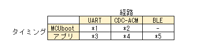

# Nordic Semiconductor 調査 > Device Firmware Update(DFU)

nRF5340 しか持っていないので、その構成を念頭に記載する。

## DFU の種類

* イメージの取得ルート別
  * DFU over UART
    * UART ポート
  * DFU over USB
    * USB CDC-ACM(Virtual COM port)
  * FOTA over BLE
* イメージの取得タイミング別
  * MCUboot
  * アプリ



## sysbuild

ncs v2.8 以降は sysbuild がデフォルトになるので、ここでは sysbuild で書いていく。

* アプリの設定
  * `/sysbuild.conf`
    * `SB_CONFIG_BOOTLOADER_MCUBOOT=y`
      * 必須
    * `SB_CONFIG_MCUBOOT_USE_ALL_AVAILABLE_RAM=y`
      * nRF5340 で secure/non-secure の分離を使用する場合
      * そうでない環境で使うと warning が出るので気付くだろう
    * `SB_CONFIG_MCUBOOT_HARDWARE_DOWNGRADE_PREVENTION=y`
      * nRF5340 はイメージが app と net の 2つがあるため、片方だけイメージを変更するとうまくいかなくなることがある。それを避けるためにダウングレード禁止にしておくことも視野に入れると良いだろう。
      * 私はまだ使ったことが無い
    * `SB_CONFIG_MCUBOOT_MODE_OVERWRITE_ONLY=y`
      * これも使ったことが無い
* MCUbootの設定
  * `/sysbuild/mcuboot.conf, mcuboot.overlay`
    * ボード共通の設定
    * overlayファイルに `chosen` で `zephyr,code-partition = &boot_partition;` の設定がいるようだ
  * `/sysbuild/mcuboot/prj.conf`
    * MCUbootのプロジェクトビルド用。オリジナルからコピーして使うとよいだろう。
    * 各ボード依存の設定がなければいらないのかも？
  * `/sysbuild/mcuboot/boards/*.conf, *.overlay`
    * 各ボード依存の設定

## mcumgr-cli

[MCUmgr](https://docs.nordicsemi.com/bundle/ncs-latest/page/zephyr/services/device_mgmt/mcumgr.html) というしくみを使って DFU を行う。  
デバイス側がサーバ、イメージをアップロードする方がクライアントとなる。

クライアント操作をコマンドラインから行うツールが提供されている。  
([Apache Mynewt](https://mynewt.apache.org/))

Go言語のツールなので事前に `go` のインストールをしておくこと。

```console
$ go install github.com/apache/mynewt-mcumgr-cli/mcumgr@latest
```

### 使い方

* 通信経路の設定
  * これは "ssci" という設定名で `/dev/ttyUSB0` を登録している

```console
$ mcumgr conn add ssci type="serial" connstring="dev=/dev/ttyUSB0,baud=115200,mtu=512"
```

* Flash のスロット確認
  * これはスロットが 2つ(0, 1)あって、それぞれにイメージがある状態

```console
$ mcumgr -c ssci image list
Images:
 image=0 slot=0
    version: 0.0.0
    bootable: true
    flags: active
    hash: 12f3717c56660de5e287cdabca80419735a89ba84d74bb625a8d3356f8e685b7
 image=0 slot=1
    version: 0.0.0
    bootable: true
    flags:
    hash: 51313bcb36a2d3bba7c8ae8830e978f3976915ad979afb52e27d2ad93dcbfdd8
Split status: N/A (0)
```

* イメージのアップロード
  * [from MCUboot で試したとき](https://blog.hirokuma.work/2024/12/20241205-ncs.html)は自動で slot 0 に上書きされたし、[from app で試したとき](https://blog.hirokuma.work/2024/12/20241207-ncs.html)は slot 1 に書き込まれていた。

```console
$ mcumgr -c ssci image upload build/l8_e1/zephyr/zephyr.signed.bin
```

* アップロードされたイメージのテスト
  * [from app](https://blog.hirokuma.work/2024/12/20241207-ncs.html) で試した
  * `test` は必須か分からないが推奨される手順である

```console
$ mcumgr -c ssci image test <ハッシュ値>
```

* リセット
  * アップロードされた状態で行うとイメージの入替(swap-moveか?)が行われる

```console
$ mcumgr -c ssci reset
```

### その他のツール

[Rustで書かれたツールへのリンク](https://github.com/vouch-opensource/mcumgr-client) があったので Release ページからバイナリをダウンロードして使うことができるのかもしれないが私は試していない。

DFU over USB(CDC-ACM) であれば [nRF Connect for Desktop](https://docs.nordicsemi.com/bundle/nrf-connect-desktop/page/index.html) の [Programmer アプリ](https://docs.nordicsemi.com/bundle/nrf-connect-programmer/page/index.html)が使用できるかもしれない。

## DFU over UART

### from MCUboot

MCUboot で DFU モード(Serial Recovery モード)になって DFU を行う。  
UART と USB CDC-ACM が使用可能。両立できるかは調べていない。  
アプリから行う DFU との両立は可能。

DFU モードで DFU を行う場合、直接アプリイメージを上書きする。  
アプリから DFU する場合と違うので注意すること。

DFU モードになるための手段が必要。  
ボタンを押したまま起動すると DFUモードになるという機能がデフォルトで備わっている。  
DTS ファイルの `alias` で `mcuboot-button0` に割り当てたボタンがそれになる。  
また、DFU モードになると LED を点灯させるという機能もある。  
これは MCUboot の confファイルに設定がいる。  
`alias` で `mcuboot-led0` に割り当てた LED が点灯する。

DFU モード(Serial Recoveryモード)でしか DFU しない場合の confファイル

* アプリの設定
  * 特になし
* MCUbootの設定
  * `CONFIG_MCUBOOT_SERIAL_DIRECT_IMAGE_UPLOAD=y`
    * アプリを直接上書きするようになる
  * `CONFIG_SINGLE_APPLICATION_SLOT=y`
    * アプリを直接上書きするので複数のスロットは不要
  * `CONFIG_UART_CONSOLE=n`
    * UART の邪魔になるため無効にしておく
  * `CONFIG_MCUBOOT_SERIAL=y`
  * `CONFIG_MCUBOOT_INDICATION_LED=y`
    * DFU モードになったときに LED を点灯させたい場合
  * DTSファイル
    * `chosen` で `zephyr,console` に `&uart0` や `&cdc_acm_uart0` などを設定する
    * ボード定義ファイルでの設定がデフォルト値になるのでそのままでよければ定義不要

アプリからも DFU する場合はそちらの設定に合わせること。

#### via hardware UART (*1)

DFU over UART from MCUboot

UART を使う。  
CTS/RTS は無くても動作した。

* MCUbootの設定
  * `CONFIG_BOOT_SERIAL_UART=y`

* [ncs: USBでのDFU (4) - hiro99ma blog](https://blog.hirokuma.work/2024/12/20241205-ncs.html)
* [ncs: USBでのDFU (5) - hiro99ma blog](https://blog.hirokuma.work/2024/12/20241206-ncs.html)

#### via virtual COM port (*2)

DFU over USB from MCUboot

USB CDC-ACM を使う。  
USB スタックが載る分 MCUboot が大きくなる。

* MCUbootの設定
  * `CONFIG_BOOT_SERIAL_CDC_ACM=y`
  * `CONFIG_PM_PARTITION_SIZE_MCUBOOT=0x15000`
    * デフォルト値は `0xc000` だが USBスタックを載せることでサイズが大きくなる
    * サイズが足りなければリンクエラーになるので分かるだろう

* [ncs: USBでのDFU (6) - hiro99ma blog](https://blog.hirokuma.work/2024/12/20241206-ncs2.html)

### from the application

アプリ側からイメージをダウンロードして空いた Flash のスロットに書き込んだ後に MCUboot が既存のイメージとの入替を行う。  

* アプリの設定
  * `CONFIG_MCUMGR=y`
  * `CONFIG_MCUMGR_GRP_OS=y`
  * `CONFIG_MCUMGR_GRP_IMG=y`
  * `CONFIG_MCUMGR_TRANSPORT_UART=y`
  * `CONFIG_NET_BUF=y`
  * `CONFIG_ZCBOR=y`
  * `CONFIG_CRC=y`
  * `CONFIG_FLASH=y`
  * `CONFIG_IMG_MANAGER=y`
  * `CONFIG_STREAM_FLASH=y`
  * `CONFIG_FLASH_MAP=y`
  * `CONFIG_BASE64=y`
  * DTSファイル
    * `chosen` で `zephyr,uart-mcumgr` を設定する
* MCUbootの設定
  * `CONFIG_SINGLE_APPLICATION_SLOT=n`

#### via hardware UART (*3)

DFU over UART from the application

UART を使う。  
動かしていないので省略。

#### via virtual COM port (*4)

DFU over USB from the application

USB を使う。  
初回 `mcumgr-cli` を使うと[応答しない](https://blog.hirokuma.work/2024/12/20241207-ncs.html)ようだった。  
一度コマンドを使うとそれ以降は有効になるようだったので、さっさと Ctrl+C で止めて進めるとよいだろう。  
そのせいか `Programmer` アプリは使うことができなかった。

* アプリの設定
  * `CONFIG_USB_DEVICE_STACK=y`
  * `ONFIG_UART_LINE_CTRL=y`
  * `CONFIG_USB_DEVICE_INITIALIZE_AT_BOOT=n`

* [ncs: USBでのDFU (7) - hiro99ma blog](https://blog.hirokuma.work/2024/12/20241207-ncs.html)

### via BLE (*5)

FOTA over BLE

MCUboot に BLE を載せるのは重たいため、アプリで BLE が動く。  
サンプルの SMP server という扱いだが、ncs 標準のような扱いだろう。  
conf を 1つ追加するだけで BLEサービスの登録などもやってくれる(MCUmgrなどの設定も不要)ので、導入は手軽である。

* アプリの設定
  * `CONFIG_NCS_SAMPLE_MCUMGR_BT_OTA_DFU=y`

* [ncs: USBでのDFU (8) - hiro99ma blog](https://blog.hirokuma.work/2024/12/20241208-ncs.html)

#### DFU クライアントアプリ

nRF デバイス側が SMP server になり、クライアントアプリが DFU するイメージをアップロードする。  

アプリとしては nRF Connect Device Manager がある。  
それ以外に nRF Connect for Mobile も DFU 機能を持っている。

* [nRF Connect Device Manager](https://www.nordicsemi.com/Products/Development-tools/nrf-connect-device-manager)
* [nRF Connect for Mobile](https://www.nordicsemi.com/Products/Development-tools/nRF-Connect-for-mobile)

自作アプリに機能を組み込むことも可能でライブラリが提供されている。

* [Android版](https://github.com/NordicSemiconductor/Android-nRF-Connect-Device-Manager)
* [iOS版](https://github.com/NordicSemiconductor/IOS-nRF-Connect-Device-Manager)

## 署名の検証

* 鍵の指定方法
* 検証に失敗するとどうなるか
