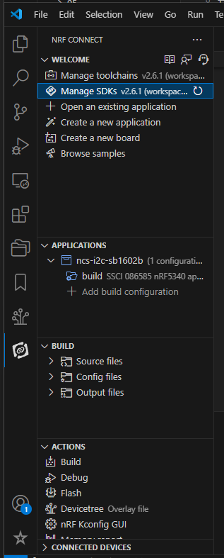

# はじめ方 > 1. 準備

## インストール

nRF Connect SDK をインストールする。  
コマンドライン版もあるが、nRF Connect SDK for Visual Studio Code での環境のみ説明する。

サポートする OS は Linux(64bit) / Mac(Intel/Arm) / Windows(32bit/64bit)である。  
多少細かいところがあるので詳細は [Requirements](https://docs.nordicsemi.com/bundle/ncs-2.6.1/page/nrf/installation/recommended_versions.html) の表を確認すること。  
Tier1 が動作確認環境、それから Tier2, Tier3 と数が大きくなるに従って確認度合いが弱くなる。

インストール手順は何箇所か書いてある。  
おすすめは画像もある DevAcademy の方だ。

* [Installation](https://docs.nordicsemi.com/bundle/ncs-2.6.1/page/nrf/installation.html)
* DevAcademy
  * [Lesson 1 – nRF Connect SDK Introduction](https://academy.nordicsemi.com/courses/nrf-connect-sdk-fundamentals/lessons/lesson-1-nrf-connect-sdk-introduction/)

Unit Test は OS での qemu で Zephyr OS を立ち上げることで行っている。  
その辺りの動作は Linux でしかサポートしていない。  
私は Windows 環境なので、Mac が "Linux" の範囲に入っているのかは確認していない。  
Windows の場合は [WSL2](https://learn.microsoft.com/ja-jp/windows/wsl/) を使うことで動作させることはできた。
ただ WSL2 側のファイルシステムにも ncs 一式をインストールしないと実行速度が分単位で遅くなった(Windows側のファイルシステムで実行すると2分くらいかかったのが WSL2側のファイルシステムだと10秒程度になるくらいの差)。

## nRF Connect SDK for Visual Studio Code

Installation の項目か DevAcademy の Lesson 1 を全部行うと Toolchain と SDK がインストールされた状態になっているだろう。  
nRF Connect SDK for Visual Studio Code をすべてインストールしていると以下のような見栄えになる。  
(これはプロジェクトを開きビルドも行った状態)

一番上の "WELCOME" は常に表示されるが、それより下はプロジェクトを開いていたり、プロジェクトをビルドしたりで表示が変わってくる。  
ときどき表示されるはずなのにそれがないことがあるが、そういうときは再読み込みするとよい。  
プロジェクトを作成して初めてビルドしたときなどはほぼ再読み込みが必要になる。  
再読み込みといっても vscode を再起動する必要はなく、ラベルの横にあるアイコンをクリックするだけである。

SDK や Toolchain は複数インストールすることが可能である。  
削除さえしなければプロジェクトごとにバージョンを変更することもできる。  
別のディレクトリにダウンロードされるので、切替に時間はかからないがその分ディスクスペースは消費される。

